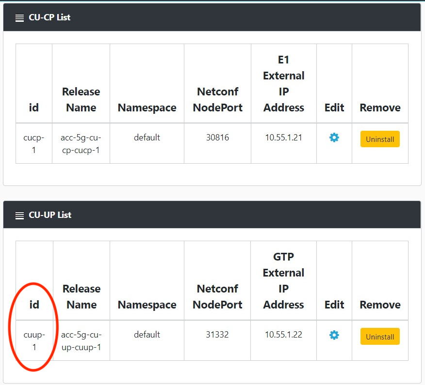

# CU

## 5G RAN Configuration

If you have a dRAX License for 5G, have enabled 5G during the RIC and Dashboard installation in [Enabling 5G components](#enabling-5g-components), and have deployed the CU components as instructed in [Install dRAX 5G Components](#install-drax-5g-components), you can now configure the 5G CU components.
You can do so by navigating to **RAN Configuration** in the dRAX Dashboard sidebar and clicking the **gNB Configuration**:

  

You will reach the 5G CU components configuration page:

On this page there are two lists, one for CU-CPs and one for CU-UPs.
You can click the icon under the Edit column of each CU component to edit its configuration.
When you deploy the 5G CU component and click this button for the first time, you will be asked to set the initial configuration.
Later on, you can click this button to edit the configuration.

### 5G CU-CP configuration

The 5G CU-CP components have a number of parameters that you can set as can be seen below:

* PLMN ID: The PLMN ID to be used
* GNB ID: The GNB ID
* GNB CU-CP name: A friendly name of the 5G CU-CP component
* AMF NG interface IP Address: You can click on the (+) sign in the table to expand it like on the figure below. You can now Add Rows to add multiple AMF NG interface IP addresses, or delete them using the Delete Row field. Edit the **NG Destination IP Address** to be the AMF NG IP address of your setup. This IP is the $CORE_IP.

Click the **Submit** button to send the configuration.

### 5G CU-UP configuration

The 5G CU-UP has a number of configuration parameters as seen below:

* GNB CU-UP ID: The 3GPP ID of the CU-UP component.
* GNB CU-UP name: The 3GPP friendly name of the CU-UP component,
* E1 Links: You can Add Row or Delete Rows using the button. Here we add the E1 IP address of the CU-CP component that this CU-UP component will connect to. Enter the E1 IP under **E1 Destination IP Address.** This IP is the $E1_CU_IP . 
* Supported PLMN Slices; Expand the table by clicking the (+) sign. You can now Add Rows or Delete Rows to add multiple PLMN IDs. For each PLMN ID, you can Add Rows to add slices or Delete Rows to delete slices. Each slice is defined by the Slice Type and Slice Differentiator.

**IMPORTANT**  Do not attempt to modify slices and PLMNs unless you are aware of the target Scenario you want to achieve: slice configuration and multiple PLMN (MOCN) configurations are rather complex to handle and require that CU, DU and Core are configured coherently in order fro such Scenarios to be functional.We recommend to consult the relative sections of this document and contact your Core Network Supplier and Accelleran to tailor a solution for your specific case. 

