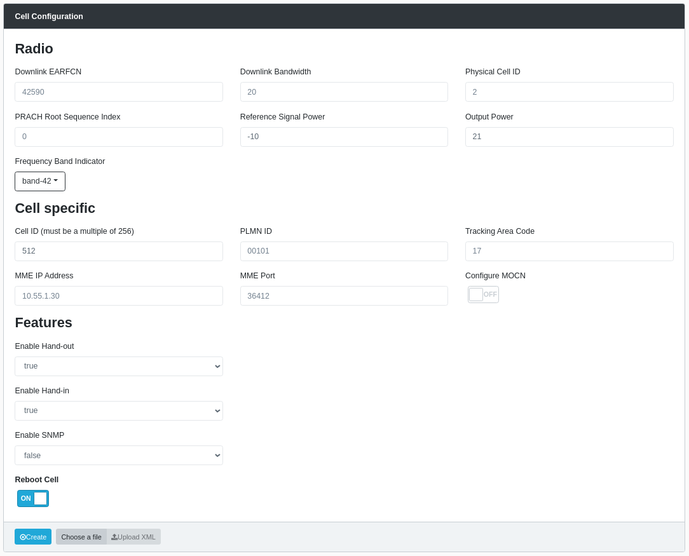

# E1000

## 4G E1000 Provisioning

This section is dedicated to the provisioniing and the configuration of an E1000 Series 4G eNB. The provisioning of an E1000 unit in the dRAX allows the
dRAX to "remember" a certain Cell even after a software update of the system and or the cell itself, including a change of name, the so called Filter Id
in this document. Certificates get created and signed for this to happen so that only those cel that can show a signed certificate to dRAX get admitted 
to the system and served accrodingly. This part is beyond the scope of the Configuration, here we only describe how to provision the Cells who have
already been supplied by Accelleran with signed certficates, are DHCP enabled typicaly, and can reach out for dRAX tahnsk to the bootstrap file 

When you don't use 4G together with E1000 Cells you can skip this section

### Listing currently provisioned E1000s

The current list of provisioned E1000s can be retrieved with the following command:

``` bash
curl --cacert ca.crt https://$NODE_IP:31610/get/
```

### Provisioning additional Accelleran E1000 DUs

Each additional E1000 DU, which is to be used with this dRAX installation, needs to be provisioned.
This is only needed for E1000 DUs which were not pre-provisioned during the installation process.

#### Determine Unique Identifier

Each Accelleran E1000 has a Model, a Hardware Version, and a Serial Number - this information is displayed on the label attached to the unit, and is required in order to pre-provision the DUs.
A unique identifier is constructed from this information in the following format:

```
Model-HardwareVersion-SerialNumber
```

This identifier can also be determined automatically via SSH using the following command:

``` 
echo "$(eeprom_vars.sh -k)-$(eeprom_vars.sh -v)-$(eeprom_vars.sh -s)"
```

Each E1000 also needs to be given a unique name, also known as filter id.
This name could be as simple as "du-1" - all that matters is that it is unique in this dRAX installation.

#### Prepare configuration file

To provision a new E1000, create a new file called `cellconfig.yaml` with the following contents:

``` yaml
E1011-GC01-ACC000000000001:
     redis:
         hostname: NODE_IP
         port: 32000
     loki:
         hostname: NODE_IP
         port: 30302
     instance:
        filter: du-1
```

Replace the unique identifier based on the specific E1000, replace `NODE_IP` with the correct IP for your installation, and replace `du-1` with the chosen unique name for this E1000 unit.

If you'd like to provision multiple E1000s at once, duplicate the above snippet for each additional E1000, updating the unique identifier and the name in each case.
Make sure to match the indentation in each duplicated snippet - **incorrect indentation will result in an error.**
It's recommended to keep these snippets all in the same file so that we can push the new configuration with a single command.

#### Push new configuration

Now run the following command to push this configuration to the Provisioner:

``` bash
curl --cacert ca.crt --cert client.crt --key client.key https://NODE_IP:31610/push/ --data-binary @cellconfig.yaml
```

### Changing the name of an E1000

The name of a specific E1000 can be updated if required in a slightly more straightforward manner.
First determine the unique identifier - refer to the [Determine Unique Identifier section](#determine-unique-identifier) above for the exact instructions.
Use the following command, replacing `KUBE_IP` with the correct IP for your installation, the unique identifier with that just determined, and replacing `du-1` with the new name:

``` bash
curl --cacert ca.crt --cert admin.crt --key admin.key https://_$NODE_IP:31610_/set/E0123-GC01-ACC0123456978901/instance/filter -d du-1
```

### 4G RAN Configuration

Configuration of the 4G RAN is made simple, intuitive and efficient when using the dRAX Dashboard.

Note: all of these options require the Accelleran E1000s to already have been provisioned as described in the [E1000 Provisioning section](#e1000-provisioning) above, or during the installation process.

### eNB Configuration via eNB list

To access the configuration page for an eNB, first click on the **RAN Configuration** section, and then click on **eNB Configuration.**
From the displayed list of eNBs, click on the Cog icon in the Edit column corresponding to the eNB you'd like to reconfigure.


From the following screen, the configuration of this eNB can be adjusted.
Once the configuration has been updated as desired, click on the **Create** button at the bottom left of the page:



Notes:

1. Make sure the Cell ID is a multiple of 256, you can submit Cell IDs that are not a multiple of 256, however this will result in a Macro eNB ID that looks different on the surface, 
2. There is no conflict or error check in manual mode, therefore for instance it is possible to configure two cells with the same ID, set an EARFCN that is out of band, and so on: it is assumed that the User is aware of what he/she tries to set up
3. The reference signal power is calculated automatically from the output power, please adjust the output power in dBm which represent the maximum power per channel at the exit without antenna gain

### eNB Configuration via Dashboard

An alternative way of configuring an individual eNB is to make use of the **Dashboard** initial page (click on **Dashboard** in the sidebar to return there).
Click on the eNB in the Network Topology, and then choose **Configure Cell** on the **Selected Node** window at the right: this will take you to the  **eNB Configuration** page and described in the previous section.


## Appendix: How to enable/disable DHCP for the IP address of the E1000 4G DU

The 4G DU units are separate hardware components and therefore get preconfigured at Accelleran with a standard SW image which of course will have default settings that may require changes.
Typically in fact a network component will require IP address Netmask default gateway to be configured and the Customer will want to rework these settings before commissioning the component into the existing Network.
The default settings are:

* Static IP address
* DHCP Off
* Provisioner Off
* Bootstrap file with Redis port 32000, dRAX IP 10.20.20.20 and a generic eNB Name indicating for instance the Customer name, Band, and a progressing number

The rest of environment variables are visible once logged in to the E1000 using the `fprintenv` command.
So for instance the variable you will be able to see are:

    ethact=octeth0
    ethaddr=1C:49:7B:DE:35:F7
    fdtcontroladdr=80000
    gatewayip=10.188.6.1
    gpsenable=1
    ipaddr=10.20.20.222
    loadaddr=0x20000000
    mtdparts=mtdparts=octeon_nor0:0x220000(u-boot)ro,128k(u-boot-env)ro,128k(u-boot-env-bak)ro,128k(u-boot-env-gemtek)ro,0x1340000(init-app)ro,-(accelleran-app)ro
    namedalloc=namedalloc dsp-dump 0x400000 0x7f4D0000; namedalloc pf4cazac 0x13000 0x84000000; namedalloc cazac 0x630000 0x7f8D0000; namedalloc cpu-dsp-if 0x100000 0x7ff00000; namedalloc dsp-log-buf 0x4000000 0x80000000; namedalloc initrd 0x2B00000 0x30800000;
    netmask=255.255.255.0
    numcores=4
    octeon_failsafe_mode=0
    octeon_ram_mode=0
    serverip=10.188.6.137
    stderr=serial
    stdin=serial
    stdout=serial
    swloadby=flash
    unprotect=protect off 0x17cc0000 0x1fc00000;
    ver=U-Boot 2017.05 (Sep 08 2017 - 16:27:53 +0000)
    xoservoenable=1
    xoservolog=/var/log/xolog.txt
    dhcp=yes

If the Customers wants to change IP address using the command line he can do the following (special attention must be put as an error in the input can bring the E1000 out of reach):

``` bash
fsetenv ipaddr <new_ip_address>
```

In order to modify the netmask type:

``` bash
fsetenv netmask <new_net_mask> (ex. 255.255.255.0)
```

NOTE: the User that wishes to perform such modifications must be aware of the consequences of that choice, for instance the necessity of shipping back the unit to Accelleran for refurbishment in case of misconfigurations.

In case the E1000 is supposed to get a dynamic address from a DHCP server in the Customer network the related flag shall be enable:

``` bash
fsetenv dhcp yes
```

Don't forget to reboot the E1000 once done with the settings.

If for any reasons the Customer decides not to use the dynamic address assignment he can revert the choice by typing:

``` bash
fsetenv dhcp no
```

**IMPORTANT**: In this case it is also essential to configure a static address and an IP Mask in harmony with the rest of the network:

``` bash
fsetenv ipaddr <new_ip_address>
fsetenv netmask <new_net_mask> (ex. 255.255.255.0)
```

_After that_, you can reboot the E1000 which will come back with ARP signals with the chosen static address.

### How to configure dRAX for a cell

#### Introduction

For the cell to be able to communicate with the dRAX Provisioner, it needs to use its own certificate.
For this certificate to be valid, the time and date on the cell need to be synchronized.
If the time and date are not correct, the certificates will not work.

#### How to enable the dRAX Provisioner

SSH into the E1000:

``` bash
ssh -i guest.key guest@<ip_of_e1000>
```

Create a folder:

``` bash
mkdir /mnt/common/bootstrap_source
```

Create and save an empty dhcp file in the folder created:

``` bash
touch /mnt/common/bootstrap_source/dhcp
```

## Appendix: dRAX and Accelleran E1000s on different subnets

Normally, we recommend your Accelleran E1000s are located on the same subnet as your dRAX.
However, if that is not the case, then you need to run a specific component of the dRAX Provisioner called the Provisioner-DHCP.
This component should be running on any machine that is part of the subnet where the Accelleran E1000s are.
We support running this component via Docker, so you must have Docker installed on that machine.

### Prepare conf file

Create the configuration file named udhcpd.conf. The contents are:

```
start        10.0.0.20
end          10.255.255.254
interface    eth0
opt     dns     10.0.0.1 10.0.0.2
option  subnet  255.0.0.0
opt     router  10.0.0.1
opt     wins    10.0.0.2
option  domain  local
option  lease   86400
option  provision  https://$NODE_IP:31610
option staticroutes 10.20.20.0/24 10.22.10.52
```

Substitute the IP in the "option provision …" line to where the provisioner is installed.

Also change the interface to the main interface of the machine (eth0, eno1, br0, …) that is used to reach the subnet where the dRAX is installed.

NOTE: You should make sure from your networking aspect that the two subnets are reachable by one-another.
If this is not the case, although we do not recommend this, you can create a static route on the E1000s towards the subnet where dRAX is installed.
This can be done using the Provisioner-DHCP component. Find the line: `option staticroutes 10.20.20.0/24 10.22.10.52`.
This translates to "create a static route to the 10.20.20.0/24 network (where the dRAX is) via gateway 10.22.10.52".
Replace the values with the correct ones for your network case.

### Create docker login details

Login with docker command:

``` bash
sudo docker login
```

Then use the username and password of your DockerHub account that you also used to create the kubernetes secret.

### Pull the image from DockerHub

Check what is the latest version on DockerHub [https://hub.docker.com/repository/docker/accelleran/provisioner-dhcp](https://hub.docker.com/repository/docker/accelleran/provisioner-dhcp).

Pull the image using the docker command, and substitute the &lt;version> with the one found in the above step:

``` bash
sudo docker image pull accelleran/provisioner-dhcp:<version>
```

### Run as docker container

Start the container with the docker run command. Make sure to give the full path to the configuration file (/home/ad/...). Also make sure you give the correct docker image name at the end of the command including the version:

``` bash
sudo docker run -d --name dhcp --net host --mount type=bind,source=/path/to/udhcpd.conf,target=/conf/udhcpd.conf accelleran/provisioner-dhcp:<version>
```

To check if the service is running use

``` bash
sudo docker ps | grep dhcp
```
