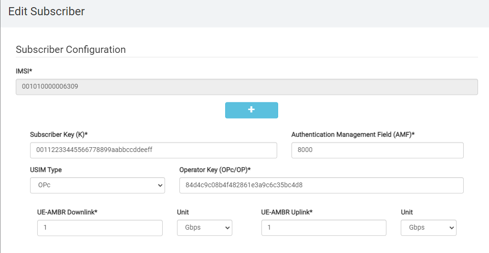

# Core Installation

In order to have end-to-end connectivity a core network is required.
If no core network is available, Open5GS can be installed in a virtual machine on the installation machine.
If you already have a core you can skip this chapter.


## Create a Network Bridge

In order to be able to assign a public IP address to the Virtual Machine, the network connection of the installation machine has to be bridged.
This allows to add the virtual machine to the created bridge.
To create a bridge, replace the network configuration of the installation machine which is assumed to be located in `/etc/netplan/00-installer-config.yaml` with the configuration below.
You might have to edit this configuration to match your set-up.

``` bash
network:
  ethernets:
    $SERVER_INT:
      dhcp4: false
  :
  :
  bridges:
    br0:
      interfaces: [$SERVER_INT]
      addresses:
            - $SERVER_IP/24
      gateway4: $GATEWAY_IP
      nameservers:
        addresses: [8.8.8.8]

  version: 2

```

Next run the following command to test and apply the new configuration:

``` bash
sudo netplan try
```

Make sure to use `br0` as the `$NODE_INT` from now on:

``` bash
export NODE_INT=br0
```

## Create a Virtual Machine

Next you can install the virtual machine that hosts the core. The installation process is outside the scope of this document. Still we share the commandline you can use
Below a command line that creates a VM with the correct settings.

> IMPORTANT ! the $CORE_SET_CU can only be a comma seperated list. 

```bash
sudo virt-install  --name "$OPEN5GS_VM_NAME"  --memory 16768 --vcpus "sockets=1,cores=$CORE_AMOUNT_CU,cpuset=$CORE_SET_CU"  --os-type linux  --os-variant rhel7.0 --accelerate --disk "/var/lib/libvirt/images/o5gsCORE-ubuntu-20.04.4-live-server-amd64.img,device=disk,size=100,sparse=yes,cache=none,format=qcow2,bus=virtio"  --network "source=br0,type=bridge" --vnc  --noautoconsole --cdrom "./ubuntu-20.04.4-live-server-amd64.iso"  --console pty,target_type=virtio
```

> some notes about this command
> * --noautoconsole : if you ommit this, a graphical console window will popup. This works only when the remote server can export its graphical UI to your local graphical environment like an X-windows
> * --console pty,target_type=virtio will make sure you can use ```virsh console $CU_VM_NAME```

Continue with ```virt-manager``` console
Choose all default except for
  * Fill in the hostname $OPEN5GS_HOSTNAME
  * Fill in the static ip of $CORE_IP
  * select [ x ] openSsh
  
VM installation takes 5 minutes

Make sure to create a bridged network for the virtual machine and assign a fixed IP address (`$CORE_IP`) in the same subnet as `$NODE_IP` to it. 

Copy the .var file over to the core VM.

``` bash
scp $HOME/.vars $USER@$CORE_IP:.vars
ssh $USER@$CORE_IP "echo . .vars >> .profile"
```

ssh into the CORE VM.

``` bash
ssh $USER@$CORE_IP
```


## Install Open5GS

Please refer to [the Open5GS website](https://open5gs.org/open5gs/docs/guide/01-quickstart/) for information on how to install and configure the Open5GS core network on the virtual machine.

> NOTE : don't forget the ip forwarding section. If forgotten the UE connects with an exclemation mark in the triangle and has no internet connectivity.

### Configure Open5GS

The default configuration of Open5GS can mostly be used as-is.
There are a couple of modifications that have to be made to its configuration:

Edit `/etc/open5gs/amf.yaml` and set the NGAP listen address to the public address of the virtual machine:

``` yaml
amf:
    ngap:
      - addr: $CORE_IP
```

Change the ```plmn_id:``` everywhere in the amf.yaml file to the one of your setup.

Edit `/etc/open5gs/upf.yaml` and set the GTP-U listen address to the public address of the virtual machine:

``` yaml
upf:
    gtpu:
      - addr: $CORE_IP
```

Restart the AMF and UPF:

``` bash
sudo systemctl restart open5gs-amfd
sudo systemctl restart open5gs-upfd
```

### open5gs GUI
To be able to reach the GUI from any IP address add these lines 

```
[Service]
Environment=HOSTNAME=0.0.0.0
Environment=PORT=3000
```

to the file ```/etc/systemd/system/multi-user.target.wants/open5gs-webui.service``` under de ```[Service]``` section.

and restart the service 

```
systemctl daemon-reload
```
```
systemctl restart open5gs-webui.service
```
now you will find that this service is listening on port 3000 on any ip

``` bash
netstat -ano | grep 3000
#tcp        0      0 0.0.0.0:3000            0.0.0.0:*               LISTEN      off (0.00/0/0)
```

### making iptables persistent

Add this table to make the UE reach the internet
```
sudo iptables -t nat -A POSTROUTING -s 10.45.0.0/16 ! -o ogstun -j MASQUERADE
```

Add this iptable rule to be able to ping the UE from the core.
```
sudo iptables -I INPUT -i ogstun -j ACCEPT
```

To make these rules boot safe install and configure
```
sudo apt-get install iptables-persistent
sudo netfilter-persistent save
sudo systemctl enable netfilter-persistent
```
Each time you change a rule you have to save it like this
```
chmod 666 /etc/iptables/rules.v4
sudo iptables-save > /etc/iptables/rules.v4
chmod 640 /etc/iptables/rules.v4
```

### Provision a UE

This can be done through command line
``` bash
open5gs-dbctl add 001010000006309 00112233445566778899aabbccddeeff 84d4c9c08b4f482861e3a9c6c35bc4d8 internet
```

or webgui

<p align="center">
  
  
  
</p>


* use static ip address which you can map to the imsi. This makes debugging traffic much easier when using multiple UE's. 
    ``` eg: imsi 235880000009834 gets ip address 10.0.0.34```
### Verify if open5gs is functional
open5gs listens on ngap interface
``` bash
netstat -ano | grep 38412
# sctp                10.55.7.104:38412                               LISTEN      
```

5g configuration
``` bash
grep -e 10.55.7 -e m[cn]c  /etc/open5gs/* | egrep -v :\s*#
#/etc/open5gs/amf.yaml:      - addr: 10.55.7.104
#/etc/open5gs/amf.yaml:          mcc: 001
#/etc/open5gs/amf.yaml:          mnc: 01
#/etc/open5gs/amf.yaml:          mcc: 001
#/etc/open5gs/amf.yaml:          mnc: 01
#/etc/open5gs/amf.yaml:          mcc: 001
#/etc/open5gs/amf.yaml:          mnc: 01
#/etc/open5gs/upf.yaml:      - addr: 10.55.7.104
```

### Some scripts one often uses
#### restart
``` bash
at > restartcore.sh << EOF
sudo systemctl restart open5gs-mmed
sudo systemctl restart open5gs-sgwcd
sudo systemctl restart open5gs-smfd
sudo systemctl restart open5gs-amfd
sudo systemctl restart open5gs-sgwud
sudo systemctl restart open5gs-upfd
sudo systemctl restart open5gs-hssd
sudo systemctl restart open5gs-pcrfd
sudo systemctl restart open5gs-nrfd
sudo systemctl restart open5gs-ausfd
sudo systemctl restart open5gs-udmd
sudo systemctl restart open5gs-pcfd
sudo systemctl restart open5gs-udrd
sudo systemctl restart open5gs-webui
EOF
```
#### version 
``` bash
cat > versioncore.sh << EOF
set -x
open5gs-mmed -v 
open5gs-sgwcd -v 
open5gs-smfd -v 
open5gs-amfd -v 
open5gs-sgwud -v 
open5gs-upfd -v 
open5gs-hssd -v 
open5gs-pcrfd -v 
open5gs-nrfd -v 
open5gs-ausfd -v 
open5gs-udmd -v 
open5gs-pcfd -v 
open5gs-udrd -v 
open5gs-webui -v 
set +x
EOF
```
