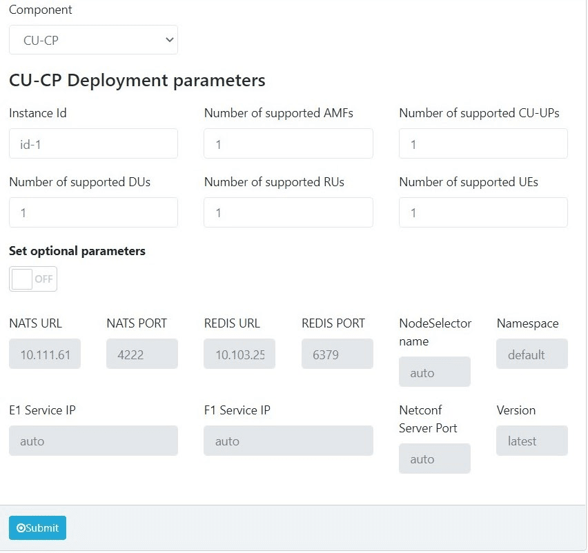
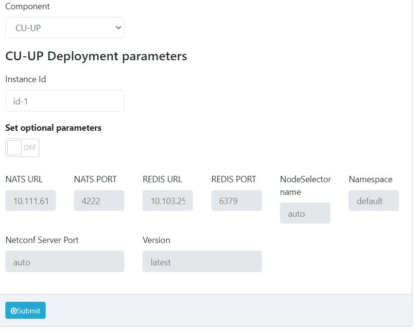

# dRAX Installation


## Introduction

This document contains only the minimal set of information to achieve a default installation of dRAX, with some assumptions made such as software and hardware prerequisites as well as Network Configuration.

The first section gives a detailed overview on hardware, software and other requirements that are considered as default prerequisites to install and operate a dRAX installation. Customers who require a more custom-designed deployment should contact Accelleran’s Customer Support team to get a tailored solution.

The second section describes all of the steps needed to deploy and run a new software version of Accelleran’s dRAX  for the first time, using provided Helm charts. This section is split into multiple subsections, including one for the installation of the dRAX base, one for the 4G components, and one for the 5G components. For a first time installation, it is important to verify of course the SW and HW prerequisites presented in this document before proceeding further.

The third section covers configuration of dRAX, including details on both RAN as well as xApp configuration.

We advise customers who wish to know more about dRAX’s architecture to request the full dRAX Architecture User Guide.


## Software and Hardware Prerequisites

The assumption made in this User Guide is that the typical Customer who doesn’t want a full turn key dRAX kit is familiar with Server installations, VMs and VNFs so here we limit to describe what are the minimum requirements, OS used, and software packages that allow the dRAX to run correctly.


### Hardware Minimum Requirements

1. Intel Xeon D-1541 or stronger 64-bit processor
2. 32GB DDR4 RAM
3. 250GB Hard Disk

### Software Requirements to be pre installed

1. Linux Ubuntu Server 20.04 LTS
2. Docker (recommended version 19.03, check the latest compatible version with Kubernetes)
4. Kubernetes 1.13 or later (1.21 is currently unsupported)
5. Helm, version 3

### Other Requirements

1. dRAX License, as provided by Accelleran’s Customer Support team
2. The Customer Network allows access to internet services
3. a DockerHub account, and have shared the username with the Accelleran team to provide access to the needed images
4. EPC/5GC must be routable without NAT from dRAX (and E1000 DUs in case of 4G)

4G Specific requirements:

1. A DHCP server must be available on the subnet where the E1000 DUs will be installed
2. E1000 DUs must be in the same subnet as Kubernetes’ advertise address (otherwise refer to 

<p id="gdcalert2" ><span style="color: red; font-weight: bold">>>>>>  gd2md-html alert: undefined internal link (link text: "Appendix: E1000 on separate subnet"). Did you generate a TOC? </span><br>(<a href="#">Back to top</a>)(<a href="#gdcalert3">Next alert</a>)<br><span style="color: red; font-weight: bold">>>>>> </span></p>

[Appendix: E1000 on separate subnet](#heading=h.1hrm1q5bw6cp)

## Installation

### Introduction

This section explains how to install dRAX for the very first time in its default configuration. Assuming that the Customer has already verified all the prerequisites described in the previous Section 4. If you already have dRAX and are only updating it, please refer to the 

<p id="gdcalert3" ><span style="color: red; font-weight: bold">>>>>>  gd2md-html alert: undefined internal link (link text: "section on updating an existing installation"). Did you generate a TOC? </span><br>(<a href="#">Back to top</a>)(<a href="#gdcalert4">Next alert</a>)<br><span style="color: red; font-weight: bold">>>>>> </span></p>

[section on updating an existing installation](#heading=h.896yduw5uidw).

**Please note:** if you are updating an old version of dRAX which was installed without our Helm charts, a fresh install will be needed.

dRAX consists of multiple components:

* RIC and Dashboard (required)
* 4G components based on Accelleran’s E1000 DU and 4G CU
* 5G components based on Accelleran’s 5G SA CU

You should decide at this point which of these components you intend to install during this process as it will impact many of the steps.

### Plan your deployment 

We recommend storing all files created during this installation process inside of a dedicated folder, e.g. _dRAX-yyyymmdd_, so that they are clearly available for when you next update the installation. These files could also be committed to version control, or backed up to the cloud.

#### Plan parameters

Please determine the following parameters for your setup - these will be used during the installation process.

| Description | Parameter |
| ----------- | --------- |
| Kubernetes advertise IP address | $KUBE_IP |
| The interface where Kubernetes is advertising | $KUBE_INT |

#### Prepare License and Certificate

In order to run Accelleran’s dRAX software, a License file is required - please contact Accelleran’s customer support to request the appropriate license. This license file will be named license.crt and will be used in a later step.

If you intend to deploy the 4G aspects of dRAX (together with Accelleran’s E1000 4G DUs), you will also need to prepare a certificate to ensure secure communication between the various components. Please refer to 

<p id="gdcalert4" ><span style="color: red; font-weight: bold">>>>>>  gd2md-html alert: undefined internal link (link text: "the Appendix on creating certificates"). Did you generate a TOC? </span><br>(<a href="#">Back to top</a>)(<a href="#gdcalert5">Next alert</a>)<br><span style="color: red; font-weight: bold">>>>>> </span></p>

[the Appendix on creating certificates](#heading=h.lkpf5jvn7ez). This will also need to be validated by Accelleran’s customer support team, so please do this in advance of attempting the installation.


#### Namespaces

At the preference of the customer, additional Kubernetes namespaces may be used for the various components which will be installed during this process. Kubernetes namespaces should be all lowercase letters and can include the “-” sign.

Please note that when selecting to use custom namespaces, extra steps or flags must be used with most of the commands that follow. The following table describes the different “blocks” of components, and for each, a distinct namespace may be used (please note that this is entirely optional!), as well as the default namespace where these components will be installed.

| Description | Parameter | Default Namespace |
| ----------- | --------- | ----------------- |
| Core dRAX components | $NS_DRAX | default |
| dRAX 4G components | $NS_4G | default |
| dRAX 4G CUs | $NS_4G_CU | $NS_4G |
| dRAX 5G components | $NS_5G | $NS_DRAX |
| dRAX 5G CUs | $NS_5G_CU | default |

The Default Namespace column sometimes contains another Namespace placeholder, e.g. the NS_4G_CU default is $NS_4G - this means that the default behaviour is to run the CUs in the $NS_4G namespace, but it can be overridden. If neither $NS_4G or $NS_4G_CU is specified, the CU will run in the “default” namespace.


### Updating existing installations

If you already have an existing dRAX installation (based on our Helm charts), please follow these instructions first, otherwise skip to the next section.

#### Update Helm Charts

To update to our latest version, we need to update the Helm charts:

``` bash
helm repo update
```

#### Remove existing deployments

In order to continue with the remaining steps, we remove the existing deployments of our charts. Note that this will not remove the data, so any configured components should remain once the installation is completed.

It may be that the previous versions used different names for the Helm deployments, so to check the correct names we can use the `helm list` command:

``` bash
$ helm list
NAME    NAMESPACE   REVISION    UPDATED                    STATUS    CHART  APP VERSION
drax    default    1    2021-05-11 12:53:50.978520059 +0000 UTC deployed    drax-1.5.2    1.5.2
ric     default    1    2021-05-11 13:52:35.587178279 +0000 UTC deployed    ric-1.15.4    1.15.4
```

In the above example, the installations are called `drax` and `ric`, so the required commands would be:

``` bash
helm uninstall ric
helm uninstall drax
```

Please wait until all the pods and resources of the previous dRAX installation are deleted. You can view them by:

``` bash
watch kubectl get pods -A
```

You can now continue with the remaining steps.


### Pre-Requirements


#### Add Accelleran Helm Chart Repo

Use the helm command:

``` bash
helm repo add acc-helm https://accelleran.github.io/helm-charts/
```

#### Create namespace(s) for dRAX (optional)

If you choose to use dedicated namespaces for dRAX, please create them before the installation process. So for example if you choose $NS_DRAX=drax, then create it using the following command:

``` bash
kubectl create namespace drax
```

This needs to be repeated for each namespace that you wish to use for dRAX, either for the RIC, 4G or 5G components, as per the table in [the Namespaces section](#namespaces).

!!! warning
    If you choose to use specific namespaces, special care must be used throughout the remaining steps when executing the kubectl commands. For each one, it is important to specify the appropriate namespace using the -n option, example:
    
    ``` bash
    kubectl get pods -n $NS_DRAX
    ```

#### Configure DockerHub credentials in Kubernetes

Create a secret named `accelleran-secret` with your DockerHub credentials, specifically using the kubectl command (do not forget the `-n <namespace>` option if you selected different namespaces previously):

``` bash
kubectl create secret docker-registry accelleran-secret --docker-server=docker.io --docker-username=<username> --docker-password=<password> --docker-email=<email>
```

This needs to be repeated for each namespace that you created previously, specifying each namespace one time using the -n flag.


#### Configure License in Kubernetes

Create a secret named `accelleran-license` using the previously provided License file. The name of this secret is critical - this name is used in our Helm charts to access the License file. Please refer to [the previous section on the License file](#prepare-license-and-certificate) if you don’t yet have one.

``` bash
kubectl create secret generic accelleran-license --from-file=license.crt
```

This needs to be repeated for each namespace that you created previously, specifying each namespace one time using the -n flag.

### Install dRAX RIC and Dashboard

#### Prepare RIC values configuration file

We first have to prepare the Helm values configuration file for the dRAX RIC and Dashboard Helm chart. To do so, we first retrieve the default values file from the Helm chart repository and save it to a file named `ric-values.yaml`. We do this with the following command:

``` bash
curl https://raw.githubusercontent.com/accelleran/helm-charts/master/ric/values.yaml  > ric-values.yaml
```

Next, edit the newly created `ric-values.yaml` file. Find the following fields and edit them according to your setup. We use parameters from the [Plan your deployment](#plan-parameters) section, such as `$KUBE_IP`, to show what should be filled in: 

``` yaml
global:
    kubeIp: $KUBE_IP
    # Enable the components that you intend to install
    # Note that these must also be supported by the License you have
    enable4G: true
    enable5G: false
```

If you’d like to use specific nodes in the Kubernetes cluster, you can adjust the following settings to select the nodes based on labels assigned to them (this needs to have been done separately and is outside the scope of this document):

``` yaml
global:
    # If using a node label, enable the dRAX Node Selector and specify the draxName label value
    draxNodeSelectorEnabled: "true"
    draxName: "main"
```

If you’ve chosen to use specific namespaces during the [Plan your deployment](#namespaces) section, additional changes are needed to handle these additional namespaces. If you’ve chosen not to use one of these dedicated namespaces, use the default value as described in the [Plan your deployment](#namespaces) section, e.g. if you don’t have a dedicated NS_4G_CU namespace, but you are using a dedicated NS_4G namespace for all 4G components, use that value to replace both $NS_4G and $NS_4G_CU.

Find and update the following fields with the names of the Namespaces which you’ve chosen to use:

``` yaml
dash-front-back-end:
    config:
        # The namespace where the 4G CUs will be run
        defaultServiceNamespace: "$NS_4G_CU"
        # The namespace where the other 4G components will be installed
        defaultOranNamespace: "$NS_4G"
acc-service-monitor:
    # Enter all namespaces used by your dRAX deployment, in a comma-separated-list of namespace names
    monitoredNamespaces: "$NS_DRAX, $NS_4G, $NS_4G_CU, $NS_5G, $NS_5G_CU"
```

Note: For the monitoredNamespaces list, make sure that each value is unique, i.e. if two of the namespaces are the same, only add them to the list once.

##### Dashboard specific configuration

When opening the dRAX Dashboard in a browser, the frontend needs to be able to connect to the backend. For this to work properly, the following fields in the RIC values.yaml need to be edited:

``` yaml
dash-front-back-end:
    config:
        grafanaURL: "{{ .Values.global.kubeIp }}"
        apiUrl: "{{ .Values.global.kubeIp }}"
```

By default, these IPs are taken to be the `$KUBE_IP`. If you are browsing the dRAX Dashboard from a machine that can reach the `$KUBE_IP`, this will work. However, in certain use cases, dRAX can be installed on a public IP, and the `$KUBE_IP` will not be reachable from your local machine. In that case, it's best to set these two IPs above to the public IP. 

##### Enabling 5G components

If you plan to install the 5G components (and you have the license to support this), you need to make a few other adjustments to the `ric-values.yaml` file:

``` yaml
global:
    enable5G: true
acc-5g-infrastructure:
    metallb:
        configInline:
            address-pools:
                - name: default
                  protocol: layer2
                  # IP pool used for E1, F1 and GTP interfaces when exposed outside of Kubernetes
                  addresses:
                      - 10.55.1.20-10.55.1.60
```
!!! Note
    The IP pool which is selected here will be used by [MetalLB](https://metallb.universe.tf/), which we use to expose the E1, F1, and GTP interfaces to the external O-RAN components, such as the DU, and the 5GC. MetalLB works by handling ARP requests for these addresses, so the external components need to be in the same L2 subnet in order to access these interfaces. To avoid difficulties, it’s recommended that this IP pool is unique in the wider network.


#### Install the dRAX RIC and Dashboard

Install the RIC and Dashboard with Helm (if installing without dedicated namespaces, leave off the -n option): 

``` bash
helm install ric acc-helm/ric --version 2 --values ric-values.yaml -n $NS_DRAX
```

!!! info
    The installation process can take some minutes, please hold on and don’t interrupt the installation.

### Install dRAX 4G components

#### Prepare keys and certificates for the dRAX Provisioner

The working assumption is that keys and certificates for the dRAX Provisioner have been created by the Accelleran Support Team, however, for a more detailed guide, please check the [Appendix: dRAX Provisioner - Keys and Certificates Generation](#appendix-drax-provisioner-keys-and-certificates-generation) of this document.

#### Create configMaps for the dRAX Provisioner

We now need to store the previously created keys and certificates as configMaps in Kubernetes, so that they can be used by the dRAX Provisioner:

``` bash
kubectl create configmap -n &lt;$NS_DRAX_4G> prov-server-key --from-file=server.key 
kubectl create configmap -n &lt;$NS_DRAX_4G> prov-server-crt --from-file=server.crt
kubectl create configmap -n &lt;$NS_DRAX_4G> prov-client-crt --from-file=client.crt 
kubectl create configmap -n &lt;$NS_DRAX_4G> prov-client-key --from-file=client.key
kubectl create configmap -n &lt;$NS_DRAX_4G> prov-ca-crt --from-file=ca.crt 
```

!!! warning
    The names of these configmaps are critical - these names are referenced specifically in other parts of Accelleran’s software.


#### Prepare the values configuration file 

To install the dRAX 4G components, we first have to prepare the Helm values configuration file for the dRAX 4G components Helm chart. To do so, we first retrieve the default values file from the Helm chart repository and save it to a file named `drax-4g-values.yaml`:

``` bash
curl https://raw.githubusercontent.com/accelleran/helm-charts/master/drax/values.yaml > drax-4g-values.yaml
```

Next, edit the newly created `drax-4g-values.yaml` file. Find the following fields and edit them according to your setup. We then use parameters from the planning section, such as `$KUBE_IP` and `$KUBE_INT` to show what should be filled in:

``` yaml
global:
    # The Kubernetes advertise IP, $KUBE_IP
    kubeIp: "$KUBE_IP"
```

If you’d like to use specific nodes in the Kubernetes cluster, you can adjust the following settings to select the nodes based on labels assigned to them (this needs to have been done separately and is outside the scope of this document):

``` yaml
global:
    # If using a node label, enable the dRAX Node Selector and specify the draxName label value
    draxNodeSelectorEnabled: "true"
    draxName: "main"
```

If you’ve chosen to use specific namespaces during the [Namespaces](#namespaces) section, additional changes are needed to handle these additional namespaces. If you don’t have a dedicated NS_4G_CU namespace, but you are using a dedicated NS_4G namespace for all 4G components, use that value to replace $NS_4G_CU.

Find and update the following fields with the names of the Namespaces which you’ve chosen to use:

``` yaml
4g-radio-controller:
  config:
    # The namespace where the 4G CU pods will be installed
    l3Namespace: "$NS_4G_CU"
```

Finally, if you are using the Provisioner, you need to configure the provisioner-dhcp component. This component is using the DHCP protocol, and hence needs to know the default interface of the machine where dRAX is installed. This interface will be used to reach the cells, hence make sure the cells are reachable through the interface specified here. The configuration is located here:

``` yaml
provisioner-dhcp:
  configuration:
    Interface: eno1
```

Here, change `eno1` to the intended interface on your machine.

##### Pre-provisioning the list of E1000 DUs

If you already have access to the Accelleran E1000 DUs that you wish to use with this dRAX installation, we can pre-provision the information regarding these during installation. This can also be done later, or if new E1000 DUs are added.

Each Accelleran E1000 has a Model, a Hardware Version, and a Serial Number - this information is displayed on the label attached to the unit, and is required in order to pre-provision the DUs. A unique identifier is constructed from this information in the following format: `Model-HardwareVersion-SerialNumber`. This identifier is then listed, along with a unique name, for each E1000. This name could be as simple as `du-1` - all that matters is that it is unique in this dRAX installation.

Edit the `drax-4g-values.yaml` file, adding a new line for each E1000 that you would like to pre-provision:

``` yaml
configurator:
    provisioner:
        # Pre-provision the E1000 4G DUs, create a list of identifier: name as shown below
        cells:
            E1011-GC01-ACC000000000001: du-1
            E1011-GC01-ACC000000000002: du-2
```

(In this example, the E1000 specific Model is E1011, the Hardware Version is GC01, and the Serial Numbers were 0001, and 0002. Update this according to the values of your E1000s.)

!!! note
    If your dRAX installation and Accelleran E1000s will not be on the same subnet, after completing the previous step, please also follow [Appendix: dRAX and Accelleran E1000s on different subnets](#appendix-drax-and-accelleran-e1000s-on-different-subnets).

#### Install dRAX 4G components based on the values configuration file

Install the dRAX 4G components with Helm using the above create file:

``` bash
helm install drax-4g acc-helm/drax  --version 2 --values drax-4g-values.yaml -n $NS_4G
```

!!! warning
    The installation process can take some minutes, please hold on and don’t interrupt the installation.

#### Configure 4G Radio Controller

In order for the dRAX 4G components to function properly, we need to configure the 4G Radio Controller. This can be done from the Dashboard, which is accessible at [http://$KUBE_IP:31315](http://$KUBE_IP:31315). From the sidebar, select the **xApps Management** section, and then click **Overview**:

{ align=middle }

From the **dRAX Core** section, find the **4G-Radio-Controller** entry, and click on the corresponding cog icon in the Configure column, as shown in the picture below:

{ align=middle }

You will be presented with a configuration page - the following changes should be made, making sure to replace `$KUBE_IP` with the value from your installation:

{ align=middle }

#### Update E1000 DUs

The Accelleran E1000 DUs need to be updated to match the new version of dRAX. The following steps will guide you through this update process. As a prerequisite, the E1000s must be powered on, and you must be able to connect to them via SSH. If you do not have an SSH key to access the E1000s, contact Accelleran’s support team.

##### Download the E1000 update files

There is a server included with the dRAX installation that hosts the E1000 update files. Depending on the E1000 type (FDD or TDD), you can grab those files using the following command:

``` bash
curl http://$KUBE_IP:30603/fdd --output fdd-update.tar.gz
curl http://$KUBE_IP:30603/tdd --output tdd-update.tar.gz
```

!!! note 
    Please replace the $KUBE_IP with the advertised address of your Kubernetes

##### Update software of E1000

Copy the TDD or FDD image to the E1000 in /tmp/. For example:

``` bash
scp -i ~/guest.key tdd-update.tar.gz guest@<ip_of_e1000>:/tmp/update.tar.gz
```

SSH into the E1000:

``` bash
ssh -i guest.key guest@<ip_of_e1000>
```

Now execute:

``` bash
do_update.sh
```

##### Verify the update of E1000 on the unit and the alignment with dRAX version

To validate that the newly updated software matches with the installed version of dRAX, we can run the following steps:

SSH into the E1000:

``` bash
ssh -i guest.key guest@<ip_of_e1000>
```

Note down the Git commit of the newly installed software:

``` bash
strings /mnt/app/acc.tar | grep Git
```

Now on the dRAX server, we need to retrieve the Git commit of the `4g-radio-controller` to compare.

Find the correct pod name using this command:

``` bash
kubectl get pods | grep 4g-radio-controller
```

With the full pod name, run the following command (replace xxx with the correct identifier from the previous command):

``` bash
kubectl exec -it drax-4g-4g-radio-controller-xxxx -- cat /data/oranC | strings | grep Git
```

The two commits must match, if not please verify the installation and contact Accelleran for support


### Install dRAX 5G Components

!!! note
5G DU installation is not currently covered by dRAX, but support for DUs from our partners can be provided - contact Accelleran’s support team for further details.

Accelleran’s 5G Components are managed and installed via the Dashboard. From the dRAX Dashboard sidebar, select **New deployment** and then click **5G CU deployment**:

{ align=middle }

You will reach the **Deploy a new CU component** page. Here, you have the ability to deploy either a CU-CP or a CU-UP component. Therefore, you first have to pick one from the drop-down menu:

{ align=middle }

#### 5G CU-CP Installation

When installing the 5G CU-CP component, there are a number of configuration parameters that should be filled in the **Deploy a new CU component** form once the CU-CP is chosen from the drop-down menu. The form with the deployment parameters is shown below:

{ align=middle }

##### Required Parameters

The deployment parameters are split into required and optional ones. The required parameters are:

| Required Parameter | Description |
| ---- | ----------- |
| Instance ID | The instance ID of the CU-CP component - this must be unique across all CU-CP and CU-UPs |
| Number of supported AMFs | The maximum number of AMFs which can be connected to at any time |
| Number of supported CU-UPs | The maximum number of CU-UPs which can be connected to at any time |
| Number of supported DUs | The maximum number of DUs which can be connected to at any time |
| Number of supported RUs | The maximum number of RUs which can be supported at any time |
| Number of supported UEs | The maximum number of UEs which can be supported at any time |

!!! warning 
    The Instance ID must consist of lower case alphanumeric characters or '-', start with an alphabetic character, and end with an alphanumeric character (e.g. 'my-name',  or 'abc-123'). The regex used for validation is `^[a-z]([a-z0-9-]*[a-z0-9])?$`. The Instance ID also cannot be longer than 16 alphanumeric characters!

Once the deployment parameters are set, click the submit button to deploy the 5G CU-CP.

##### Optional Parameters

The optional parameters are auto-discovered and auto-filled by dRAX. As such they do not need to be changed. However, depending on the use case, you may want to edit them. In this case, you first have to toggle the **Set optional parameters** to **ON**. The optional parameters are:

| Optional Parameter | Description |
| ------------------ | ----------- |
| NATS URL/Port | Connection details towards NATS. When installing the RIC and Dashboard component, if you set the `enable5g` option to true, a NATS server was deployed, which will be auto-discovered |
| Redis URL/Port | Connection details towards Redis. Similar to NATS, if you set the `enable5g` option to true, a Redis server was deployed, which will be auto-discovered |
| dRAX Node Selector name | If you label your Kubernetes node with the label `draxName`, you can specify the value of that label here and force the CU component to be installed on a specific node in the cluster |
| Namespace | The namespace where the CU component should be installed |
| E1 Service IP | Part of the CU-CP is the E1 interface. The 5G component will be exposed outside of Kubernetes on a specific IP and the E1 port of 38462. This IP is given by MetalLB, which is part of the 5G infrastructure. If this field is set to auto, MetalLB will give out the first free IP, otherwise you can specify the exact IP to be used. NOTE: The IP must be from the MetalLB IP pool defined in [Enabling 5G components](#enabling-5g-components) |
| F1 Service IP | Similar to E1, you can specify the IP to be used for the F1 interface. NOTE: Again it has to be from the MetalLB IP pool defined in [Enabling 5G components](#enabling-5g-components) |
| NETCONF Server Port | The NETCONF server used for configuring the 5G CU-CP component is exposed on the host machine on a random port. You can override this and set a predefined port. NOTE: The exposed port has to be in the Kubernetes NodePort range. |
| Version | This is the version of the 5G CU component. By default, the latest stable version compatible with the dRAX version is installed. Other versions can be specified, but compatibility is not guaranteed |

#### 5G CU-UP Installation

When deploying the 5G CU-UP component, there is only one required parameter in the **Deploy a new CU component** form. The form with the deployment parameters is shown below:

{ align=middle }

##### Required Parameters

The required deployment parameter is:

| Required Parameter | Description |
| ------------------ | ----------- |
| Instance ID | The instance ID of the CU-UP component. The Instance ID must consist of lower case alphanumeric characters or '-', start with an alphabetic character, and end with an alphanumeric character (e.g. 'my-name',  or 'abc-123'). The regex used for validation is `^[a-z]([a-z0-9-]*[a-z0-9])?$`. The Instance ID also cannot be longer than 16 alphanumeric characters! |

##### Optional Parameters

Optional parameters are auto-discovered and auto-filled by dRAX. As such they do not need to be changed. However, depending on the use case, you may want to edit them. In this case, you first have to toggle the **Set optional parameters** to **ON**. The optional parameters are:


| Optional Parameter | Description |
| ------------------ | ----------- |
| NATS URL/Port | Connection details towards NATS. When installing the RIC and Dashboard component, if you set the `enable5g` option to true, a NATS server was deployed, which will be auto-discovered |
| Redis URL/Port | Connection details towards Redis. Similar to NATS, if you set the `enable5g` option to true, a Redis server was deployed, which will be auto-discovered |
| dRAX Node Selector name | If you label your Kubernetes node with the label `draxName`, you can specify the value of that label here and force the CU component to be installed on a specific node in the cluster |
| Namespace | The namespace where the CU component should be installed |
| NETCONF Server Port | The NETCONF server used for configuring the 5G CU-UP component is exposed on the host machine on a random port. You can override this and set a predefined port. NOTE: The exposed port has to be in the Kubernetes NodePort range. |
| Version | This is the version of the 5G CU component. By default, the latest stable version compatible with the dRAX version is installed. Other versions can be specified, but compatibility is not guaranteed |

### Install xApps

Compatible xApps can be managed and installed via the Dashboard. This can be achieved by clicking on **New deployment** in the sidebar, and then clicking **xApp deployment:**

{ align=middle }

In the resulting form, xApps can be deployed either from a remote Helm repository or by uploading a local packaged Helm chart file.

{ align=middle }

In the “Metadata” section of the form, the user inputs information regarding the xApp name, the organization and team who own the xApp, the version of the xApp Helm Chart and the namespace where the xApp will be deployed on. 

When deploying an xApp from a remote Helm repository, the user needs to specify the name of the remote repository, its URL and the Helm chart name. Optionally, the user can upload a values configuration file to override the default configuration present in the remote Helm Chart.

When deploying an xApp using the second method, the user can upload a local packaged Helm chart (a .tgz file produced by the command “helm package &lt;chartName>”) which contains the dRAX compatible xApp and optionally an accompanying values configuration file.


<p id="gdcalert24" ><span style="color: red; font-weight: bold">>>>>>  gd2md-html alert: inline image link here (to images/image11.png). Store image on your image server and adjust path/filename/extension if necessary. </span><br>(<a href="#">Back to top</a>)(<a href="#gdcalert25">Next alert</a>)<br><span style="color: red; font-weight: bold">>>>>> </span></p>


Upon clicking the “Submit” button, the xApp will be deployed on the user-defined namespace in Kubernetes following the naming convention “_organization-team-xappname-version”_.


## 6. dRAX Configuration

dRAX configuration is split into multiple subsections which mirrors the microservice approach central to dRAX’s design. Most of the configuration can be managed via the Dashboard. The Dashboard is accessible at _[http://$KUBE_IP:31315](http://$KUBE_IP:31315). _


### 6.1. xApp Configuration

xApps can be configured via our Dashboard. From the sidebar, select the **xApps Management **section, and then click **Overview**:


<p id="gdcalert25" ><span style="color: red; font-weight: bold">>>>>>  gd2md-html alert: inline image link here (to images/image12.png). Store image on your image server and adjust path/filename/extension if necessary. </span><br>(<a href="#">Back to top</a>)(<a href="#gdcalert26">Next alert</a>)<br><span style="color: red; font-weight: bold">>>>>> </span></p>


You will be presented with a list of installed xApps - you can click on the icon in the Details column to access further information on the xApp:


<p id="gdcalert26" ><span style="color: red; font-weight: bold">>>>>>  gd2md-html alert: inline image link here (to images/image13.jpg). Store image on your image server and adjust path/filename/extension if necessary. </span><br>(<a href="#">Back to top</a>)(<a href="#gdcalert27">Next alert</a>)<br><span style="color: red; font-weight: bold">>>>>> </span></p>


From the following page, you will be presented with information on the behaviour of the xApp and the topics that the xApp consumes and produces - the exact information is dependent on the vendor of the xApp. Configuration of the xApp is now managed in the Configuration Parameters section - it may need to be expanded with the collapse/expand button at the top right of the section.

You can also expand the Services, by clicking the Show button in the Services column. This will show all the services used and exposed by the xApp, including the port information.


### 6.2. E1000 Provisioning

The certificates and keys referenced in this section are those mentioned in the 

<p id="gdcalert27" ><span style="color: red; font-weight: bold">>>>>>  gd2md-html alert: undefined internal link (link text: "Prepare keys and certificates for the dRAX Provisioner section"). Did you generate a TOC? </span><br>(<a href="#">Back to top</a>)(<a href="#gdcalert28">Next alert</a>)<br><span style="color: red; font-weight: bold">>>>>> </span></p>

[Prepare keys and certificates for the dRAX Provisioner section](#heading=h.68xxnddv2b4i). These are required so that the onboarding of new E1000s is a secure process.


#### 6.2.1. Listing currently provisioned E1000s

The current list of provisioned E1000s can be retrieved with the following command:


### curl --cacert ca.crt https://$KUBE_IP:31610/get/


#### 6.2.2. Provisioning additional Accelleran E1000 DUs

Each additional E1000 DU, which is to be used with this dRAX installation, needs to be provisioned. This is only needed for E1000 DUs which were not pre-provisioned during the installation process.


##### 6.2.2.1. Determine Unique Identifier

Each Accelleran E1000 has a Model, a Hardware Version, and a Serial Number - this information is displayed on the label attached to the unit, and is required in order to pre-provision the DUs. A unique identifier is constructed from this information in the following format: \
	_Model-HardwareVersion-SerialNumber \
_This identifier can also be determined automatically via SSH using the following command:


### echo "$(eeprom_vars.sh -k)-$(eeprom_vars.sh -v)-$(eeprom_vars.sh -s)"

Each E1000 also needs to be given a unique name. This name could be as simple as “du-1” - all that matters is that it is unique in this dRAX installation.


##### 6.2.2.2. Prepare configuration file

To provision a new E1000, create a new file called _cellconfig.yaml_ with the following contents:


### E1011-GC01-ACC000000000001:


###     redis:


###         hostname: $KUBE_IP


###         port: 32000


###     loki:


###         hostname: $KUBE_IP


###         port: 30302


###     instance:


###        filter: du-1

Replace the unique identifier based on the specific E1000, replace _$KUBE_IP_ with the correct IP for your installation, and replace _du-1_ with the chosen unique name for this DU.

If you’d like to provision multiple E1000s at once, duplicate the above snippet for each additional E1000, updating the unique identifier and the name in each case. Make sure to match the indentation in each duplicated snippet - incorrect indentation will result in an error. It’s recommended to keep these snippets all in the same file so that we can push the new configuration with a single command. 


##### 6.2.2.3. Push new configuration

Now run the following command to push this configuration to the Provisioner:


### curl --cacert ca.crt --cert client.crt --key client.key https://$KUBE_IP:31610/push/ --data-binary @cellconfig.yaml


#### 6.2.3. Changing the name of an E1000

The name of a specific E1000 can be updated if required in a slightly more straightforward manner. First determine the unique identifier - refer to the 

<p id="gdcalert28" ><span style="color: red; font-weight: bold">>>>>>  gd2md-html alert: undefined internal link (link text: "Determine Unique Identifier section"). Did you generate a TOC? </span><br>(<a href="#">Back to top</a>)(<a href="#gdcalert29">Next alert</a>)<br><span style="color: red; font-weight: bold">>>>>> </span></p>

[Determine Unique Identifier section](#heading=h.bngtk5dkq7oq) above for the exact instructions. Use the following command, replacing _$KUBE_IP_ with the correct IP for your installation, the unique identifier with that just determined, and replacing _du-1_ with the new name:

	curl --cacert ca.crt --cert admin.crt --key admin.key https://_$KUBE_IP:31610_/set/E0123-GC01-ACC0123456978901/instance/filter -d du-1


### 6.3. 4G RAN Configuration

Configuration of the 4G RAN is made simple, intuitive and efficient when using the dRAX Dashboard.

Note: all of these options require the Accelleran E1000s to already have been provisioned as described in the 

<p id="gdcalert29" ><span style="color: red; font-weight: bold">>>>>>  gd2md-html alert: undefined internal link (link text: "E1000 Provisioning section"). Did you generate a TOC? </span><br>(<a href="#">Back to top</a>)(<a href="#gdcalert30">Next alert</a>)<br><span style="color: red; font-weight: bold">>>>>> </span></p>

[E1000 Provisioning section](#heading=h.qd1ndqx8ojau) above, or during the installation process.


#### 6.3.1. eNB Configuration via eNB list

To access the configuration page for an eNB, first click on the** RAN Configuration **section, and then click on **eNB Configuration.** From the displayed list of eNBs, click on the Cog icon in the Edit column corresponding to the eNB you’d like to reconfigure.


<p id="gdcalert30" ><span style="color: red; font-weight: bold">>>>>>  gd2md-html alert: inline image link here (to images/image14.png). Store image on your image server and adjust path/filename/extension if necessary. </span><br>(<a href="#">Back to top</a>)(<a href="#gdcalert31">Next alert</a>)<br><span style="color: red; font-weight: bold">>>>>> </span></p>


From the following screen, the configuration of this eNB can be adjusted. Once the configuration has been updated as desired, click on the **Create **button at the bottom left of the page:


<p id="gdcalert31" ><span style="color: red; font-weight: bold">>>>>>  gd2md-html alert: inline image link here (to images/image15.png). Store image on your image server and adjust path/filename/extension if necessary. </span><br>(<a href="#">Back to top</a>)(<a href="#gdcalert32">Next alert</a>)<br><span style="color: red; font-weight: bold">>>>>> </span></p>


Notes: 


1. the Cell ID is a multiple of 256, this is automatically taken into consideration not allowing to submit Cell IDs that are not a multiple of 256
2. There is no conflict or error check in manual mode, therefore for instance it is possible to configure two cells with the same ID, set an EARFCN that is out of band, and so on: it is assumed that the User is aware of what he/she tries to set up
3. The reference signal power is calculated automatically from the output power, please adjust the output power in dBm which represent the maximum power per channel at the exit without antenna gain


#### 6.3.2. eNB Configuration via Dashboard

An alternative way of configuring an individual eNB is to make use of the **Dashboard** initial page (click on **Dashboard** in the sidebar to return there). Click on the eNB in the Network Topology, and then choose **Configure Cell** on the **Selected Node **window at the right: this will take you to the  **eNB Configuration **page and described in the previous section.


<p id="gdcalert32" ><span style="color: red; font-weight: bold">>>>>>  gd2md-html alert: inline image link here (to images/image16.png). Store image on your image server and adjust path/filename/extension if necessary. </span><br>(<a href="#">Back to top</a>)(<a href="#gdcalert33">Next alert</a>)<br><span style="color: red; font-weight: bold">>>>>> </span></p>


### 6.4. 5G RAN Configuration

If you have a dRAX License for 5G, have enabled 5G during the RIC and Dashboard installation in 

<p id="gdcalert33" ><span style="color: red; font-weight: bold">>>>>>  gd2md-html alert: undefined internal link (link text: "5.5.1.1. Enabling 5G components"). Did you generate a TOC? </span><br>(<a href="#">Back to top</a>)(<a href="#gdcalert34">Next alert</a>)<br><span style="color: red; font-weight: bold">>>>>> </span></p>

[5.5.1.1. Enabling 5G components](#heading=h.1sazcg2adaop), and have deployed the CU components as instructed in 

<p id="gdcalert34" ><span style="color: red; font-weight: bold">>>>>>  gd2md-html alert: undefined internal link (link text: "5.7. Install dRAX 5G Components"). Did you generate a TOC? </span><br>(<a href="#">Back to top</a>)(<a href="#gdcalert35">Next alert</a>)<br><span style="color: red; font-weight: bold">>>>>> </span></p>

[5.7. Install dRAX 5G Components](#heading=h.t4q6e6azld1k), you can now configure the 5G CU components. You can do so by navigating to **RAN Configuration** in the dRAX Dashboard sidebar and clicking the **gNB Configuration **like shown on [Figure. 5G CU Configuration from the dRAX Dashboard](#bookmark=id.li8pfi89arr5). 


<table>
  <tr>
   <td>

<p id="gdcalert35" ><span style="color: red; font-weight: bold">>>>>>  gd2md-html alert: inline image link here (to images/image17.png). Store image on your image server and adjust path/filename/extension if necessary. </span><br>(<a href="#">Back to top</a>)(<a href="#gdcalert36">Next alert</a>)<br><span style="color: red; font-weight: bold">>>>>> </span></p>


   </td>
  </tr>
  <tr>
   <td>Figure. 5G CU Configuration from the dRAX Dashboard
   </td>
  </tr>
</table>


You will reach the 5G CU components configuration page which is shown on [Figure. 5G CU Components configuration page](#bookmark=id.xb000pj60u). 


<table>
  <tr>
   <td>

<p id="gdcalert36" ><span style="color: red; font-weight: bold">>>>>>  gd2md-html alert: inline image link here (to images/image18.png). Store image on your image server and adjust path/filename/extension if necessary. </span><br>(<a href="#">Back to top</a>)(<a href="#gdcalert37">Next alert</a>)<br><span style="color: red; font-weight: bold">>>>>> </span></p>


   </td>
  </tr>
  <tr>
   <td>Figure. 5G CU Components configuration page
   </td>
  </tr>
</table>


On this page there are two lists, one for CU-CPs and one for CU-UPs. You can click the icon under the Edit column of each CU component to edit its configuration. When you deploy the 5G CU component and click this button for the first time, you will be asked to set the initial configuration. Later on, you can click this button to edit the configuration.


#### 6.4.1. 5G CU-CP configuration

The 5G CU-CP components have a number of parameters that you can set as can be seen on [Figure. 5G CU-CP Configuration parameters](#bookmark=id.4u9k2osobn7g):


* PLMN ID: The PLMN ID to be used 
* GNB ID: The GNB ID
* GNB CU-CP name: A friendly name of the 5G CU-CP component
* AMF NG interface IP Address: You can click on the (+) sign in the table to expand it like on [Figure. 5G CU-CP Configuration parameters](#bookmark=id.4u9k2osobn7g). You can now Add Rows to add multiple AMF NG interface IP addresses, or delete them using the Delete Row field. Edit the **NG Destination IP Address** to be the AMF NG IP address of your setup.

Click the **Submit** button to send the configuration.


<table>
  <tr>
   <td>

<p id="gdcalert37" ><span style="color: red; font-weight: bold">>>>>>  gd2md-html alert: inline image link here (to images/image19.png). Store image on your image server and adjust path/filename/extension if necessary. </span><br>(<a href="#">Back to top</a>)(<a href="#gdcalert38">Next alert</a>)<br><span style="color: red; font-weight: bold">>>>>> </span></p>


   </td>
  </tr>
  <tr>
   <td>Figure. 5G CU-CP Configuration parameters
   </td>
  </tr>
</table>


#### 6.4.2. 5G CU-UP configuration

The 5G CU-UP has a number of configuration parameters as seen on [Figure. 5G CU-UP Configuration parameters](#bookmark=id.41bjsve8v527):


* GNB CU-UP ID: The 3GPP ID of the CU-UP component.
* GNB CU-UP name: The 3GPP friendly name of the CU-UP component,
* E1 Links: You can Add Row or Delete Rows using the button. Here we add the E1 IP address of the CU-CP component that this CU-UP component will connect to. Enter the E1 IP under **E1 Destination IP Address.**
* Supported PLMN Slices; Expand the table by clicking the (+) sign. You can now Add Rows or Delete Rows to add multiple PLMN IDs. For each PLMN ID, you can Add Rows to add slices or Delete Rows to delete slices. Each slice is defined by the Slice Type and Slice Differentiator. 

<table>
  <tr>
   <td>


<p id="gdcalert38" ><span style="color: red; font-weight: bold">>>>>>  gd2md-html alert: inline image link here (to images/image20.png). Store image on your image server and adjust path/filename/extension if necessary. </span><br>(<a href="#">Back to top</a>)(<a href="#gdcalert39">Next alert</a>)<br><span style="color: red; font-weight: bold">>>>>> </span></p>


   </td>
  </tr>
  <tr>
   <td>Figure. 5G CU-UP Configuration parameters
   </td>
  </tr>
</table>


## 7. Verifying the dRAX installation


### 7.1. Monitoring via the Kubernetes API

As specified in the previous sections of this document, the installation of Accelleran dRAX consists of multiple components. Exactly which are installed depends on the choices made during the installation process. All Pods that have been installed should be running correctly at this point though. To verify this, we can use the following command:


### watch “kubectl get pods -A | grep -e ric- -e drax-4g- -e acc-5g- -e l3-”

The listed Pods should either all be Running and fully Ready (i.e. all expected instances are running - 1/1, 2/2, etc.), or Completed - it may take a few minutes to reach this state. The number of restarts for each pod should also stabilize and stop increasing.

If something crashes or you need to restart a pod, you can use the scale command - for example:


### kubectl scale deployment $DEPLOYMENT_NAME --replicas=0


### kubectl scale deployment $DEPLOYMENT_NAME --replicas=1


### 7.2. The Grafana Accelleran dRAX System Dashboard

The dRAX Grafana contains two system health dashboards, one for 4G and one for 5G. On these dashboards we can check if all the 4G or 5G components are running, if there are Kubernetes pods that are in an error state, we can check the RAM and CPU usage per pod, etc. In fact, they give a complete overview of the System in 5 sections, each containing detailed information to allow a graphic, intuitive approach to the System health conditions. Each section can be expanded by clicking on its name. 


1. **Cluster Information** contains:
    1. Number of nodes
    2. Allocatable RAM
    3. Running PODs
    4. Pending Containers
    5. Crashed Containers
    6. Pending or Crashed containers listed by Node, Namespace, Status, POD name and package
2. **RAM Information** contains:
    7. Total RAM Usage 
    8. Node RAM Usage
    9. POD RAM Usage
    10. Container RAM Usage
    11. RAM Usage History
    12. Node RAM Info listed by Node, Requested RAM Limit RAM Allocatable RAM RAM Reserved, RAM Usage
    13. POD RAM information listed by Node, Pod, Requested RAM, RAM Limit, Used RAM
    14. Container RAM information listed by Node, Pod, Requested RAM, RAM Limit, Used RAM
3. **CPU Information **contains:
    15. Total CPU Usage 
    16. Node CPU Usage
    17. POD CPU Usage
    18. Container CPU Usage
    19. CPU Usage History
    20. Node CPU Info listed by Node, Requested Core Limit Cores Allocatable Cores CPU Reserved,CPU Burstable, CPU Usage
    21. POD CPU information listed by Node, Pod, Requested Cores, Limit Cores, Used Cores
    22. Container CPU information listed by Node, Pod, Requested Cores, Limit Cores, Used Cores
4. **Network Information** contains:
    23. TX Traffic
    24. RX Traffic
5. **Disk Space information** contains:
    25. Disk Usage
    26. Disk Usage History
    27. Disk Usage per Node listed by Node, User Disk Space, Free Disk Space, Total Disk Space
    28. Persistent Disk Volumes listed by Node, Volume Name,Disk Space, Bound status


#### 7.2.1. 4G system health dashboard

To access the dRAX Grafana, browse to [http://$KUBE_IP:30300](http://$KUBE_IP:30300). From here you can browse the different pre-built Grafana dashboards that come with dRAX. One of them is the **Accelleran dRAX System Dashboard**. This dashboard is shown on [Figure. Accelleran dRAx 4G Health Dashboard](#bookmark=id.9lfm3h42hrf)**. **The 4G specific health dashboard, in addition to the 5 global sections explained above, also shows which components of 4G dRAX are running (Redis, NATS, 4GRC, etc.).


<table>
  <tr>
   <td>

<p id="gdcalert39" ><span style="color: red; font-weight: bold">>>>>>  gd2md-html alert: inline image link here (to images/image21.png). Store image on your image server and adjust path/filename/extension if necessary. </span><br>(<a href="#">Back to top</a>)(<a href="#gdcalert40">Next alert</a>)<br><span style="color: red; font-weight: bold">>>>>> </span></p>


   </td>
  </tr>
  <tr>
   <td>Figure. Accelleran dRAX 4G Health Dashboard
   </td>
  </tr>
</table>


#### 7.2.2. 5G system health dashboard

The 5G system health dashboard can also be found on dRAX Grafana on  [http://$KUBE_IP:30300](http://$KUBE_IP:30300). This time, pick the **Accelleran dRAX 5G System Dashboard ** from the list of pre-built Grafana dashboards. The 5G system health dashboard can be seen on [Figure. Accelleran dRAX 5G Health Dashboard](#bookmark=id.tsx6951qeqz9). The 5G specific health dashboard, in addition to the 5 global sections explained above, also shows which components of 5G dRAX are running (AMF Controller, CUUP, DS Ctrl, etc.).


<table>
  <tr>
   <td>

<p id="gdcalert40" ><span style="color: red; font-weight: bold">>>>>>  gd2md-html alert: inline image link here (to images/image22.png). Store image on your image server and adjust path/filename/extension if necessary. </span><br>(<a href="#">Back to top</a>)(<a href="#gdcalert41">Next alert</a>)<br><span style="color: red; font-weight: bold">>>>>> </span></p>


   </td>
  </tr>
  <tr>
   <td>Figure. Accelleran dRAX 5G Health Dashboard
   </td>
  </tr>
</table>


## 8. Appendix: Install Helm version 3

Helm version 3 is required for the installation of dRAX. Detailed instructions on installing Helm, which should be done first, can be found here: [https://helm.sh/docs/intro/install/](https://helm.sh/docs/intro/install/)


## 9. Appendix: How to enable/disable DHCP for the IP address of the E1000 4G DU

The DU units are separate hardware components and therefore get preconfigured at Accelleran with a standard SW image which of course will have default settings that may require changes. Typically in fact a network component will require IP address Netmask default gateway to be configured and the Customer will want to rework these settings before commissioning the component into the existing Network. The default settings are:

Static IP address 

DHCP Off

Provisioner Off

Bootstrap file with Redis port 32000, dRAX IP 10.20.20.20 and a generic eNB Name indicating for instance the Customer name, Band, and a progressing number 

The rest of environment variables are visible once logged in to the E1000 using the **_fprintenv _**command. So for instance the variable you will be able to see are:

ethact=octeth0

ethaddr=1C:49:7B:DE:35:F7

fdtcontroladdr=80000

gatewayip=10.188.6.1

gpsenable=1

ipaddr=10.20.20.222

loadaddr=0x20000000

mtdparts=mtdparts=octeon_nor0:0x220000(u-boot)ro,128k(u-boot-env)ro,128k(u-boot-env-bak)ro,128k(u-boot-env-gemtek)ro,0x1340000(init-app)ro,-(accelleran-app)ro

namedalloc=namedalloc dsp-dump 0x400000 0x7f4D0000; namedalloc pf4cazac 0x13000 0x84000000; namedalloc cazac 0x630000 0x7f8D0000; namedalloc cpu-dsp-if 0x100000 0x7ff00000; namedalloc dsp-log-buf 0x4000000 0x80000000; namedalloc initrd 0x2B00000 0x30800000;

netmask=255.255.255.0

numcores=4

octeon_failsafe_mode=0

octeon_ram_mode=0

serverip=10.188.6.137

stderr=serial

stdin=serial

stdout=serial

swloadby=flash

unprotect=protect off 0x17cc0000 0x1fc00000;

ver=U-Boot 2017.05 (Sep 08 2017 - 16:27:53 +0000)

xoservoenable=1

xoservolog=/var/log/xolog.txt

dhcp=yes

If the Customers wants to change IP address using the command line he can do the following (special attention must be put as an error in the input can bring the E1000 out of reach):

fsetenv ipaddr &lt;new_ip_address>

In order to modify the netmask type:

fsetenv netmask &lt;new_net_mask> (ex. 255.255.255.0)

NOTE: the User that wishes to perform such modifications must be aware of the consequences of that choice, for instance the necessity of shipping back the unit to Accelleran for refurbishment in case of misconfigurations


<table>
  <tr>
   <td>✔
   </td>
   <td><strong>$DHCP_CELLS = True</strong>
   </td>
  </tr>
</table>


In case the E1000 is supposed to get a dynamic address from a DHCP server in the Customer network the related flag shall be enable:

fsetenv dhcp yes

Don’t forget to reboot the E1000 once done with the settings

How to use DHCP


<table>
  <tr>
   <td>✖
   </td>
   <td><strong>$DHCP_CELLS = False</strong>
   </td>
  </tr>
</table>


If for any reasons the Customer decides not to use the dynamic address assignment he can revert the choice by typing:

fsetenv dhcp no

**IMPORTANT**: In this case it is also essential to configure a static address and an IP Mask in harmony with the rest of the network:

fsetenv ipaddr &lt;new_ip_address>

fsetenv netmask &lt;new_net_mask> (ex. 255.255.255.0)

<span style="text-decoration:underline;">After that</span>, you can reboot the E1000 which will come back with ARP signals with the chosen static address


#### 9.0.1. How to configure dRAX for a cell


##### 9.0.1.1. Introduction 

For the cell to be able to communicate with the dRAX Provisioner, it needs to use its own certificate. For this certificate to be valid, the time and date on the cell need to be synchronized. If the time and date are not correct, the certificates will not work. 


##### 9.0.1.2. How to enable the dRAX Provisioner


<table>
  <tr>
   <td>✔
   </td>
   <td><strong>dRAX provisioner: Used</strong>
   </td>
  </tr>
</table>


SSH into the E1000:

_ ssh -i guest.key guest@&lt;ip_of_e1000>_

Create a folder:

_mkdir /mnt/common/bootstrap_source_

Create and save an empty dhcp file in the folder created:

_touch /mnt/common/bootstrap_source/dhcp_


## 10. Appendix: dRAX and Accelleran E1000s on different subnets


<table>
  <tr>
   <td>✖
   </td>
   <td><strong>$SAME_SUBNET == False</strong>
   </td>
  </tr>
</table>


Normally, we recommend your Accelleran E1000s are located on the same subnet as your dRAX. However, if that is not the case, then you need to run a specific component of the dRAX Provisioner called the Provisioner-DHCP. This component should be running on any machine that is part of the subnet where the Accelleran E1000s are. We support running this component via Docker, so you must have Docker installed on that machine.


### 10.1. Prepare conf file

Create the configuration file named udhcpd.conf. The contents are:


```
start        10.0.0.20
end          10.255.255.254
interface    eth0
opt     dns     10.0.0.1 10.0.0.2
option  subnet  255.0.0.0
opt     router  10.0.0.1
opt     wins    10.0.0.2
option  domain  local
option  lease   86400
option  provision  https://$KUBE_IP:31610
option staticroutes 10.20.20.0/24 10.22.10.52
```


Substitute the IP in the “option provision …” line to where the provisioner is installed. 

Also change the interface to the main interface of the machine (eth0, eno1, br0, …) that is used to reach the subnet where the dRAX is installed.

NOTE: You should make sure from your networking aspect that the two subnets are reachable by one-another. If this is not the case, although we do not recommend this, you can create a static route on the E1000s towards the subnet where dRAX is installed. This can be done using the Provisioner-DHCP component. Find the line: _option staticroutes 10.20.20.0/24 10.22.10.52_. This translates to “create a static route to the 10.20.20.0/24 network (where the dRAX is) via gateway 10.22.10.52”. Replace the values with the correct ones for your network case.


### 10.2. Create docker login details

Login with docker command


### sudo docker login

Then use the username and password of your DockerHub account that you also used to create the kubernetes secret.


### 10.3. Pull the image from DockerHub

Check what is the latest version on DockerHub \
[https://hub.docker.com/repository/docker/accelleran/provisioner-dhcp](https://hub.docker.com/repository/docker/accelleran/provisioner-dhcp)

Pull the image using the docker command, and substitute the &lt;version> with the one found in the above step::


### sudo docker image pull accelleran/provisioner-dhcp:&lt;version>


### 10.4. Run as docker container

Start the container with the docker run command. Make sure to give the full path to the configuration file (/home/ad/...). Also make sure you give the correct docker image name at the end of the command including the version:


### sudo docker run -d --name dhcp --net host --mount type=bind,source=/path/to/udhcpd.conf,target=/conf/udhcpd.conf accelleran/provisioner-dhcp:&lt;version>

To check if the service is running use


### sudo docker ps | grep dhcp


## 11. Appendix: dRAX Provisioner - Keys and Certificates Generation

In general, TLS certificates only allow you to connect to a server if the url of the server matches one of the subjects in the certificate configuration.

This section assumes the usage of `openssl` to handle tls security due to its flexibility, even if  it is both complex to use and easy to make mistakes. Customers can choose to use different options to generate the keys and certificates as long as of course the final output matches the content of this section.


### 11.1. Create the certificates


#### 11.1.1. Create the server.key

First thing is to create a key (if it doesn't exist yet):


### 	openssl genrsa -out server.key 4096

This command will create a RSA based server key with a key length of 4096 bits.


#### 11.1.2. Create a server certificate

First, create the cert.conf

Create a file like the example below and save it as _cert.conf_:


```
[ req ]
default_bits        = 2048
default_keyfile     = server-key.pem
distinguished_name  = subject
req_extensions      = req_ext
x509_extensions     = req_ext
string_mask         = utf8only

[ subject ]
countryName         = Country Name (2 letter code)
countryName_default     = BE

stateOrProvinceName     = State or Province Name (full name)
stateOrProvinceName_default = Example state

localityName            = Locality Name (eg, city)
localityName_default        = Example city

organizationName         = Organization Name (eg, company)
organizationName_default    = Example company

commonName          = Common Name (e.g. server FQDN or YOUR name)
commonName_default      = Example Company

emailAddress            = Email Address
emailAddress_default        = test@example.com

[ req_ext ]

subjectKeyIdentifier        = hash
basicConstraints        = CA:FALSE
keyUsage            = digitalSignature, keyEncipherment
subjectAltName          = @alternate_names
nsComment           = "OpenSSL Generated Certificate"

[ alternate_names ]
DNS.1        = localhost
IP.1         = 10.0.0.1
IP.2         = 10.20.20.20
```


Fill in the details, like the country, company name, etc. 

**IMPORTANT:** Edit the last line of the file. IP.2 should be equal to IP where the provisioner will be running. This is the $KUBE_IP from the planning phase. The default is set to 10.20.20.20.

To create the server certificate, use the following command:


### 	openssl req -new -key server.key -config cert.conf -out server.csr -batch

Command explanation:

  - `openssl req -new`: create a new certificate

  - `-key server.key`: use server.key as the private half of the certificate

  - `-config cert.conf`: use the configuration as a template

  - `-out server.csr`: generate a csr

  - `-batch`: don't ask about the configuration on the terminal


#### 11.1.3. Create a self-signed client certificate

To create the client certificate, use the following command:


### 	openssl req -newkey rsa:4096 -nodes -keyout client.key -sha384 -x509 -days 3650 -out client.crt -subj /C=XX/ST=YY/O=RootCA

This command will create a client.key and client.crt from scratch to use for tls-based authentication, in details the options are:

  - `openssl req`: create a certificate

  - `-newkey rsa:4096`: create a new client key

  - `-nodes`: do not encrypt the newly create client key with a passphrase (other options are -aes)

  - `-keyout client.key`: write the key to client.key

  - `-x509`: sign this certificate immediately

  - `-sha384`: use sha384 for signing the certificate`

  - `-days 3650`: this certificate is valid for ten years

  - `-subj /C=XX/ST=YY/O=RootCA`: use some default configuration

  - `-out client.crt`: write the certificate to client.crt


#### 11.1.4. Sign the server certificate using the root certificate authority key

The server certificate needs to be signed by Accelleran. To do so, please contact the Accelleran Customers Support Team and send us the following files you created previously:


* server.csr
* cert.conf

You will receive from Accelleran the following files:


* signed server.crt
* ca.crt


#### 11.1.5. Verify the certificates work

The following commands should be used and return both  `server/client.crt: OK` :


### 	openssl verify -CAfile client.crt client.crt


### 	openssl verify -CAfile ca.crt server.crt

