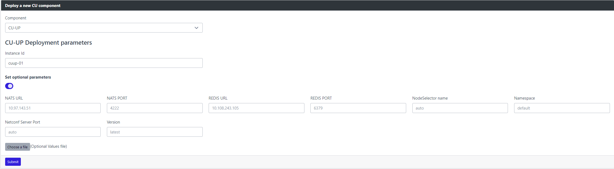
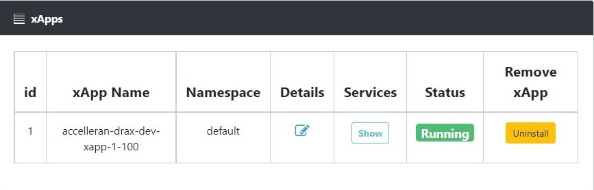
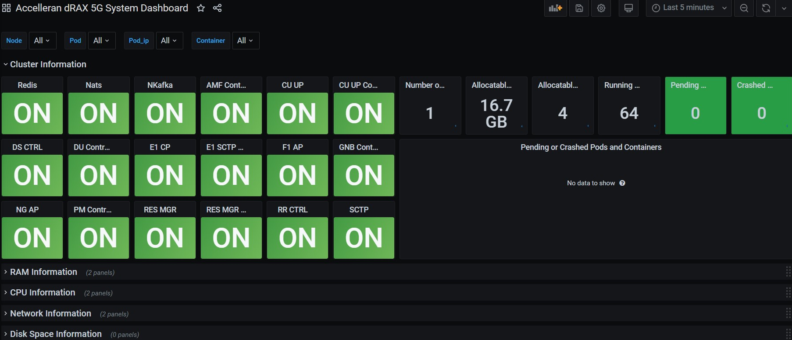

# RIC & CU Installation

## Introduction

This document contains only the minimal set of information to achieve a default installation of dRAX, with some assumptions made such as software and hardware prerequisites as well as Network Configuration.

The first section gives a detailed overview on hardware, software and other requirements that are considered as default prerequisites to install and operate a dRAX installation.
Customers who require a more custom-designed deployment should contact Accelleran's Customer Support team to get a tailored solution.

The second section describes all of the steps needed to deploy and run a new software version of Accelleran's dRAX  for the first time, using provided Helm charts.
This section is split into multiple subsections, including one for the installation of the dRAX base, one for the 4G components, and one for the 5G components.
For a first time installation, it is important to verify of course the SW and HW prerequisites presented in this document before proceeding further.

The third section covers configuration of dRAX, including details on both RAN as well as xApp configuration.

We advise customers who wish to know more about dRAX's architecture to request the full dRAX Architecture User Guide.

## Software and Hardware Prerequisites

The assumption made in this User Guide is that the typical Customer who doesn't want a full turn key dRAX kit is familiar with Server installations, VMs and VNFs

Also, as mentioned in the [Overview](../index.md) section of this document, it is assumed that the Customer has already created a VM with a *$NODE_IP* address in the same subnet of the Server (*$SERVER_IP*) and a linux bridge *br0*.


### Software Requirements have been installed in previous chapter.

1. Linux Ubuntu Server 20.04 LTS
2. Docker (recommended version 19.03, check the latest compatible version with Kubernetes)
3. Permanently disabled swap
4. Kubernetes 1.13 or later till 1.20 (1.21 is currently unsupported)
5. Helm, version 3

### Other Requirements

1. dRAX License, as provided by Accelleran's Customer Support team
2. The Customer Network allows access to internet services
3. a DockerHub account, and have shared the username with the Accelleran team to provide access to the needed images
4. EPC/5GC must be routable without NAT from dRAX (and E1000 DUs in case of 4G)
5. From Accelleran you will need access to the Dockerhub repository
    * please create your account with user, password and email from dockerub

### 4G Specific requirements:

1. A DHCP server must be available on the subnet where the E1000 DUs will be installed
2. E1000 DUs must be in the same subnet as Kubernetes' advertise address (otherwise refer to [Appendix: E1000 on separate subnet](#appendix-drax-and-accelleran-e1000s-on-different-subnets))

### Limitations : 
1. When using a graphical interface, make sure it will not go to sleep or to standby. 

## Installation

### Introduction

This section explains how to install dRAX for the very first time in its default configuration.
Assuming that the Customer has already verified all the prerequisites described in the previous Section 4.
If you already have dRAX and are only updating it, please refer to the [section on updating an existing installation](#updating-existing-installations).

dRAX consists of multiple components:

* RIC and Dashboard (required)
* 4G components based on Accelleran's E1000 DU and 4G CU
* 5G components based on Accelleran's 5G SA CU

You should decide at this point which of these components you intend to install during this process as it will impact many of the steps.

### Plan your deployment

We recommend storing all files created during this installation process inside of a dedicated folder, e.g. _dRAX-yyyymmdd_, so that they are clearly available for when you next update the installation.
These files could also be committed to version control, or backed up to the cloud.

#### Plan parameters

Please determine the following parameters for your setup - these will be used during the installation process.

| Description                                   | Parameter |
| --------------------------------------------- | --------- |
| Kubernetes advertise IP address               | $NODE_IP  |
| The interface where Kubernetes is advertising | $NODE_INT |

#### Prepare License and Certificate

In order to run Accelleran's dRAX software, a License file is required - please contact Accelleran's customer support to request the appropriate license.
This license file will be named **license.crt** and will be used in a later step.

4G Only : If you intend to deploy the 4G aspects of dRAX (together with Accelleran's E1000 4G DUs), you will also need to prepare a certificate to ensure secure communication between the various components.
Please refer to [the Appendix on creating certificates](#appendix-drax-provisioner-keys-and-certificates-generation).
This will also need to be validated and signed by Accelleran's customer support team, so please do this in advance of attempting the installation.

#### Namespaces

The definition of namespaces is optional and should be avoided if there is no specific need to define them in order to separate the pods and their visibility, as it brings in a certain complexity in the installation, the creation of secrets, keys, and the execution of kubernetes commands that is worth being considered upfront. At the preference of the customer, additional Kubernetes namespaces may be used for the various components which will be installed during this process.
Kubernetes namespaces should be all lowercase letters and can include the "-" sign.

As mentioned, extra steps or flags must be used with most of the commands that follow. The following table describes the different “blocks” of components, and for each, a distinct namespace that may be used, as well as the default namespace where these components will be installed.

| Description          | Parameter   | Default Namespace |
| -------------------- | ----------- | ----------------- |
| Core dRAX components | `$NS_DRAX`  | default           |
| dRAX 4G CUs          | `$NS_4G_CU` | `$NS_DRAX`        |
| dRAX 5G CUs          | `$NS_5G_CU` | default           |

The Default Namespace column sometimes contains another Namespace placeholder, e.g. the NS_4G_CU default is $NS_DRAX - this means that the default behaviour is to run the CUs in the $NS_DRAX namespace, but it can be overridden.
If neither $NS_DRAX nor $NS_4G_CU is specified, the CU will run in the "default" namespace.

### Install dRAX for the first time 
When you are not dealing with a new installation you can skip this chapter and move to chapter "Updating existing installation" 

#### install helm
if helm is not yet installed install it this way

```
curl -fsSL -o get_helm.sh https://raw.githubusercontent.com/helm/helm/main/scripts/get-helm-3
```
```
chmod 700 get_helm.sh
```
```
./get_helm.sh
```

#### Add Accelleran Helm Chart Repo

Use the helm command:

``` bash
helm repo add acc-helm https://accelleran.github.io/helm-charts/
```

#### Update Helm Charts

To update to our latest version, we need to update the Helm charts:

``` bash
helm repo update
```


#### Create namespace(s) for dRAX (optional)

If you choose to use dedicated namespaces for dRAX, please create them before the installation process.

```
export NS_DRAX=$NS_DRAX
``` 

``` bash
kubectl create namespace $NS_DRAX
```

This needs to be repeated for each namespace that you wish to use for dRAX, either for the RIC, 4G or 5G components, as per the table in [the Namespaces section](#namespaces).

!!! warning
    If you choose to use specific namespaces, special care must be used throughout the remaining steps when executing the kubectl commands.
    For each one, it is important to specify the appropriate namespace using the -n option, example:

``` bash
set -x
kubectl get pods -n $NS_DRAX
set +x
```

#### Configure DockerHub credentials in Kubernetes

If you have previously obtained (from the Customer Support) access to Accelleran Dockerhub repository, you can now proceed to create a secret named `accelleran-secret` with your DockerHub credentials, specifically using the kubectl command (do not forget the `-n <namespace>` option if you selected different namespaces previously):

``` bash
kubectl create secret docker-registry accelleran-secret --docker-server=docker.io --docker-username=$DOCKER_USER --docker-password=$DOCKER_PASS --docker-email=$DOCKER_EMAIL
```

This needs to be repeated for each namespace that you created previously, specifying each namespace one time using the -n flag.

#### Configure License in Kubernetes

Create a secret named `accelleran-license` using the previously provided License file.
The name of this secret is critical - this name is used in our Helm charts to access the License file.
Please refer to [the previous section on the License file](#prepare-license-and-certificate) if you don't yet have one.

``` bash
kubectl create secret generic accelleran-license --from-file=license.crt
```
> Note: if you need for any reason to use a license file with a different (ex. myfile) name the command is a bit more cumbersome:
>
> ``` bash
> kubectl create secret generic accelleran-license --from-file=license.crt=myfile
> ```

This needs to be repeated for each namespace that you created previously, specifying each namespace one time using the -n flag.

### Install dRAX RIC and Dashboard

#### Prepare RIC values configuration file

We first have to prepare the Helm values configuration file for the dRAX RIC and Dashboard Helm chart.
To do so, we first retrieve the default values file from the Helm chart repository and save it to a file named `ric-values.yaml`.
We do this with the following command:

``` bash
curl https://raw.githubusercontent.com/accelleran/helm-charts/${RIC_VERSION}/ric/simple-values/simple-values.yaml  > ric-values.yaml
```

Next, edit the newly created `ric-values.yaml` file.
Find the following fields and edit them according to your setup.
We use parameters from the [Plan your deployment](#plan-parameters) section, such as 
* `$NODE_IP`, to show what should be filled in

In the example below we disabled 4G assuming we don't install the 4G component.

``` yaml
global:
    kubeIp: $NODE_IP
    enable4G: false
    # Enable the components that you intend to install
    # Note that these must also be supported by the License you have
```

#### Enabling 5G components

If you plan to install the 5G components (and you have the license to support this), you need to make a few other adjustments to the `ric-values.yaml` file:
Let the $E1_CU_IP and $F1_CU_IP be the last in the range of ip addresses in the file below. Of which the $F1_CU_IP is the last one in the range and is the odd number in the LSB of the ipv4. eg: RANGE=10.10.10.110-10.10.10.121 , E1=10.10.10.120, F1=10.10.10.121

``` yml
global:
    enable5G: true
acc-5g-infrastructure:
    metallb:
        configInline:
            address-pools:
                - name: default
                  protocol: layer2
                  # IP pool used for E1, F1 and GTP interfaces when exposed outside of Kubernetes
                  addresses:
                      - $LOADBALANCER_IP_RANGE
```

> NOTE : The IP pool which is selected here will be used by [MetalLB](https://metallb.universe.tf/), which we use to expose the E1, F1, and GTP interfaces to the
> external O-RAN components, such as the DU, and the 5GCore. In other words, the CUCP E1, CUCP F1 and the CUUP GTP IP addresses will be taken from the specifed pool:

``` bash
$ kubectl get services
#NAME                                             TYPE           CLUSTER-IP       EXTERNAL-IP     PORT> S)                                                                                     AGE
 #acc-5g-cu-cp-cucp-1-sctp-e1                      LoadBalancer   10.107.230.196   192.168.88.170  38462:31859/SCTP                                                                            3h35m
 #acc-5g-cu-cp-cucp-1-sctp-f1                      LoadBalancer   10.99.246.255    192.168.88.171  38472:30306/SCTP                                                                            3h35m
 #acc-5g-cu-up-cuup-1-cu-up-gtp-0                  LoadBalancer   10.104.129.111   192.168.88.160  2152:30176/UDP                                                                              3h34m
 #acc-5g-cu-up-cuup-1-cu-up-gtp-1                  LoadBalancer   10.110.90.45     192.168.88.161  2152:30816/UDP                                                                              3h34m
```

> NOTE : MetalLB works by handling ARP requests for these addresses, so the external components need to be in the same L2 subnet in order to access these interfaces.
> To avoid difficulties, it's recommended that this IP pool is unique in the wider network and in the same subnet of your Kubernetes Node

 
#### Enabling 4G components
4G Only : when you don't need 4G you can skip and move on to chapter [Install the dRAX RIC and Dashboard](#install-the-drax-ricand-dashboard) where the RIC is actually being installed.

If you are not planning any 4G deployment you can skip this section and proceed to the **Install the dRAX RIC and Dashboard** section

###### 4G : Prepare keys and certificates for the dRAX Provisioner

The working assumption is that keys and certificates for the dRAX Provisioner have been created by the Accelleran Support Team, however, for a more detailed guide, please check the [Appendix: dRAX Provisioner - Keys and Certificates Generation](#appendix-drax-provisioner-keys-and-certificates-generation) of this document.

###### 4G : Create configMaps for the dRAX Provisioner

We now need to store the previously created keys and certificates as configMaps in Kubernetes, so that they can be used by the dRAX Provisioner:

``` bash
kubectl create configmap -n $NS_DRAX_4G prov-server-key --from-file=server.key
kubectl create configmap -n $NS_DRAX_4G prov-server-crt --from-file=server.crt
kubectl create configmap -n $NS_DRAX_4G prov-client-crt --from-file=client.crt
kubectl create configmap -n $NS_DRAX_4G prov-client-key --from-file=client.key
kubectl create configmap -n $NS_DRAX_4G prov-ca-crt --from-file=ca.crt
```

!!! warning
    The names of these configmaps are critical - these names are referenced specifically in other parts of Accelleran's software.

###### 4G : Prepare the values configuration file
If you plan to install the 4G components (and you have the license to support this), you need to make a few other adjustments in the ric-values.yaml file 

we first need to enable the 4G components:

``` yaml
global:
    enable4G: true    
```

Find and update the following fields with the names of the Namespaces which you've chosen to use:

``` yaml
4g-radio-controller:
  config:
    # The namespace where the 4G CU pods will be installed
    l3Namespace: "$NS_4G_CU"
```

Finally, if you are using the Provisioner, you need to configure the provisioner-dhcp component.
This component is using the DHCP protocol, and hence needs to know the default interface of the machine where dRAX is installed.
This interface will be used to reach the cells, hence make sure the cells are reachable through the interface specified here.
The configuration is located here:

``` yaml
provisioner-dhcp:
  configuration:
    Interface: eno1
```

Here, change `eno1` to the intended interface on your machine.


##### 4G : Pre-provisioning the list of E1000 DUs

If you already have access to the Accelleran E1000 DUs that you wish to use with this dRAX installation, we can pre-provision the information regarding these during installation.
This can also be done later, or if new E1000 DUs are added.

Each Accelleran E1000 has a Model, a Hardware Version, and a Serial Number - this information is displayed on the label attached to the unit, and is required in order to pre-provision the DUs.
A unique identifier is constructed from this information in the following format: `Model-HardwareVersion-SerialNumber`.
This identifier is then listed, along with a unique name, for each E1000.
This name could be as simple as `du-1` - all that matters is that it is unique in this dRAX installation.

Edit the `drax-4g-values.yaml` file, adding a new line for each E1000 that you would like to pre-provision:

``` yaml
configurator:
    provisioner:
        # Pre-provision the E1000 4G DUs, create a list of identifier: name as shown below
        cells:
            E1011-GC01-ACC000000000001: du-1
            E1011-GC01-ACC000000000002: du-2
```

(In this example, the E1000 specific Model is E1011, the Hardware Version is GC01, and the Serial Numbers were 0001, and 0002. Update this according to the values of your E1000s.)

!!! note
    If your dRAX installation and Accelleran E1000s will not be on the same subnet, after completing the previous step, please also follow [Appendix: dRAX and Accelleran E1000s on different subnets](#appendix-drax-and-accelleran-e1000s-on-different-subnets).


###### 4G : Update E1000 DUs

The Accelleran E1000 DUs need to be updated to match the new version of dRAX.
The following steps will guide you through this update process.
As a prerequisite, the E1000s must be powered on, and you must be able to connect to them via SSH.
If you do not have an SSH key to access the E1000s, contact Accelleran's support team.

###### 4G : Download the E1000 update files

There is a server included with the dRAX installation that hosts the E1000 update files.
Depending on the E1000 type (FDD or TDD), you can grab those files using the following command:

``` bash
curl http://$NODE_IP:30603/fdd --output fdd-update.tar.gz
curl http://$NODE_IP:30603/tdd --output tdd-update.tar.gz
```

!!! note
    Please replace the $NODE_IP with the advertised address of your Kubernetes

###### 4G : Update software of E1000

Copy the TDD or FDD image to the E1000 in /tmp/.
For example:

``` bash
scp -i ~/guest.key tdd-update.tar.gz guest@<ip_of_e1000>:/tmp/update.tar.gz
```

SSH into the E1000:

``` bash
ssh -i guest.key guest@<ip_of_e1000>
```

Now execute:

``` bash
do_update.sh
```

###### 4G : Verify the update of E1000 on the unit and the alignment with dRAX version

To validate that the newly updated software matches with the installed version of dRAX, we can run the following steps:

SSH into the E1000:

``` bash
ssh -i guest.key guest@<ip_of_e1000>
```

Note down the Git commit of the newly installed software:

``` bash
strings /mnt/app/acc.tar | grep Git
```

Now on the dRAX server, we need to retrieve the Git commit of the `4g-radio-controller` to compare.

Find the correct pod name using this command:

``` bash
kubectl get pods | grep 4g-radio-controller
```

With the full pod name, run the following command (replace xxx with the correct identifier from the previous command):

``` bash
kubectl exec -it drax-4g-4g-radio-controller-xxxx -- cat /data/oranC | strings | grep Git
```

The two commits must match, if not please verify the installation and contact Accelleran for support.

### Install the dRAX RIC and Dashboard

Install the RIC and Dashboard with Helm (if installing without dedicated namespaces, leave off the -n option):

``` bash
helm install ric acc-helm/ric --version $RIC_VERSION --values ric-values.yaml -n $NS_DRAX
```
!!! info
    The installation may take up to 5 minutes, it is essential that you wait till the installation is completed and all the pods are in RUNNING or COMPLETE mode, please do **NOT** interrupt the installation by trying to regain control of the command line

To check if the installation was successful first use Helm:

``` bash
helm list
#NAME	NAMESPACE	REVISION	UPDATED                                	STATUS	        CHART    	 APP VERSION
#ric 	default  	1       	2022-08-30 12:23:24.894432912 +0000 UTC	deployed	ric-5.0.0	 5.0.0      
```

Than view the pods that have been created.
``` bash
watch kubectl get pod
```

You should see something like this. You can ignore the status of Jaeger in this release. It is not used at the moment.
> ```
> NAME                                                 READY   STATUS             RESTARTS   AGE
> ric-acc-fiveg-pmcounters-6d47899ccc-k2w66            1/1     Running            0          56m
> ric-acc-kafka-955b96786-lvkns                        2/2     Running            2          56m
> ric-acc-kminion-57648f8c49-g89cj                     1/1     Running            1          56m
> ric-acc-service-monitor-8766845b8-fv9md              1/1     Running            1          56m
> ric-acc-service-orchestrator-869996756d-kfdfp        1/1     Running            1          56m
> ric-cassandra-0                                      1/1     Running            1          56m
> ric-cassandra-1                                      1/1     Running            5          54m
> ric-dash-front-back-end-85db9b456c-r2l6v             1/1     Running            1          56m
> ric-fluent-bit-loki-jpzfc                            1/1     Running            1          56m
> ric-grafana-7488865b58-nwqvx                         1/1     Running            2          56m
> ric-influxdb-0                                       1/1     Running            1          56m
> ric-jaeger-agent-qn6xv                               1/1     Running            1          56m
> ric-kube-eagle-776bf55547-55f5m                      1/1     Running            1          56m
> ric-loki-0                                           1/1     Running            1          56m
> ric-metallb-controller-7dc7845dbc-zlmvv              1/1     Running            1          56m
> ric-metallb-speaker-vsvln                            1/1     Running            1          56m
> ric-metrics-server-b4dd76cbc-hwf6d                   1/1     Running            1          56m
> ric-nats-5g-0                                        3/3     Running            3          55m
> ric-nkafka-5g-76b6558c5f-zs4np                       1/1     Running            1          56m
> ric-prometheus-alertmanager-7d78866cc6-svxc5         2/2     Running            2          56m
> ric-prometheus-kube-state-metrics-585d88b6bb-6kx5l   1/1     Running            1          56m
> ric-prometheus-node-exporter-pxh6w                   1/1     Running            1          56m
> ric-prometheus-pushgateway-55b97997bf-xb2m2          1/1     Running            1          56m
> ric-prometheus-server-846c4bf867-ff4s5               2/2     Running            2          56m
> ric-redis-5g-6f9fbdbcf-j447s                         1/1     Running            1          56m
> ric-vector-84c8b58dbc-cdtmb                          1/1     Running            0          56m
> ric-vectorfiveg-6b8bf8fb4c-79vl7                     1/1     Running            0          56m
> ric-zookeeper-0                                      1/1     Running            1          56m
> ```

### Install dRAX 5G Components
> NOTE : when you can't reach the VM from the server the browser is running you can add some iptables in the DU server ( the bare metal ).
> ``` bash
> sudo iptables -A PREROUTING -t nat -p tcp --dport 31315 -j DNAT --to $NODE_IP:31315
> sudo iptables -A FORWARD -p tcp -d $NODE_IP --dport 31315 -j ACCEPT
> ```
> use URL ```http://<external-ip-du-server>:31315/``` to access the drax dashboard
> to make these ip rules persistent perform
> ``` bash
> sudo apt install iptables-persistent
> chown $USER /etc/iptables/rules.v4
> chmod 775 /etc/iptables/rules.v4
> sudo iptables-save > /etc/iptables/rules.v4
> ```

Accelleran's 5G Components are managed and installed via the Dashboard.
From the dRAX Dashboard sidebar, select **New deployment** and then click **5G CU deployment**:

<p align="center">
  
</p>


You will reach the **Deploy a new CU component** page.
Here, you have the ability to deploy either a CU-CP or a CU-UP component.
Therefore, you first have to pick one from the drop-down menu:

<p align="center">
  
</p>


#### 5G CU-CP Installation

When installing the 5G CU-CP component, there are a number of configuration parameters that should be filled in the **Deploy a new CU component** form once the CU-CP is chosen from the drop-down menu.

The form with the deployment parameters is shown below:
> NOTE : fill in the E1 and F1 address manually according to what's set in the Preperation section in the start of this installation document.
> for F1 it will be the ip address we will also configure the DU with.


###### Required Parameters

The deployment parameters are split into required and optional ones.

It is important to pay attention to certain constraints on two of the parameters in order to obtain the desired installation:

- The Instance ID must consist of no more than 16 **lower case** alphanumeric characters or '-', start with an alphabetic character, and end with an alphanumeric character (e.g. 'my-name',  or 'abc-123', but not 123-cucp)
- The maximum number of UE that can be admitted depends also on how many ds-ctrl components get created (by default one per UE) so because occasionally at attach the UE may need two of such components, as a rule of thumb the desired maximum number of UEs must be doubled: if you intend to have at most 2 UEs, set the maximum number of UEs to 4

The required parameters are:

| Required Parameter         | Description                                                                              |
| -------------------------- | ---------------------------------------------------------------------------------------- |
| Instance ID                | The instance ID of the CU-CP component - this must be unique across all CU-CP and CU-UPs |
| Number of supported AMFs   | The maximum number of AMFs which can be connected to at any time                         |
| Number of supported CU-UPs | The maximum number of CU-UPs which can be connected to at any time                       |
| Number of supported DUs    | The maximum number of DUs which can be connected to at any time                          |
| Number of supported RUs    | The maximum number of RUs which can be supported at any time                             |
| Number of supported UEs    | The maximum number of UEs which can be supported at any time                             |

Once the deployment parameters are set, click the submit button to deploy the 5G CU-CP.

###### Optional Parameters

The optional parameters are auto-discovered and auto-filled by dRAX.
As such they do not need to be changed.
However, depending on the use case, you may want to edit them.
In this case, you first have to toggle the **Set optional parameters** to **ON**.
The optional parameters are:

| Optional Parameter      | Description |
| ------------------      | ----------- |
| NATS URL/Port           | Connection details towards NATS. When installing the RIC and Dashboard component, if you set the `enable5g` option to true, a NATS server was deployed, which will be auto-discovered. |
| Redis URL/Port          | Connection details towards Redis. Similar to NATS, if you set the `enable5g` option to true, a Redis server was deployed, which will be auto-discovered. |
| dRAX Node Selector name | If you label your Kubernetes node with the label `draxName`, you can specify the value of that label here and force the CU component to be installed on a specific node in the cluster. |
| Namespace               | The namespace where the CU component should be installed. |
| E1 Service IP           | Part of the CU-CP is the E1 interface. The 5G component will be exposed outside of Kubernetes on a specific IP and the E1 port of 38462. This IP is given by MetalLB, which is part of the 5G infrastructure. If this field is set to auto, MetalLB will give out the first free IP, otherwise you can specify the exact IP to be used. NOTE: The IP must be from the MetalLB IP pool defined in [Enabling 5G components](#enabling-5g-components). |
| F1 Service IP           | Similar to E1, you can specify the IP to be used for the F1 interface. NOTE: Again it has to be from the MetalLB IP pool defined in [Enabling 5G components](#enabling-5g-components). |
| NETCONF Server Port     | The NETCONF server used for configuring the 5G CU-CP component is exposed on the host machine on a random port. You can override this and set a predefined port. NOTE: The exposed port has to be in the Kubernetes NodePort range. |
| Version                 | This is the version of the 5G CU component. By default, the latest stable version compatible with the dRAX version is installed. Other released versions can be specified, but compatibility is not guaranteed. |

#### 5G CU-UP Installation

When deploying the 5G CU-UP component, there is only one required parameter in the **Deploy a new CU component** form.
The form with the deployment parameters is shown below:



###### Required Parameters

The required deployment parameter is:

| Required Parameter | Description |
| ------------------ | ----------- |
| Instance ID        | The instance ID of the CU-UP component. As before, the Instance ID must be unique, different from the relative CU-CP and must consist of at most 16 lower case alphanumeric characters or '-', start with an alphabetic character, and end with an alphanumeric character (e.g. 'my-name',  or 'abc-123'). 

###### Optional Parameters

Optional parameters are auto-discovered and auto-filled by dRAX.
As such they do not need to be changed.
However, depending on the use case, you may want to edit them.
In this case, you first have to toggle the **Set optional parameters** to **ON**.
The optional parameters are:

| Optional Parameter      | Description |
| ----------------------- | ----------- |
| NATS URL/Port           | The details where the NATS is located. When installing the RIC and Dashboard component, if you set the enable5g option to true, the 5G infrastructure will be deployed, which includes the 5G NATS. This NATS is auto-discovered and auto-filled here |
| Redis URL/Port          | Like NATS, a 5G REDIS is deployed and autofilled |
| dRAX Node Selector name | If you label your Kubernetes node with the label `draxName`, you can specify the value of that label here and force the CU component to be installed on a specific node in the cluster |
| Namespace               | The namespace where the CU component will be installed |
| NETCONF Server Port     | The NETCONF server used for configuring the 5G CU-UP component is exposed on the host machine on a random port. You can override this and set a predefined port. NOTE: The exposed port has to be in the Kubernetes NodePort range. |
| Version                 | This is the version of the 5G CU component. By default, the latest stable version compatible with the dRAX version is installed. Other versions can be specified, but compatibility is not guaranteed |

Now the installation of CU is done. To see the pods and services execute following steps. Here is what to expect.


### Optional : Install xApps 
For a basic installation you can skip this chapter.

Compatible xApps can be managed and installed via the Dashboard.
This can be achieved by clicking on **New deployment** in the sidebar, and then clicking **xApp deployment:**

<p align="center">
  
</p>

In the resulting form, xApps can be deployed either from a remote Helm repository or by uploading a local packaged Helm chart file.


In the "Metadata" section of the form, the user inputs information regarding the xApp name, the organization and team who own the xApp, the version of the xApp Helm Chart and the namespace where the xApp will be deployed on.

When deploying an xApp from a remote Helm repository, the user needs to specify the name of the remote repository, its URL and the Helm chart name.
Optionally, the user can upload a values configuration file to override the default configuration present in the remote Helm Chart.

When deploying an xApp using the second method, the user can upload a local packaged Helm chart (a .tgz file produced by the command "helm package &lt;chartName>") which contains the dRAX compatible xApp and optionally an accompanying values configuration file.

<p align="center">
  
</p>


Upon clicking the "Submit" button, the xApp will be deployed on the user-defined namespace in Kubernetes following the naming convention "organization-team-xappname-version".

## dRAX Configuration

dRAX configuration is split into multiple subsections which mirrors the microservice approach central to dRAX's design.
Most of the configuration can be managed via the Dashboard.
The Dashboard is accessible at [http://$NODE_IP:31315](http://$NODE_IP:31315).

### xApp Configuration

xApps can be configured via our Dashboard.
From the sidebar, select the **xApps Management **section, and then click **Overview**:

<p align="center">
  
</p>

You will be presented with a list of installed xApps - you can click on the icon in the Details column to access further information on the xApp:



From the following page, you will be presented with information on the behaviour of the xApp and the topics that the xApp consumes and produces - the exact information is dependent on the vendor of the xApp.
Configuration of the xApp is now managed in the Configuration Parameters section - it may need to be expanded with the collapse/expand button at the top right of the section.

You can also expand the Services, by clicking the Show button in the Services column.
This will show all the services used and exposed by the xApp, including the port information.

### 4G E1000 Provisioning

When you don't use 4G you can skip this and go to [5G Configuration](#5g-configuration)

The certificates and keys referenced in this section are those mentioned in the [Prepare keys and certificates for the dRAX Provisioner section](#prepare-keys-and-certificates-for-the-drax-provisioner).
These are required so that the onboarding of new E1000s is a secure process.

#### Listing currently provisioned E1000s

The current list of provisioned E1000s can be retrieved with the following command:

``` bash
curl --cacert ca.crt https://$NODE_IP:31610/get/
```

#### Provisioning additional Accelleran E1000 DUs

Each additional E1000 DU, which is to be used with this dRAX installation, needs to be provisioned.
This is only needed for E1000 DUs which were not pre-provisioned during the installation process.

###### Determine Unique Identifier

Each Accelleran E1000 has a Model, a Hardware Version, and a Serial Number - this information is displayed on the label attached to the unit, and is required in order to pre-provision the DUs.
A unique identifier is constructed from this information in the following format:

```
Model-HardwareVersion-SerialNumber
```

This identifier can also be determined automatically via SSH using the following command:

``` bash
echo "$(eeprom_vars.sh -k)-$(eeprom_vars.sh -v)-$(eeprom_vars.sh -s)"
```

Each E1000 also needs to be given a unique name.
This name could be as simple as "du-1" - all that matters is that it is unique in this dRAX installation.

###### Prepare configuration file

To provision a new E1000, create a new file called `cellconfig.yaml` with the following contents:

``` yaml
E1011-GC01-ACC000000000001:
     redis:
         hostname: $NODE_IP
         port: 32000
     loki:
         hostname: $NODE_IP
         port: 30302
     instance:
        filter: du-1
```

Replace the unique identifier based on the specific E1000, replace `$KUBE_IP` with the correct IP for your installation, and replace `du-1` with the chosen unique name for this DU.

If you'd like to provision multiple E1000s at once, duplicate the above snippet for each additional E1000, updating the unique identifier and the name in each case.
Make sure to match the indentation in each duplicated snippet - **incorrect indentation will result in an error.**
It's recommended to keep these snippets all in the same file so that we can push the new configuration with a single command.

###### Push new configuration

Now run the following command to push this configuration to the Provisioner:

``` bash
curl --cacert ca.crt --cert client.crt --key client.key https://$NODE_IP:31610/push/ --data-binary @cellconfig.yaml
```

#### Changing the name of an E1000

The name of a specific E1000 can be updated if required in a slightly more straightforward manner.
First determine the unique identifier - refer to the [Determine Unique Identifier section](#determine-unique-identifier) above for the exact instructions.
Use the following command, replacing `$KUBE_IP` with the correct IP for your installation, the unique identifier with that just determined, and replacing `du-1` with the new name:

``` bash
curl --cacert ca.crt --cert admin.crt --key admin.key https://_$NODE_IP:31610_/set/E0123-GC01-ACC0123456978901/instance/filter -d du-1
```

#### 4G RAN Configuration

Configuration of the 4G RAN is made simple, intuitive and efficient when using the dRAX Dashboard.

Note: all of these options require the Accelleran E1000s to already have been provisioned as described in the [E1000 Provisioning section](#e1000-provisioning) above, or during the installation process.

#### eNB Configuration via eNB list

To access the configuration page for an eNB, first click on the **RAN Configuration** section, and then click on **eNB Configuration.**
From the displayed list of eNBs, click on the Cog icon in the Edit column corresponding to the eNB you'd like to reconfigure.


From the following screen, the configuration of this eNB can be adjusted.
Once the configuration has been updated as desired, click on the **Create** button at the bottom left of the page:


Notes:

1. Make sure the Cell ID is a multiple of 256, you can submit Cell IDs that are not a multiple of 256, however this will result in a Macro eNB ID that looks different on the surface, 
2. There is no conflict or error check in manual mode, therefore for instance it is possible to configure two cells with the same ID, set an EARFCN that is out of band, and so on: it is assumed that the User is aware of what he/she tries to set up
3. The reference signal power is calculated automatically from the output power, please adjust the output power in dBm which represent the maximum power per channel at the exit without antenna gain

#### eNB Configuration via Dashboard

An alternative way of configuring an individual eNB is to make use of the **Dashboard** initial page (click on **Dashboard** in the sidebar to return there).
Click on the eNB in the Network Topology, and then choose **Configure Cell** on the **Selected Node** window at the right: this will take you to the  **eNB Configuration** page and described in the previous section.


### 5G RAN Configuration

If you have a dRAX License for 5G, have enabled 5G during the RIC and Dashboard installation in [Enabling 5G components](#enabling-5g-components), and have deployed the CU components as instructed in [Install dRAX 5G Components](#install-drax-5g-components), you can now configure the 5G CU components.
You can do so by navigating to **RAN Configuration** in the dRAX Dashboard sidebar and clicking the **gNB Configuration**:

<p align="center">
  
</p>


You will reach the 5G CU components configuration page:


On this page there are two lists, one for CU-CPs and one for CU-UPs.
You can click the icon under the Edit column of each CU component to edit its configuration.
When you deploy the 5G CU component and click this button for the first time, you will be asked to set the initial configuration.
Later on, you can click this button to edit the configuration.

#### 5G CU-CP configuration

The 5G CU-CP components have a number of parameters that you can set as can be seen below:

* PLMN ID: The PLMN ID to be used
* GNB ID: The GNB ID
* GNB CU-CP name: A friendly name of the 5G CU-CP component
* AMF NG interface IP Address: You can click on the (+) sign in the table to expand it like on the figure below. You can now Add Rows to add multiple AMF NG interface IP addresses, or delete them using the Delete Row field. Edit the **NG Destination IP Address** to be the AMF NG IP address of your setup. This IP is the $CORE_IP.

The values can be displayed like this
``` bash
env | grep -e CORE_IP -e PLMN 
#CORE_IP=192.168.88.5
#PLMN_ID=253.88
```
Click the **Submit** button to send the configuration.


#### 5G CU-UP configuration

The 5G CU-UP has a number of configuration parameters as seen below:

* GNB CU-UP ID: The 3GPP ID of the CU-UP component.
* GNB CU-UP name: The 3GPP friendly name of the CU-UP component,
* E1 Links: You can Add Row or Delete Rows using the button. Here we add the E1 IP address of the CU-CP component that this CU-UP component will connect to. Enter the E1 IP under **E1 Destination IP Address.** This IP is the $E1_CU_IP . 
* Supported PLMN Slices; Expand the table by clicking the (+) sign. You can now Add Rows or Delete Rows to add multiple PLMN IDs. For each PLMN ID, you can Add Rows to add slices or Delete Rows to delete slices. Each slice is defined by the Slice Type and Slice Differentiator.

Show the values that have been prepared like this.
``` bash
env | grep -e E1 -e PLMN
```


#### Install XDP
This chapter will improve the CU performance.

go to the CU VM

``` bash
ssh $USER@$NODE_IP
```

login to docker

``` bash
docker login -u $DOCKER_USER -p $DOCKER_PASS
```

To create the xdp pod execute following script. This script has been cloned to the system on the first page of this install guide.
``` bash
$HOME/install/drax-install/bin/deploy_xdp_ups_pod.sh -g $NODE_IP
```

> NOTE : in case the POD is not getting in the running state execute
>
> ``` docker pull accelleran/xdpupsappl:$CU_VERSION ```
>

## Verifying the dRAX installation

### Monitoring via the Kubernetes API

As specified in the previous sections of this document, the installation of Accelleran dRAX consists of multiple components.
Exactly which are installed depends on the choices made during the installation process.
All Pods that have been installed should be running correctly at this point though.
To verify this, we can use the following command:

``` bash
watch "kubectl get pods -A | grep -e ric- -e drax-4g- -e acc-5g- -e l3-"
```
This is what to expect

```
NAME                                                     READY   STATUS             RESTARTS   AGE
acc-5g-cu-cp-cucp-01-amf-controller-5cb5d654fd-p75n9     1/1     Running            0          7m15s
acc-5g-cu-cp-cucp-01-cu-up-controller-75859656cd-t9shf   1/1     Running            0          7m14s
acc-5g-cu-cp-cucp-01-ds-ctrl-0                           1/1     Running            0          7m15s
acc-5g-cu-cp-cucp-01-ds-ctrl-1                           1/1     Running            0          6m39s
acc-5g-cu-cp-cucp-01-ds-ctrl-10                          1/1     Running            0          6m18s
acc-5g-cu-cp-cucp-01-ds-ctrl-11                          1/1     Running            0          6m16s
acc-5g-cu-cp-cucp-01-ds-ctrl-12                          1/1     Running            0          6m15s
acc-5g-cu-cp-cucp-01-ds-ctrl-13                          1/1     Running            0          6m14s
acc-5g-cu-cp-cucp-01-ds-ctrl-14                          1/1     Running            0          6m13s
acc-5g-cu-cp-cucp-01-ds-ctrl-15                          1/1     Running            0          6m11s
acc-5g-cu-cp-cucp-01-ds-ctrl-2                           1/1     Running            0          6m36s
acc-5g-cu-cp-cucp-01-ds-ctrl-3                           1/1     Running            0          6m34s
acc-5g-cu-cp-cucp-01-ds-ctrl-4                           1/1     Running            0          6m31s
acc-5g-cu-cp-cucp-01-ds-ctrl-5                           1/1     Running            0          6m29s
acc-5g-cu-cp-cucp-01-ds-ctrl-6                           1/1     Running            0          6m27s
acc-5g-cu-cp-cucp-01-ds-ctrl-7                           1/1     Running            0          6m25s
acc-5g-cu-cp-cucp-01-ds-ctrl-8                           1/1     Running            0          6m23s
acc-5g-cu-cp-cucp-01-ds-ctrl-9                           1/1     Running            0          6m20s
acc-5g-cu-cp-cucp-01-du-controller-8477b5f5c8-69j26      1/1     Running            0          7m15s
acc-5g-cu-cp-cucp-01-e1-cp-0                             1/1     Running            0          7m15s
acc-5g-cu-cp-cucp-01-f1-ap-0                             1/1     Running            0          7m15s
acc-5g-cu-cp-cucp-01-f1-ap-1                             1/1     Running            0          6m48s
acc-5g-cu-cp-cucp-01-f1-ap-2                             1/1     Running            0          6m43s
acc-5g-cu-cp-cucp-01-gnb-controller-7d666fdfdd-lps9c     1/1     Running            0          7m14s
acc-5g-cu-cp-cucp-01-netconf-8974d4495-f5mln             1/1     Running            0          7m15s
acc-5g-cu-cp-cucp-01-ng-ap-0                             1/1     Running            0          7m15s
acc-5g-cu-cp-cucp-01-pm-controller-7869f89778-hf228      1/1     Running            0          7m15s
acc-5g-cu-cp-cucp-01-res-mgr-cd6c87484-2v8s4             1/1     Running            0          7m15s
acc-5g-cu-cp-cucp-01-rr-ctrl-0                           1/1     Running            0          7m15s
acc-5g-cu-cp-cucp-01-rr-ctrl-1                           1/1     Running            0          6m43s
acc-5g-cu-cp-cucp-01-rr-ctrl-2                           1/1     Running            0          6m41s
acc-5g-cu-cp-cucp-01-sctp-f46df5cfb-4kzxh                1/1     Running            0          7m15s
acc-5g-cu-up-cuup-01-cu-up-0                             1/1     Running            0          6m54s
acc-5g-cu-up-cuup-01-cu-up-1                             1/1     Running            0          6m54s
acc-5g-cu-up-cuup-01-e1-sctp-up-868897844f-xh4rx         1/1     Running            0          6m54s
acc-5g-cu-up-cuup-01-netconf-6746749b49-kdqbq            1/1     Running            0          6m54s
acc-5g-cu-up-cuup-01-pm-controller-up-57f874bbdb-ttg5k   1/1     Running            0          6m54s
acc-5g-cu-up-cuup-01-res-mgr-up-589689966c-9txd8         1/1     Running            0          6m54s
busybox                                                  1/1     Running            2          160m
ric-acc-fiveg-pmcounters-6d47899ccc-k2w66                1/1     Running            0          71m
ric-acc-kafka-955b96786-lvkns                            2/2     Running            2          71m
ric-acc-kminion-57648f8c49-g89cj                         1/1     Running            1          71m
ric-acc-service-monitor-8766845b8-fv9md                  1/1     Running            1          71m
ric-acc-service-orchestrator-869996756d-kfdfp            1/1     Running            1          71m
ric-cassandra-0                                          1/1     Running            1          71m
ric-cassandra-1                                          1/1     Running            5          69m
ric-dash-front-back-end-85db9b456c-r2l6v                 1/1     Running            1          71m
ric-fluent-bit-loki-jpzfc                                1/1     Running            1          71m
ric-grafana-7488865b58-nwqvx                             1/1     Running            2          71m
ric-influxdb-0                                           1/1     Running            1          71m
ric-jaeger-agent-qn6xv                                   1/1     Running            1          71m
ric-jaeger-collector-55597cfbbc-r9mdh                    0/1     CrashLoopBackOff   19         71m
ric-jaeger-query-774f759bb6-jz7jc                        1/2     CrashLoopBackOff   19         71m
ric-kube-eagle-776bf55547-55f5m                          1/1     Running            1          71m
ric-loki-0                                               1/1     Running            1          71m
ric-metallb-controller-7dc7845dbc-zlmvv                  1/1     Running            1          71m
ric-metallb-speaker-vsvln                                1/1     Running            1          71m
ric-metrics-server-b4dd76cbc-hwf6d                       1/1     Running            1          71m
ric-nats-5g-0                                            3/3     Running            3          70m
ric-nkafka-5g-76b6558c5f-zs4np                           1/1     Running            1          71m
ric-prometheus-alertmanager-7d78866cc6-svxc5             2/2     Running            2          71m
ric-prometheus-kube-state-metrics-585d88b6bb-6kx5l       1/1     Running            1          71m
ric-prometheus-node-exporter-pxh6w                       1/1     Running            1          71m
ric-prometheus-pushgateway-55b97997bf-xb2m2              1/1     Running            1          71m
ric-prometheus-server-846c4bf867-ff4s5                   2/2     Running            2          71m
ric-redis-5g-6f9fbdbcf-j447s                             1/1     Running            1          71m
ric-vector-84c8b58dbc-cdtmb                              1/1     Running            0          71m
ric-vectorfiveg-6b8bf8fb4c-79vl7                         1/1     Running            0          71m
ric-zookeeper-0                                          1/1     Running            1          71m
```
Another check you need to do is this one. 
``` 
kubectl get services
```
you can see 4 External IP addresses. Those ip addresses are the ones of the range we filled in in the ric-values.yaml file. The 2 last in the range are of the E1 and F1 service. The first two are selected the handle the GTP traffic.
```
NAME                                TYPE           CLUSTER-IP       EXTERNAL-IP   PORT(S)                                                                                     AGE   
acc-5g-cu-cp-cucp-01-sctp-e1        LoadBalancer   10.104.225.53    10.55.7.130   38462:32063/SCTP                                                                            6m10s 
acc-5g-cu-cp-cucp-01-sctp-f1        LoadBalancer   10.103.34.228    10.55.7.131   38472:31066/SCTP                                                                            6m10s 
acc-5g-cu-up-cuup-01-cu-up-gtp-0    LoadBalancer   10.96.213.103    10.55.7.120   2152:32081/UDP                                                                              5m49s 
acc-5g-cu-up-cuup-01-cu-up-gtp-1    LoadBalancer   10.99.208.214    10.55.7.121   2152:30575/UDP                                                                              5m49s 
acc-service-monitor                 NodePort       10.104.125.9     <none>        80:30500/TCP                                                                                70m   
acc-service-orchestrator            NodePort       10.111.157.49    <none>        80:30502/TCP                                                                                70m   
kubernetes                          ClusterIP      10.96.0.1        <none>        443/TCP                                                                                     160m  
netconf-cucp-01                     NodePort       10.110.18.130    <none>        830:32285/TCP                                                                               6m10s 
netconf-cuup-01                     NodePort       10.103.120.206   <none>        830:31705/TCP                                                                               5m49s 
ric-acc-fiveg-pmcounters            NodePort       10.98.3.182      <none>        8000:30515/TCP                                                                              70m   
ric-acc-kafka                       NodePort       10.98.24.152     <none>        9092:31090/TCP,9010:32537/TCP,5556:32155/TCP                                                70m   
ric-acc-kminion                     ClusterIP      10.107.221.30    <none>        8080/TCP                                                                                    70m   
ric-cassandra                       ClusterIP      None             <none>        7000/TCP,7001/TCP,7199/TCP,9042/TCP,9160/TCP                                                70m   
ric-dash-front-back-end             NodePort       10.106.72.78     <none>        5000:31315/TCP                                                                              70m   
ric-dash-front-back-end-websocket   NodePort       10.102.245.64    <none>        5001:31316/TCP                                                                              70m   
ric-grafana                         NodePort       10.96.41.39      <none>        80:30300/TCP                                                                                70m   
ric-influxdb                        ClusterIP      10.108.225.110   <none>        8088/TCP                                                                                    70m   
ric-influxdb-api                    NodePort       10.105.161.178   <none>        8086:30303/TCP                                                                              70m   
ric-jaeger-agent                    ClusterIP      10.103.0.234     <none>        5775/UDP,6831/UDP,6832/UDP,5778/TCP,14271/TCP                                               70m   
ric-jaeger-collector                ClusterIP      10.100.187.234   <none>        14250/TCP,14268/TCP,14269/TCP                                                               70m   
ric-jaeger-query                    NodePort       10.97.254.197    <none>        80:31445/TCP,16687:31025/TCP                                                                70m   
ric-kube-eagle                      ClusterIP      10.102.90.103    <none>        8080/TCP                                                                                    70m   
ric-loki                            NodePort       10.108.39.131    <none>        3100:30302/TCP                                                                              70m   
ric-loki-headless                   ClusterIP      None             <none>        3100/TCP                                                                                    70m   
ric-metrics-server                  ClusterIP      10.105.180.254   <none>        443/TCP                                                                                     70m   
ric-nats-5g                         NodePort       10.107.246.192   <none>        4222:31100/TCP,6222:32053/TCP,8222:30606/TCP,7777:30168/TCP,7422:30680/TCP,7522:31616/TCP   70m   
ric-prometheus-alertmanager         ClusterIP      10.106.127.91    <none>        80/TCP                                                                                      70m   
ric-prometheus-kube-state-metrics   ClusterIP      None             <none>        80/TCP,81/TCP                                                                               70m   
ric-prometheus-node-exporter        ClusterIP      None             <none>        9100/TCP                                                                                    70m   
ric-prometheus-pushgateway          ClusterIP      10.105.167.58    <none>        9091/TCP                                                                                    70m   
ric-prometheus-server               NodePort       10.97.205.182    <none>        80:30304/TCP                                                                                70m   
ric-redis-5g                        NodePort       10.96.155.105    <none>        6379:32200/TCP                                                                              70m   
ric-zookeeper                       NodePort       10.109.78.254    <none>        2181:30305/TCP                                                                              70m   
ric-zookeeper-headless              ClusterIP      None             <none>        2181/TCP,3888/TCP,2888/TCP                                                                  70m   
```

The listed Pods should either all be Running and fully Ready (i.e. all expected instances are running - 1/1, 2/2, etc.), or Completed - it may take a few minutes to reach this state.
The number of restarts for each pod should also stabilize and stop increasing.

If something crashes or you need to restart a pod, you can use the scale command - for example:

``` bash
kubectl scale deployment $DEPLOYMENT_NAME --replicas=0
kubectl scale deployment $DEPLOYMENT_NAME --replicas=1
```

### SCTP connections setup
Check services and verify E1 and F1 ip address.

``` bash
kubectl get services
```

Verify SCTP connection is setup. Expecting  HB REQ and HB ACK tracing with this tcpdump commandline.
``` bash
sudo tcpdump -i any or 38462
```

### The Grafana Accelleran dRAX System Dashboard

The dRAX Grafana contains two system health dashboards, one for 4G and one for 5G.
On these dashboards we can check if all the 4G or 5G components are running, if there are Kubernetes pods that are in an error state, we can check the RAM and CPU usage per pod, etc.
In fact, they give a complete overview of the System in 5 sections, each containing detailed information to allow a graphic, intuitive approach to the System health conditions.
Each section can be expanded by clicking on its name.

1. **Cluster Information** contains:
    1. Number of nodes
    2. Allocatable RAM
    3. Running PODs
    4. Pending Containers
    5. Crashed Containers
    6. Pending or Crashed containers listed by Node, Namespace, Status, POD name and package
 
2. **RAM Information** contains:
    7. Total RAM Usage
    8. Node RAM Usage
    9. POD RAM Usage
    10. Container RAM Usage
    11. RAM Usage History
    12. Node RAM Info listed by Node, Requested RAM Limit RAM Allocatable RAM RAM Reserved, RAM Usage
    13. POD RAM information listed by Node, Pod, Requested RAM, RAM Limit, Used RAM
    14. Container RAM information listed by Node, Pod, Requested RAM, RAM Limit, Used RAM


3. **CPU Information **contains:
    15. Total CPU Usage
    16. Node CPU Usage
    17. POD CPU Usage
    18. Container CPU Usage
    19. CPU Usage History
    20. Node CPU Info listed by Node, Requested Core Limit Cores Allocatable Cores CPU Reserved,CPU Burstable, CPU Usage
    21. POD CPU information listed by Node, Pod, Requested Cores, Limit Cores, Used Cores
    22. Container CPU information listed by Node, Pod, Requested Cores, Limit Cores, Used Cores


4. **Network Information** contains:
    23. TX Traffic
    24. RX Traffic


5. **Disk Space information** contains:
    25. Disk Usage
    26. Disk Usage History
    27. Disk Usage per Node listed by Node, User Disk Space, Free Disk Space, Total Disk Space
    28. Persistent Disk Volumes listed by Node, Volume Name,Disk Space, Bound status

#### 4G system health dashboard

To access the dRAX Grafana, browse to [http://$NODE_IP:30300](http://$NODE_IP:30300).
From here you can browse the different pre-built Grafana dashboards that come with dRAX.
One of them is the **Accelleran dRAX System Dashboard**:


The 4G specific health dashboard, in addition to the 5 global sections explained above, also shows which components of 4G dRAX are running (Redis, NATS, 4GRC, etc.).

#### 5G system health dashboard

The 5G system health dashboard can also be found on dRAX Grafana on [http://$NODE_IP:30300](http://$NODE_IP:30300).
This time, pick the **Accelleran dRAX 5G System Dashboard** from the list of pre-built Grafana dashboards:



The 5G specific health dashboard, in addition to the 5 global sections explained above, also shows which components of 5G dRAX are running (AMF Controller, CUUP, DS Ctrl, etc.).

## Appendix: How to enable/disable DHCP for the IP address of the E1000 4G DU

The 4G DU units are separate hardware components and therefore get preconfigured at Accelleran with a standard SW image which of course will have default settings that may require changes.
Typically in fact a network component will require IP address Netmask default gateway to be configured and the Customer will want to rework these settings before commissioning the component into the existing Network.
The default settings are:

* Static IP address
* DHCP Off
* Provisioner Off
* Bootstrap file with Redis port 32000, dRAX IP 10.20.20.20 and a generic eNB Name indicating for instance the Customer name, Band, and a progressing number

The rest of environment variables are visible once logged in to the E1000 using the `fprintenv` command.
So for instance the variable you will be able to see are:

    ethact=octeth0
    ethaddr=1C:49:7B:DE:35:F7
    fdtcontroladdr=80000
    gatewayip=10.188.6.1
    gpsenable=1
    ipaddr=10.20.20.222
    loadaddr=0x20000000
    mtdparts=mtdparts=octeon_nor0:0x220000(u-boot)ro,128k(u-boot-env)ro,128k(u-boot-env-bak)ro,128k(u-boot-env-gemtek)ro,0x1340000(init-app)ro,-(accelleran-app)ro
    namedalloc=namedalloc dsp-dump 0x400000 0x7f4D0000; namedalloc pf4cazac 0x13000 0x84000000; namedalloc cazac 0x630000 0x7f8D0000; namedalloc cpu-dsp-if 0x100000 0x7ff00000; namedalloc dsp-log-buf 0x4000000 0x80000000; namedalloc initrd 0x2B00000 0x30800000;
    netmask=255.255.255.0
    numcores=4
    octeon_failsafe_mode=0
    octeon_ram_mode=0
    serverip=10.188.6.137
    stderr=serial
    stdin=serial
    stdout=serial
    swloadby=flash
    unprotect=protect off 0x17cc0000 0x1fc00000;
    ver=U-Boot 2017.05 (Sep 08 2017 - 16:27:53 +0000)
    xoservoenable=1
    xoservolog=/var/log/xolog.txt
    dhcp=yes

If the Customers wants to change IP address using the command line he can do the following (special attention must be put as an error in the input can bring the E1000 out of reach):

``` bash
fsetenv ipaddr <new_ip_address>
```

In order to modify the netmask type:

``` bash
fsetenv netmask <new_net_mask> (ex. 255.255.255.0)
```

NOTE: the User that wishes to perform such modifications must be aware of the consequences of that choice, for instance the necessity of shipping back the unit to Accelleran for refurbishment in case of misconfigurations.

In case the E1000 is supposed to get a dynamic address from a DHCP server in the Customer network the related flag shall be enable:

``` bash
fsetenv dhcp yes
```

Don't forget to reboot the E1000 once done with the settings.

If for any reasons the Customer decides not to use the dynamic address assignment he can revert the choice by typing:

``` bash
fsetenv dhcp no
```

**IMPORTANT**: In this case it is also essential to configure a static address and an IP Mask in harmony with the rest of the network:

``` bash
fsetenv ipaddr <new_ip_address>
fsetenv netmask <new_net_mask> (ex. 255.255.255.0)
```

_After that_, you can reboot the E1000 which will come back with ARP signals with the chosen static address.

#### How to configure dRAX for a cell

###### Introduction

For the cell to be able to communicate with the dRAX Provisioner, it needs to use its own certificate.
For this certificate to be valid, the time and date on the cell need to be synchronized.
If the time and date are not correct, the certificates will not work.

###### How to enable the dRAX Provisioner

SSH into the E1000:

``` bash
ssh -i guest.key guest@<ip_of_e1000>
```

Create a folder:

``` bash
mkdir /mnt/common/bootstrap_source
```

Create and save an empty dhcp file in the folder created:

``` bash
touch /mnt/common/bootstrap_source/dhcp
```

## Appendix: dRAX and Accelleran E1000s on different subnets

Normally, we recommend your Accelleran E1000s are located on the same subnet as your dRAX.
However, if that is not the case, then you need to run a specific component of the dRAX Provisioner called the Provisioner-DHCP.
This component should be running on any machine that is part of the subnet where the Accelleran E1000s are.
We support running this component via Docker, so you must have Docker installed on that machine.

### Prepare conf file

Create the configuration file named udhcpd.conf. The contents are:

```
start        10.0.0.20
end          10.255.255.254
interface    eth0
opt     dns     10.0.0.1 10.0.0.2
option  subnet  255.0.0.0
opt     router  10.0.0.1
opt     wins    10.0.0.2
option  domain  local
option  lease   86400
option  provision  https://$NODE_IP:31610
option staticroutes 10.20.20.0/24 10.22.10.52
```

Substitute the IP in the "option provision …" line to where the provisioner is installed.

Also change the interface to the main interface of the machine (eth0, eno1, br0, …) that is used to reach the subnet where the dRAX is installed.

NOTE: You should make sure from your networking aspect that the two subnets are reachable by one-another.
If this is not the case, although we do not recommend this, you can create a static route on the E1000s towards the subnet where dRAX is installed.
This can be done using the Provisioner-DHCP component. Find the line: `option staticroutes 10.20.20.0/24 10.22.10.52`.
This translates to "create a static route to the 10.20.20.0/24 network (where the dRAX is) via gateway 10.22.10.52".
Replace the values with the correct ones for your network case.

### Create docker login details

Login with docker command:

``` bash
sudo docker login
```

Then use the username and password of your DockerHub account that you also used to create the kubernetes secret.

### Pull the image from DockerHub

Check what is the latest version on DockerHub [https://hub.docker.com/repository/docker/accelleran/provisioner-dhcp](https://hub.docker.com/repository/docker/accelleran/provisioner-dhcp).

Pull the image using the docker command, and substitute the &lt;version> with the one found in the above step:

``` bash
sudo docker image pull accelleran/provisioner-dhcp:<version>
```

### Run as docker container

Start the container with the docker run command. Make sure to give the full path to the configuration file (/home/ad/...). Also make sure you give the correct docker image name at the end of the command including the version:

``` bash
sudo docker run -d --name dhcp --net host --mount type=bind,source=/path/to/udhcpd.conf,target=/conf/udhcpd.conf accelleran/provisioner-dhcp:<version>
```

To check if the service is running use

``` bash
sudo docker ps | grep dhcp
```

## Appendix: dRAX Provisioner - Keys and Certificates Generation

In general, TLS certificates only allow you to connect to a server if the URL of the server matches one of the subjects in the certificate configuration.

This section assumes the usage of `openssl` to handle TLS security due to its flexibility, even if  it is both complex to use and easy to make mistakes.
Customers can choose to use different options to generate the keys and certificates as long as of course the final output matches the content of this section.

### Create the certificates

#### Create the server.key

First thing is to create a key (if it doesn't exist yet):

``` bash
openssl genrsa -out server.key 4096
```

This command will create a RSA based server key with a key length of 4096 bits.

#### Create a server certificate

First, create the `cert.conf`.
Create a file like the example below and save it as `cert.conf`:

```
[ req ]
default_bits        = 2048
default_keyfile     = server-key.pem
distinguished_name  = subject
req_extensions      = req_ext
x509_extensions     = req_ext
string_mask         = utf8only

[ subject ]
countryName         = Country Name (2 letter code)
countryName_default     = BE

stateOrProvinceName     = State or Province Name (full name)
stateOrProvinceName_default = Example state

localityName            = Locality Name (eg, city)
localityName_default        = Example city

organizationName         = Organization Name (eg, company)
organizationName_default    = Example company

commonName          = Common Name (e.g. server FQDN or YOUR name)
commonName_default      = Example Company

emailAddress            = Email Address
emailAddress_default        = test@example.com

[ req_ext ]

subjectKeyIdentifier        = hash
basicConstraints        = CA:FALSE
keyUsage            = digitalSignature, keyEncipherment
subjectAltName          = @alternate_names
nsComment           = "OpenSSL Generated Certificate"

[ alternate_names ]
DNS.1        = localhost
IP.1         = 10.0.0.1
IP.2         = 10.20.20.20
```

Fill in the details, like the country, company name, etc.

**IMPORTANT:** Edit the last line of the file.
`IP.2` should be equal to IP where the provisioner will be running.
This is the `$NODE_IP` from the planning phase.
The default is set to 10.20.20.20.

To create the server certificate, use the following command:

``` bash
openssl req -new -key server.key -config cert.conf -out server.csr -batch
```

Command explanation:

  - `openssl req -new`: create a new certificate
  - `-key server.key`: use server.key as the private half of the certificate
  - `-config cert.conf`: use the configuration as a template
  - `-out server.csr`: generate a csr
  - `-batch`: don't ask about the configuration on the terminal

#### Create a self-signed client certificate

To create the client certificate, use the following command:

``` bash
openssl req -newkey rsa:4096 -nodes -keyout client.key -sha384 -x509 -days 3650 -out client.crt -subj /C=XX/ST=YY/O=RootCA
```

This command will create a `client.key` and `client.crt` from scratch to use for TLS-based authentication, in details the options are:

  - `openssl req`: create a certificate
  - `-newkey rsa:4096`: create a new client key
  - `-nodes`: do not encrypt the newly create client key with a passphrase (other options are -aes)
  - `-keyout client.key`: write the key to client.key
  - `-x509`: sign this certificate immediately
  - `-sha384`: use sha384 for signing the certificate`
  - `-days 3650`: this certificate is valid for ten years
  - `-subj /C=XX/ST=YY/O=RootCA`: use some default configuration
  - `-out client.crt`: write the certificate to client.crt

#### Sign the server certificate using the root certificate authority key

The server certificate needs to be signed by Accelleran.
To do so, please contact the Accelleran Customers Support Team and send us the following files you created previously:

* server.csr
* cert.conf

You will receive from Accelleran the following files:

* signed server.crt
* ca.crt

#### Verify the certificates work

The following commands should be used and return both OK:

``` bash
openssl verify -CAfile client.crt client.crt
openssl verify -CAfile ca.crt server.crt
```

## Appendix: Configure 4G Radio Controller

In order for the dRAX 4G components to function properly, we need to configure the 4G Radio Controller.
This can be done from the Dashboard, which is accessible at [http://$NODE_IP:31315](http://$NODE_IP:31315).
From the sidebar, select the **xApps Management** section, and then click **Overview**:

<p align="center">
  
</p>

From the **dRAX Core** section, find the **4G-Radio-Controller** entry, and click on the corresponding cog icon in the Configure column, as shown in the picture below:


You will be presented with a configuration page - the following changes should be made, making sure to replace `$NODE_IP` with the value from your installation:

<p align="center">
  
</p>

The parameters are:
Automatic Handover: If set to true, the 4G default handover algorithm is activated, based on the A3 event. If set to false, the A3 event from the UE is ignored by dRAX and the handover will not be triggered. 
Publish Measurement Data:
Publish UE Data:
Measurement Type:
Orchestrator URL: This should be the $KUBE_IP:6443, so the Kubernetes advertise address and using the secure port 6443

## Appendix: License Error Codes

Sometimes you might run into issues when trying to launch dRAX due to a licensing error. A list of possible error codes is provided below:

|ID        | Tag                   | Explanation                                                                       |
|----------|-----------------------| ----------------------------------------------------------------------------------|
| E001      | ENotInEnv             | Environment variable not set                                                      |
| E002      | EInvalidUTF8          | The content of the environment varable is not valid UTF8                          |
| E003      | ECannotOpen          |  Cannot open license file, was it added as a secret with the right name? To verify whether it's loaded correctly, run: ```  bash kubectl get secret accelleran-license -o'jsonpath={.data.license\\.crt}' ```   which should give you a base64 encoded dump. |
|E004|ELicenseExpired|Your license is expired! You'll likely need a new license from Accelleran|
|E005|EDecryption|An error occurred during decryption
|E006|EVerification|An error occurred during verification
|E007|EMissingPermission|You do not have the permissions to execute the software. You'll likely need a more permissive license from Accelleran.
|E008|ESOError|Inner function returned an error
|E009|ERunFn|Cannot find the correct function in the library
|E010|ELoadLibrary|Cannot load the .so file
|E011|ETryWait|An error occurred while waiting for the subprocess to return
|E012|ESpawn|Could not spawn subprocess
|E013|EWriteDecrypted|Cannot write to file descriptor
|E014|EMemFd|Cannot open memory file descriptor
|E015|ECypher|Cannot create cypher|

## Appendix : Remove existing deployments

In order to continue with the remaining steps, we remove the existing deployments of our charts.
Note that this will not remove the data, so any configured components should remain once the installation is completed.

It may be that the previous versions used different names for the Helm deployments, so to check the correct names we can use the `helm list` command:

``` bash
helm list
#NAME        	NAMESPACE	REVISION	UPDATED                                	STATUS  	CHART             	APP VERSION               
#acc-5g-cu-cp	default  	1       	2022-01-21 15:16:35.893230618 +0000 UTC	deployed	acc-5g-cu-cp-3.0.0	release-2.3-duvel-8b8d7f05
#acc-5g-cu-up	default  	1       	2022-01-21 15:16:44.931753616 +0000 UTC	deployed	acc-5g-cu-up-3.0.0	release-2.3-duvel-8b8d7f05
#acc-helm-ric	default  	1       	2022-01-09 17:20:52.860528687 +0000 UTC	deployed  	ric-4.0.0         	4.0.0                     

```

In the above example, the installations are called `acc-5g-cu-cp` , acc-5g-cu-up and `ric`, so the required commands would be:

``` bash
helm uninstall acc-5g-cu-cp
helm uninstall acc-5g-cu-up
helm uninstall ric
```

Please wait until all the pods and resources of the previous dRAX installation are deleted.
You can view them by:

``` bash
watch kubectl get pods -A
```

You can now continue with the remaining steps.

