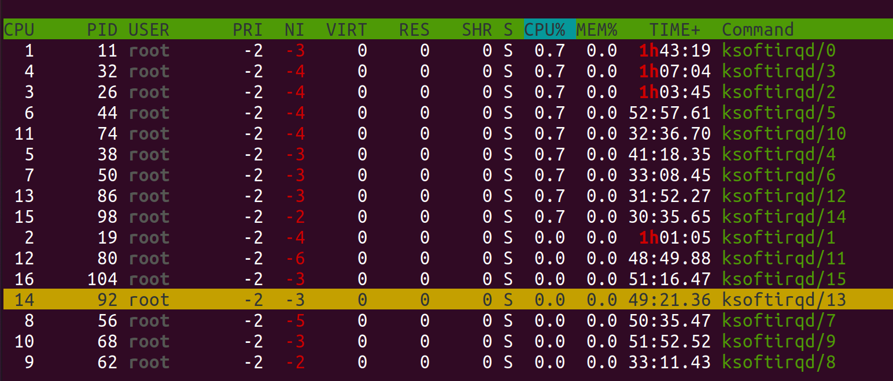

# DU Installation
## Table of content
- [DU Installation](#du-installation)
  - [Table of content](#table-of-content)
  - [Introduction](#introduction)
    - [Variables needed for this install](#variables-needed-for-this-install)
      - [5G variables](#5g-variables)
      - [Frequency variables](#frequency-variables)
      - [licenses and files needed (see intro)](#licenses-and-files-needed-see-intro)
  - [Docker installation on the Server](#docker-installation-on-the-server)
    - [Obtain the Effnet and Phluido licenses](#obtain-the-effnet-and-phluido-licenses)
      - [Preparation steps](#preparation-steps)
      - [Phluido : Install a Low Latency Kernel](#phluido--install-a-low-latency-kernel)
      - [Phluido License: Run the sysTest utility from Phluido](#phluido-license-run-the-systest-utility-from-phluido)
      - [Effnet License: Install and check your Yubikey](#effnet-license-install-and-check-your-yubikey)
      - [Effnet License: Create a PCSCD Docker Image](#effnet-license-create-a-pcscd-docker-image)
      - [Effnet License: activate the yubikey](#effnet-license-activate-the-yubikey)
      - [Install the Phluido L1 ( docker )](#install-the-phluido-l1--docker-)
      - [Install Effnet DU ( docker )](#install-effnet-du--docker-)
      - [docker compose file ( with CPU PINNING )](#docker-compose-file--with-cpu-pinning-)
      - [set softirq priorities to realtime](#set-softirq-priorities-to-realtime)
      - [**FOR B210 RU ONLY** Install Phluido RRU ( docker )](#for-b210-ru-only-install-phluido-rru--docker-)
  - [Prepare and bring on air the USRP B210 Radio](#prepare-and-bring-on-air-the-usrp-b210-radio)
    - [DU/L1/RRU Configuration and docker compose](#dul1rru-configuration-and-docker-compose)
      - [Start the DU](#start-the-du)
  - [Prepare and bring on air the Benetel 650 Radio](#prepare-and-bring-on-air-the-benetel-650-radio)
      - [Diagram](#diagram)
    - [Server installtion](#server-installtion)
      - [DU/L1 Configuration and docker compose](#dul1-configuration-and-docker-compose)
      - [Frequency, Offsets, Point A Calculation](#frequency-offsets-point-a-calculation)
      - [Create docker compose](#create-docker-compose)
    - [Prepare to configure the Benetel 650](#prepare-to-configure-the-benetel-650)
    - [Version Check](#version-check)
    - [Configure the physical Benetel Radio End - Release V0.5.x](#configure-the-physical-benetel-radio-end---release-v05x)
      - [CFR enabled](#cfr-enabled)
      - [MAC Address of the DU](#mac-address-of-the-du)
      - [Set the Frequency of the Radio End](#set-the-frequency-of-the-radio-end)
      - [Set attenuation level](#set-attenuation-level)
    - [Configure the physical Benetel Radio End - Older then Release V0.7.0](#configure-the-physical-benetel-radio-end---older-then-release-v070)
      - [auto reset dpd](#auto-reset-dpd)
    - [verify good operation of the B650 (all releases)](#verify-good-operation-of-the-b650-all-releases)
      - [GPS](#gps)
      - [Cell Status Report](#cell-status-report)
      - [RRU Status Report](#rru-status-report)
      - [Handshake](#handshake)
      - [Trace traffic between RRU and L1.](#trace-traffic-between-rru-and-l1)
      - [Check if the L1 is listening](#check-if-the-l1-is-listening)
      - [Show the traffic between rru and l1](#show-the-traffic-between-rru-and-l1)
  - [Starting RRU Benetel 650 - manual way](#starting-rru-benetel-650---manual-way)
  - [Starting RRU Benetel 650 - cell wrapper way](#starting-rru-benetel-650---cell-wrapper-way)
  - [Troubleshooting](#troubleshooting)
    - [Fiber Port not showing up](#fiber-port-not-showing-up)
    - [L1 is not listening](#l1-is-not-listening)
    - [check SCTP connections](#check-sctp-connections)
  - [Appendix: Engineering tips and tricks](#appendix-engineering-tips-and-tricks)
    - [pcscd debug](#pcscd-debug)
    - [Run RU in freerun mode](#run-ru-in-freerun-mode)
    - [custatus](#custatus)
      - [install](#install)
      - [use](#use)
      - [example](#example)
    
## Introduction
The DU will be installed in several Docker containers that run on metal on the host machine. As mentioned in the introduction, a separate Virtual Machine will host the RIC and the CU and their relative pods will be handled by Kubernetes inside that VM. Here we focus on the steps to get DU and L1 up and running.

### Variables needed for this install
Before proceeding you may want to crosscheck and modify some paramters that caracterise each deployment and depends on the desired provisioning of the components. The parameters that should be considered for this purpose and can be safely modified are:


#### 5G variables
* plmn_identity      [ eg 235 88 ] 
* nr_cell_identity   [ eg 1  any number ]
* nr_pci             [ eg 1  not any number. Ask Accelleran to do the PCI planning ]
* 5gs_tac            [ eg 1 ] 

#### Frequency variables
* center_frequency_band   [ eg  3751.680 ] 
* point_a_arfcn           [ 648840 consistent with center freq, scs 30khz ]
* band               	  [ 77  consistent with center frequency ]

#### licenses and files needed (see intro)
* accelleran-du-phluido-%Y-%m-%d-release.zip
* phluido_docker_xxxx.tar
* effnet-license-activation-%Y-%m-%d.zip 
* 32 digit phluido license key, [ ex 2B2A-962F-783F-40B9-7064-2DE3-3906-9D2E ] 

For any other modification it is advisable to make contact with the Accelleran service desk as of course, if in principle every paramter in the confuguration file is up for modification, it is certainly not recommendable to proceed in that declaration as each front end may or may not work as a consequence and the analysis and recovery from error scenario will be less than intuitive

## Docker installation on the Server

**Make sure Docker and docker-compose have been installed and that docker can be run without superuser privileges, this is a prerequisite. DO NOT install Kubernetes where DU and L1 will run**

Add the Docker APT repository:

``` bash
curl -fsSL https://download.docker.com/linux/ubuntu/gpg | sudo gpg --dearmor -o /usr/share/keyrings/docker-archive-keyring.gpg
```
```
echo "deb [arch=$(dpkg --print-architecture) signed-by=/usr/share/keyrings/docker-archive-keyring.gpg] https://download.docker.com/linux/ubuntu $(lsb_release -cs) stable" | sudo tee /etc/apt/sources.list.d/docker.list > /dev/null
```
```
sudo apt update
```

Install the required packages:

``` bash
sudo apt install docker-ce 
```
```
sudo apt install docker-ce-cli 
```
```
sudo apt install containerd.io 
```
```
sudo apt install docker-compose
```

Add your user to the docker group to be able to run docker commands without sudo access.
You might have to reboot or log out and in again for this change to take effect.

``` bash
sudo usermod -aG docker $USER
```

To check if your installation is working you can try to run a test image in a container:

``` bash
sudo docker run hello-world
```
Restart Docker and enable on boot:

``` bash
sudo systemctl enable docker
sudo systemctl daemon-reload
sudo systemctl restart docker
```


### Obtain the Effnet and Phluido licenses

#### Preparation steps
In this phase we will need to act in parallel for the DU and the L1/RRU licenses, which depend on our partner company so it is essential to give priority and possibly anticipate these two steps as there is no specific effort involved from the user/customer perspective and they may require longer than one working day before we can proceed further.


#### Phluido : Install a Low Latency Kernel

The PHY layer has very stringent latency requirements, therefore we install a low latency kernel:

``` bash
sudo apt install linux-image-lowlatency
```

make sure this line is present in the ```/etc/default/grub``` file. 
It forces the GRUB to start a lowlatency kernel.
```
$ cat /etc/default/grub | grep FLAV
GRUB_FLAVOUR_ORDER=lowlatency
``` 

Create a sysctl configuration file to configure the low latency kernel:

``` bash
sudo tee /etc/sysctl.d/10-phluido.conf <<EOF
# Improves scheduling responsiveness for Phluido L1
kernel.sched_min_granularity_ns = 100000
kernel.sched_wakeup_granularity_ns = 20000
kernel.sched_latency_ns = 500000
kernel.sched_rt_runtime_us = -1
# Message queue
fs.mqueue.msg_max = 64
EOF
```

Remove the generic kernel to avoid the low latency kernel to be replaced by a generic kernel when updates are performed:

``` bash
sudo apt remove linux-image-generic
sudo apt autoremove
```

In order to avoid possible system performance degradation, CPU scaling must be disabled:

``` bash
sudo apt install cpufrequtils
```
```
echo 'GOVERNOR="performance"' | sudo tee /etc/default/cpufrequtils
```
```
sudo systemctl disable ondemand
```

Restart the machine to make the changes take effect:

``` bash
sudo reboot
```
#### Phluido License: Run the sysTest utility from Phluido
to go to the directory where the Phluido sysTest utility is :

```
$ ./sysTest 
Running system test...
01234567890123456789012345678901
System test completed, output written to file "sysTest.bin".
```

( The test takes around 90 seconds) This will run a test of the system that will allow to determine if the server is properly configured and capable of running the demanding L1/RRU components Once it is finsihed it produces a file sysTest.bin in the same directory Send this file to Accelleran, 
to obtain the Phluido license key. Send this .bin file to phluido to receive a proper license.

#### Effnet License: Install and check your Yubikey 


For the license activation file we indicate the generic format yyyy_mm_dd as the file name may vary from case to case, your Accelleran point of contact will make sure you receive the correct license activation archive file which will have a certain timestamp on it, example effnet-license-activation-2021-12-16.zip

if you don't have yet the effnet license activation bundle, in order to obatin one you must comunicate to Accelleran the serial number of the Yubikey you intend to use so to be enabled for usage. You can obtain this information by using the following command on your server where the Yubikey has been installed physically to a USB port:

To check if the server can see the key do (in this example Device004 is your key): 
``` bash
lsusb
~$ lsusb
Bus 002 Device 002: ID 8087:8002 Intel Corp. 
Bus 002 Device 001: ID 1d6b:0002 Linux Foundation 2.0 root hub
Bus 001 Device 002: ID 8087:800a Intel Corp. 
Bus 001 Device 001: ID 1d6b:0002 Linux Foundation 2.0 root hub
Bus 004 Device 003: ID 2500:0020 Ettus Research LLC USRP B200
Bus 004 Device 001: ID 1d6b:0003 Linux Foundation 3.0 root hub
**Bus 003 Device 004: ID 1050:0407 Yubico.com Yubikey 4 OTP+U2F+CCID**
Bus 003 Device 029: ID 2a70:9024 OnePlus AC2003
Bus 003 Device 006: ID 413c:a001 Dell Computer Corp. Hub
Bus 003 Device 016: ID 20ce:0023 Minicircuits Mini-Circuits
Bus 003 Device 001: ID 1d6b:0002 Linux Foundation 2.0 root hub
```
Then you can find the serial number (yubikey-manager needed, install if it's not already):

``` bash
sudo apt install yubikey-manager
```
``` bash
ykman list --serials
#13134288
```

#### Effnet License: Create a PCSCD Docker Image 

The DU software needs access to a YubiKey that contains its license.
The license in the YubiKey is shared by the PCSCD daemon, which itself can run in a Docker container to satisfy OS dependencies.
Plug the YubiKey in a USB port of the machine.
Then, create a Dockerfile named Dockerfile.pcscd for this Docker image:

``` bash
mkdir -p pcscd 
tee pcscd/Dockerfile.pcscd <<EOF
FROM ubuntu:20.04

RUN \
set -xe && \
apt-get update && \
DEBIAN_FRONTEND="noninteractive" apt-get install -y \
    pcscd

# Cleanup
RUN \
set -xe && \
apt-get clean && \
rm -rf \
    /var/lib/apt/lists/* \
    /var/tmp/* \
    /tmp/*

ENTRYPOINT ["/usr/sbin/pcscd", "--foreground"]
EOF
```

The Docker image can now be built and started with:

``` bash
docker build --rm -t pcscd_yubikey - <pcscd/Dockerfile.pcscd
```
```
docker run --restart always -id --privileged --name pcscd_yubikey_c -v /run/pcscd:/run/pcscd pcscd_yubikey
```

You can verify it is running correct with the command:

``` bash
docker container ls --filter name=pcscd_yubikey_c
```

If every step was performed correctly this command should produce output similar to:

``` bash
CONTAINER ID        IMAGE               COMMAND                  CREATED             STATUS              PORTS               NAMES
df4f41eb70c9        pcscd_yubikey       "/usr/sbin/pcscd --f…"   1 minute ago        Up 1 minute                             pcscd_yubikey_c
```

#### Effnet License: activate the yubikey 

In order to activate the license dongles unzip the received license activation bundle effnet-license-activation-yyyy-mm-dd.zip (as mentioned the date may differ on each case so let's use the generic format) and then you need to load the included Docker image into your docker-daemon, i.e.

``` bash
bunzip2 --stdout license-activation-yyyy-mm-dd.tar.bz2 | docker load
```

Then run the image mapping the folder containing the `pcscd` daemon socket into
the container:

``` bash
docker run -it -v /var/run/pcscd:/var/run/pcscd effnet/license-activation-yyyy-mm-dd
```

If you get warnings similar to:

``` bash
WARNING: No dongle with serial-number 13134288 found
```

It means that a dongle for the bundled license was not found, i.e. in this case
the dongle with the serial number 13134288 has not been activated, or the licens bundle file you have received is not the correct one, contact Accelleran in such case

Successful activation of a license-dongle should produce an output similar to:

``` bash
Loading certificate to Yubico YubiKey CCID 00 00 (serial: 13134288)
```

Which means that a license for the dongle with serial-number 13134288 was loaded to the dongle (i.e., it was bundled in the license-activation image).


#### Install the Phluido L1 ( docker )
 
 ``` bash
 docker image load -i phluido_docker_$L1_VERSION.tar
```


#### Install Effnet DU ( docker )

``` bash
unzip accelleran-du-phluido-$DU_VERSION.zip
bzcat accelleran-du-phluido/accelleran-du-phluido-$DU_VERSION/gnb_du_main_phluido-$DU_VERSION.tar.bz2 | docker image load
```

 
 #### docker compose file ( with CPU PINNING )
 
 To achieve maximum stability and performance it is necessary to optimise the CPU load and this can be done by distributing the available CPUs among the components and assign different priorities to the most demanding processes. We split therefore the CPUs in two groups, one group of CPUs for the VM where the RIC/CU run and one group of CPUs for the containers that run L1 and DU. The CPU pinning allows for ceertain components to run only on certain CPUs, however it doesn't impede other processes to use the same CPUs, so the full optimisation of the CPU usage and the exclusive allocation of the CPUs are beyond the scope of this document, here we illustrate one possible split as an example.
 
First thing to find out is what resources are available on our system:
These have been found during the preperation fase and shared over DU and CU. In this chapter the DU core are assigned.

In this specific example, there are two banks of 4 cores, each capable of hyperthreading, so in total we can count on 16 CPUs, let's then set 8 CPUs aside to run the VM for kubernetes and CU, and the other 8 CPUs to run L1/L2 so that they never compete for the same CPU. The assumption is that the rest of the processes on the system (very light load) is equally spread over all cores. If a large number of cores is available, probably the core with a higher number will be mostly free and can be then dedicated to L1 and DU, as mentioned there is no specific rule. For the sake of argument let's assign the even cores to the L1 and DU equally, so the Docker compose looks as follows:

``` bash
mkdir -p ~/install-$DU_VERSION/ 
cd !$
cat > docker-compose.yaml << EOF
version: "2"
services:

  phluido_l1:
    image: phluido_l1:$L1_VERSION
    container_name: phluido_l1
    tty: true
    privileged: true
    ipc: shareable
    shm_size: 2gb
    command: /config.cfg
    volumes:
      - "$PWD/l1-config-0.cfg:/config.cfg:ro"
      - "$PWD/logs-0/l1:/workdir"
      - "/etc/machine-id:/etc/machine-id:ro"
    working_dir: "/workdir"
    network_mode: host
    cpuset: "$CORE_SET_DU"

  du:
    image: gnb_du_main_phluido:$DU_VERSION
    volumes:
      - "$PWD/du-config-0.json:/config.json:ro"
      - "$PWD/logs-0/du:/workdir"
      - /run/pcscd/pcscd.comm:/run/pcscd/pcscd.comm
    ipc: container:phluido_l1
    tty: true
    privileged: true
    depends_on:
      - phluido_l1
    entrypoint: ["/bin/sh", "-c", "sleep 2 && exec /gnb_du_main_phluido /config.json"]
    working_dir: "/workdir"
    extra_hosts:
      - "cu:$F1_CU_IP"
      - "du:$SERVER_IP"
    network_mode: host
    cpuset: "$CORE_SET_DU"
EOF
```


**Notes: **
1) the version has to be changed to '2' as version 3 does not support cpuset option
2) the ip address for the cu is the one of the f1 external ip interface of the relative cucp service
3) the DU ip address is the one of the server where the DU runs

> NOTE : verify the cpu pinning of the VM's are different then those we used in above compose file.
> We then need to take care of the CPUs that the VMs hosted on this server are intended to use. Earlier in the installation the CPU pinning has been done during creation. :
> ``` bash
> virsh edit $CU_VM_NAME
> virsh edit $OPEN5GS_VM_NAME
> ```
> Other ways of creating a VM may not produce a configuration file in xml format, making things more difficult. We also recommend to identify the xml configuration file by searching the directory:
> 
> ``` bash
> /etc/libvirt/qemu/
> ```
> 
> But we definitely discourage the direct editing of such file as it will reset to default at the first reboot
> 
> Once done, you can check the content of the xml configuration file, that in this case will show we decided to assign the odd CPUs to the VM:
> 
> ``` bash
> ubuntu@bbu3:~$ sudo cat /etc/libvirt/qemu/Ubuntu123.xml
> <!--
> WARNING: THIS IS AN AUTO-GENERATED FILE. CHANGES TO IT ARE LIKELY TO BE
> OVERWRITTEN AND LOST. Changes to this xml configuration should be made using:
>   virsh edit Ubuntu123
> or other application using the libvirt API.
> -->
> 
> <domain type='kvm'>
>   <name>Ubuntu123</name>
>   <uuid>f18a2a01-7b67-4f00-ad11-5920ec2b6f16</uuid>
>   <metadata>
>     <libosinfo:libosinfo xmlns:libosinfo="http://libosinfo.org/xmlns/libvirt/domain/1.0">
>       <libosinfo:os id="http://ubuntu.com/ubuntu/20.04"/>
>     </libosinfo:libosinfo>
>   </metadata>
>   <memory unit='KiB'>33554432</memory>
>   <currentMemory unit='KiB'>33554432</currentMemory>
>   <vcpu placement='static' cpuset='1,3,5,7,9,11,13,15'>8</vcpu>
>   <os>
>     <type arch='x86_64' machine='pc-q35-4.2'>hvm</type>
>     <bootmenu enable='yes'/>
>   </os>
>   <features>
> 
> ```

#### set softirq priorities to realtime	
In a normal setup, the softirq processes will run at priority 20, equal to all user processes. Here they need to run at -2, which corresponds to real time priority. They are scheduled on all cores but will get strict priority over any other user processes. To adapt the priority of the ksoft, you can use spcific commands:

to set to realtime priority 1 (lowest prio, but still "run to completion" before other default processes are executed):
``` bash
ps -A | grep ksoftirq | awk '{print $1}' | xargs -L1 sudo chrt -p 1
```

> NOTE: to revert the priority to "other policy":
> 
> 	
> ``` bash
> ps -A | grep ksoftirq | awk '{print $1}' | xargs -L1 sudo chrt --other -p 0
> ```

finally to check all the priorities set:

``` bash
ps -A | grep ksoftirq | awk '{print $1}' | xargs -L1 chrt -p
```
	
Use htop to verify the priorities of the softirq processes.	
The only thing remaining is now **prioritise the softirq processes**. One can use **htop** and work out the options to show priority and CPU ID 
	
	* Press F2 for ```Setup```, navigate to ```Columns```,  add ```PRIORITY```
	
	* Press F2 for ```Setup```, navigate to ```Display Options```, unselect ```Hide kernel threads```

<p align="center">
  
</p>


#### **FOR B210 RU ONLY** Install Phluido RRU ( docker )

 Load the Phluido RRU Docker image (this step does not have to be taken when using Benetel RUs):

``` bash
docker build -f accelleran-du-phluido/accelleran-du-phluido-2022-01-31/phluido/docker/Dockerfile.rru -t phluido_rru:v0.8.1 Phluido5GL1/Phluido5GL1_v0.8.1
```


## Prepare and bring on air the USRP B210 Radio

This section is exclusively applicable to the user/customer that intends to use the Ettus USRP B210 Radio End with our Accellleran 5G end to end solution, if you do not have such radio end the informations included in this section may be misleading and bring to undefined error scenarios. Please contact Accelleran if your Radio End is not included in any section of this user guide

Create the UDEV rules for the B210:

``` bash
sudo tee /etc/udev/rules.d/uhd-usrp.rules <<EOF
#
# Copyright 2011,2015 Ettus Research LLC
# Copyright 2018 Ettus Research, a National Instruments Company
#
# SPDX-License-Identifier: GPL-3.0-or-later
#

#USRP1
SUBSYSTEMS=="usb", ATTRS{idVendor}=="fffe", ATTRS{idProduct}=="0002", MODE:="0666"

#B100
SUBSYSTEMS=="usb", ATTRS{idVendor}=="2500", ATTRS{idProduct}=="0002", MODE:="0666"

#B200
SUBSYSTEMS=="usb", ATTRS{idVendor}=="2500", ATTRS{idProduct}=="0020", MODE:="0666"
SUBSYSTEMS=="usb", ATTRS{idVendor}=="2500", ATTRS{idProduct}=="0021", MODE:="0666"
SUBSYSTEMS=="usb", ATTRS{idVendor}=="2500", ATTRS{idProduct}=="0022", MODE:="0666"
SUBSYSTEMS=="usb", ATTRS{idVendor}=="3923", ATTRS{idProduct}=="7813", MODE:="0666"
SUBSYSTEMS=="usb", ATTRS{idVendor}=="3923", ATTRS{idProduct}=="7814", MODE:="0666"
EOF
```

Connect the B210 to the machine.
Make sure it is enumerated as USB3 by executing:

``` bash
lsusb -d 2500:0020 -v | grep -F bcdUSB
```

This should print:

```
bcdUSB               3.00
```

Add the Ettus Research APT repositories:

``` bash
sudo add-apt-repository ppa:ettusresearch/uhd
sudo apt update
```

Install the software required by the B210:

``` bash
sudo apt install libuhd-dev uhd-host libuhd3.15.0
```

Download the UHD images:

``` bash
sudo uhd_images_downloader
```

Check if the B210 is detecting using the following command:

``` bash
uhd_find_devices
```

This should output something similar to:

```
[INFO] [UHD] linux; GNU C++ version 7.5.0; Boost_106501; UHD_3.15.0.0-release
--------------------------------------------------
-- UHD Device 0
--------------------------------------------------
Device Address:
    serial: 3218C86
    name: MyB210
    product: B210
    type: b200
```

Burn the correct EEPROM for the B210:

``` bash
/usr/lib/uhd/utils/usrp_burn_mb_eeprom* --values='name=B210-#4'
```

If everything goes well this should output something similar to:

```
Creating USRP device from address:
[INFO] [UHD] linux; GNU C++ version 7.5.0; Boost_106501; UHD_3.15.0.0-release
[INFO] [B200] Detected Device: B210
[INFO] [B200] Loading FPGA image: /usr/share/uhd/images/usrp_b210_fpga.bin...
[INFO] [B200] Operating over USB 3.
[INFO] [B200] Detecting internal GPSDO....
[INFO] [GPS] No GPSDO found
[INFO] [B200] Initialize CODEC control...
[INFO] [B200] Initialize Radio control...
[INFO] [B200] Performing register loopback test...
[INFO] [B200] Register loopback test passed
[INFO] [B200] Performing register loopback test...
[INFO] [B200] Register loopback test passed
[INFO] [B200] Setting master clock rate selection to 'automatic'.
[INFO] [B200] Asking for clock rate 16.000000 MHz...
[INFO] [B200] Actually got clock rate 16.000000 MHz.

Fetching current settings from EEPROM...
    EEPROM ["name"] is "MyB210"

Setting EEPROM ["name"] to "B210-#4"...
Power-cycle the USRP device for the changes to take effect.

Done
```

Check if the current EEPROM was flashed by executing:

``` bash
uhd_find_devices
```

The output should look like:

```
[INFO] [UHD] linux; GNU C++ version 7.5.0; Boost_106501; UHD_3.15.0.0-release
--------------------------------------------------
-- UHD Device 0
--------------------------------------------------
Device Address:
    serial: 3218C86
    name: B210-#4
    product: B210
    type: b200
```
### DU/L1/RRU Configuration and docker compose

Before starting the configuration of the components it is important to avoid confusion so please create a folder file and move in all the configuration files you find for the L1, RRU and the DU configuration and remove the docker-compose as well:
``` bash
mkdir accelleran-du-phluido/accelleran-du-phluido-2022-01-31/phluido/cfg
mv accelleran-du-phluido/accelleran-du-phluido-2022-01-31/phluido/*.cfg accelleran-du-phluido/accelleran-du-phluido-2022-01-31/phluido/cfg/
mkdir accelleran-du-phluido/accelleran-du-phluido-2022-01-31/json
mv accelleran-du-phluido/accelleran-du-phluido-2022-01-31/*.json accelleran-du-phluido/accelleran-du-phluido-2022-01-31/json/
rm accelleran-du-phluido/accelleran-du-phluido-2022-01-31/docker-compose.yml
```

Create a configuration file for the Phluido RRU:
** only for B210 **

``` bash
tee accelleran-du-phluido/accelleran-du-phluido-2022-01-31/phluido/PhluidoRRU_NR_EffnetTDD_B210.cfg <<EOF
/******************************************************************
*
* This file is subject to the terms and conditions defined in
* file 'LICENSE.txt', which is part of this source code package.
*
******************************************************************/

//BBU IPv4 address.
bbuFronthaulServerAddr = "127.0.0.1";

// Number of slots in one subframe.
numSubframeSlots = 2;

//Number of TX antennas for fronthaul data exchange.
numTxAntennas = 1;
//Number of RX antennas for fronthaul data exchange.
numRxAntennas = 1;

/// Frequency [kHz] for TX "point A" (see NR definition).
txFreqPointA_kHz = 3301680;
/// Frequency [kHz] for RX "point A" (see NR definition).
rxFreqPointA_kHz = 3301680;

/// Number of PRBs for both downlink and uplink. Must match the L2-L3 configuration.
numPrbs = 51;

uhdClockMode = 0;

uhdSendAdvance_ns = 8000;

/// Parameters used for PhluidoPrototypeBPP.
bppMode = 10;
uhdSamplingRate_kHz = 23040;
EOF
```

Create a configuration file for the Phluido L1.
Make sure to set the value `LicenseKey` option to the received Phluido license key. This key has been delivered by Phluido upon receipt of the .bin file generated by the sysTest you have performed at start of this installation.

``` bash
tee l1-config.cfg <<EOF
/******************************************************************
 *
 * This file is subject to the terms and conditions defined in
 * file 'LICENSE'.
 *
 ******************************************************************/

// Enables verbose binary logging. WARNING: very CPU intensive and creates potentially huge output files. Use with caution.
//logLevel_verbose    = "DEBUG";

bbuFronthaulServerMode = 1;
bbuFronthaulServerAddr = "10.10.0.1"
bbuFronthaulServerPort = 44000;
/// BBU fronthaul server "busy poll" for the receive socket, in microseconds, used as value for the relevant (SOL_SOCKET,SO_BUSY_POLL) socket option.

numWorkers = 4;


// Enable 64-QAM support for PUSCH (license-specific)
maxPuschModOrder = 6;

maxNumPdschLayers = 2;
maxNumPuschLayers = 1;
maxNumPrachDetectionSymbols = 1;

targetRecvDelay_us = 2500;
//targetCirPosition = 0.0078125;

// License key
//LicenseKey = "2B2A-962F-783F-40B9-7064-2DE3-3906-9D2E"

EOF
```
**IMPORTANT: After this replace the LicenseKey value with the effective license sequence you obtained from Accelleran 


Create a configuration file for the Effnet DU:

* nr_cell_identity  ( in binary format eg 3 fill in ...00011 )
* nr_pci            ( decimal format eg 51 fill in 51 )
* plmn_identity     ( eg 235 88 fill in 235f88. fill in 2 times in this file)
* arfcn             ( decimal format calculated from the center frequency, see chapter ) 
* nr_frequency_band ( 77 or 78 )
* 5gs_tac           ( 3 byte array. eg 1 fill in 000001 ) 

``` bash
mkdir -p ~/install-$DU_VERSION/ 
cd !$
tee du-config.json <<EOF
{
    "configuration": {
        "du_address": "du",
        "cu_address": "cu",
        "gtp_listen_address": "du",
        "f1c_bind_address": "du",
        "vphy_listen_address": "127.0.0.1",
        "vphy_port": 13337,
        "vphy_tick_multiplier": 1,
        "gnb_du_id": 38209903575,
        "gnb_du_name": "cab-03-cell",
        "phy_control": {
            "crnti_range": {
                "min": 42000,
                "max": 42049
            }
        },
        "rrc_version": {
            "x": 15,
            "y": 6,
            "z": 0
        },
        "served_cells_list": [
            {
                "served_cell_information": {
                    "nr_cgi": {
                        "plmn_identity": "235f88",
                        "nr_cell_identity": "000000000000000000000000000000000011"
                    },
                    "nr_pci": 2,
                    "5gs_tac": "000001",
                    "ran_area_code": 1,
                    "served_plmns": [
                        {
                            "plmn_identity": "235f88",
                            "tai_slice_support_list": [
                                {
                                    "sst": 1
                                }
                            ]
                        }
                    ],
                    "nr_mode_info": {
                        "nr_freq_info": {
                            "nr_arfcn": 662664,
                            "frequency_band_list": [
                                {
                                    "nr_frequency_band": 77
                                }
                            ]
                        },
                        "transmission_bandwidth": {
                            "bandwidth_mhz": 40,
                            "scs_khz": 30,
                            "nrb": 106
                        },
                        "pattern": {
                            "periodicity_in_slots": 10,
                            "downlink": {
                                "slots": 7,
                                "symbols": 6
                            },
                            "uplink": {
                                "slots": 2,
                                "symbols": 4
                            }
                        }
                    },
                    "measurement_timing_configuration": [
                        222,
                        173,
                        190,
                        239
                    ],
                    "dmrs_type_a_position": "pos2",
                    "intra_freq_reselection": "allowed",
                    "ssb_pattern": "1000000000000000000000000000000000000000000000000000000000000000",
                    "ssb_periodicity_serving_cell_ms": 20,
                    "prach_configuration_index": 202,
                    "ssb_pbch_scs": 30,
                    "offset_point_a": 6,
                    "k_ssb": 0,
                    "coreset_zero_index": 3,
                    "search_space_zero_index": 2,
                    "ra_response_window_slots": 20,
                    "sr_slot_periodicity": 40,
                    "sr_slot_offset": 7,
                    "search_space_other_si": 1,
                    "paging_search_space": 1,
                    "ra_search_space": 1,
                    "bwps": [
                        {
                            "id": 0,
                            "start_crb": 0,
                            "num_rb": 106,
                            "scs": 30,
                            "cyclic_prefix": "normal"
                        }
                    ],
                    "coresets": [
                        {
                            "id": 1,
                            "bwp_id": 0,
                            "fd_resources": "111100000000000000000000000000000000000000000",
                            "duration": 2,
                            "interleaved": {
                                "reg_bundle_size": 6,
                                "interleaver_size": 2
                            },
                            "precoder_granularity": "same_as_reg_bundle"
                        }
                    ],
                    "search_spaces": [
                        {
                            "id": 1,
                            "control_resource_set_id": 0,
                            "common": {}
                        },
                        {
                            "id": 2,
                            "control_resource_set_id": 1,
                            "ue_specific": {
                                "dci_formats": "formats0-1-And-1-1"
                            }
                        }
                    ],
                    "maximum_ru_power_dbm": 53.0,
                    "num_tx_antennas": 2,
                    "trs": {
                        "periodicity_and_offset": {
                            "period": 80,
                            "offset": 1
                        },
                        "symbol_pair": "four_eight",
                        "subcarrier_location": 1
                    },
                    "csi_rs": {
                        "periodicity_and_offset": {
                            "period": 40,
                            "offset": 15
                        }
                    },
                    "harq_processes_for_pdsch": 16,
                    "minimum_k1_delay": 1,
                    "minimum_k2_delay": 3,
                    "force_rlc_buffer_size": 2500000
                }
            }
        ]
    }
}

EOF
```

Before creating the `docker-compose.yml` file, make sure to set the `$CU_IP` environment variable where you will store the F1 IP address of the CUCP that you have already deployed using the dRAX Dashboard (section [CUCP Installation](../drax-install/images/dashboard-cu-cp-deployment.png) )
This IP address can be determined by executing the following command:

``` bash
kubectl get services | grep f1
```
The CUCP F1 SCTP interface external address is the second IP address and should be in the IP pool that was assigned to MetalLB in [dRax Installation](../drax-install/index.md).

Now, create a docker-compose configuration file:

** remove the rru: when NOT using a b210. eg when using a b650 **

``` bash
mkdir -p ~/install-$DU_VERSION/ 
cd !$
tee docker-compose.yml <<EOF
version: "2"

services:
  phluido_l1:
    image: phluido_l1:v0.8.4.2
    container_name: phluido_l1
    tty: true
    privileged: true
    ipc: shareable
    shm_size: 2gb
    command: /config.cfg
    volumes:
      - "$PWD/l1-config.cfg:/config.cfg:ro"
      - "/run/logs-du/l1:/workdir"
      - "/etc/machine-id:/etc/machine-id:ro"
    working_dir: "/workdir"
    network_mode: host
    cpuset: "0,2,4,6,8,10,12,14"
    
  du:
    image: gnb_du_main_phluido:2022-07-01-q2-pre-release
    volumes:
      - "$PWD/du-config.json:/config.json:ro"
      - "/run/logs-du/du:/workdir"
      - /run/pcscd/pcscd.comm:/run/pcscd/pcscd.comm
    ipc: container:phluido_l1
    tty: true
    privileged: true
    depends_on:
      - phluido_l1
    entrypoint: ["/bin/sh", "-c", "sleep 4 && exec /gnb_du_main_phluido /config.json"]
    working_dir: "/workdir"
    extra_hosts:
      - "cu:$F1_CU_IP"
      - "du:$SERVER_IP"
    cpuset: "0,2,4,6,8,10,12,14"

  phluido_rru:
    image: phluido_rru:v0.8.4.2
    tty: true
    privileged: true
    depends_on:
      - du
      - phluido_l1
    network_mode: host
    volumes:
      - "$PWD/phluido/PhluidoRRU_NR_EffnetTDD_B210.cfg:/config.cfg:ro"
      - "$PWD/logs/rru:/workdir"
    entrypoint: ["/bin/sh", "-c", "sleep 20 && exec /PhluidoRRU_NR /config.cfg"]
    working_dir: "/workdir"
EOF
```

#### Start the DU

Start the DU by running the following command:

``` bash
docker-compose up -f accelleran-du-phluido/accelleran-du-phluido-2022-01-31/docker-compose.yml
```

If all goes well this will produce output similar to:

```
Starting phluido_l1 ... done
Recreating accelleran-du-phluido-2022-01-31_du_1 ... done
Recreating accelleran-du-phluido-2022-01-31_phluido_rru_1 ... done
Attaching to phluido_l1, accelleran-du-phluido-2022-01-31_du_1, accelleran-du-phluido-2022-01-31_phluido_rru_1
phluido_l1  | Reading configuration from config file "/config.cfg"...
phluido_l1  | *******************************************************************************************************
phluido_l1  | *                                                                                                     *
phluido_l1  | *  Phluido 5G-NR virtualized L1 implementation                                                        *
phluido_l1  | *                                                                                                     *
phluido_l1  | *  Copyright (c) 2014-2020 Phluido Inc.                                                               *
phluido_l1  | *  All rights reserved.                                                                               *
phluido_l1  | *                                                                                                     *
phluido_l1  | *  The User shall not, and shall not permit others to:                                                *
phluido_l1  | *   - integrate Phluido Software within its own products;                                             *
phluido_l1  | *   - mass produce products that are designed, developed or derived from Phluido Software;            *
phluido_l1  | *   - sell products which use Phluido Software;                                                       *
phluido_l1  | *   - modify, correct, adapt, translate, enhance or otherwise prepare derivative works or             *
phluido_l1  | *     improvements to Phluido Software;                                                               *
phluido_l1  | *   - rent, lease, lend, sell, sublicense, assign, distribute, publish, transfer or otherwise         *
phluido_l1  | *     make available the PHLUIDO Solution or any portion thereof to any third party;                  *
phluido_l1  | *   - reverse engineer, disassemble and/or decompile Phluido Software.                                *
phluido_l1  | *                                                                                                     *
phluido_l1  | *  THIS SOFTWARE IS PROVIDED BY THE AUTHOR ``AS IS'' AND ANY EXPRESS OR IMPLIED WARRANTIES,           *
phluido_l1  | *  INCLUDING, BUT NOT LIMITED TO, THE IMPLIED WARRANTIES OF MERCHANTABILITY AND FITNESS FOR A         *
phluido_l1  | *  PARTICULAR PURPOSE ARE DISCLAIMED.                                                                 *
phluido_l1  | *  IN NO EVENT SHALL THE AUTHOR BE LIABLE FOR ANY DIRECT, INDIRECT, INCIDENTAL, SPECIAL,              *
phluido_l1  | *  EXEMPLARY, OR CONSEQUENTIAL DAMAGES (INCLUDING, BUT NOT LIMITED TO, PROCUREMENT OF                 *
phluido_l1  | *  SUBSTITUTE GOODS OR SERVICES; LOSS OF USE, DATA, OR PROFITS; OR BUSINESS INTERRUPTION)             *
phluido_l1  | *  HOWEVER CAUSED AND ON ANY THEORY OF LIABILITY, WHETHER IN CONTRACT, STRICT LIABILITY, OR           *
phluido_l1  | *  TORT (INCLUDING NEGLIGENCE OR OTHERWISE) ARISING IN ANY WAY OUT OF THE USE OF THIS                 *
phluido_l1  | *  SOFTWARE, EVEN IF ADVISED OF THE POSSIBILITY OF SUCH DAMAGE.                                       *
phluido_l1  | *                                                                                                     *
phluido_l1  | *******************************************************************************************************
phluido_l1  |
phluido_l1  | Copyright information already accepted on 2020-11-27, 08:56:08.
phluido_l1  | Starting Phluido 5G-NR L1 software...
phluido_l1  | 	PHAPI version       = 0.5 (12/10/2020)
phluido_l1  | 	L1 SW version       = 0.8.1
phluido_l1  | 	L1 SW internal rev  = r3852
phluido_l1  | Parsed configuration parameters:
phluido_l1  |     LicenseKey = XXXX-XXXX-XXXX-XXXX-XXXX-XXXX-XXXX-XXXX
phluido_l1  |     maxNumPrachDetectionSymbols = 1
phluido_l1  |     maxNumPdschLayers = 2
phluido_l1  |     maxNumPuschLayers = 1
phluido_l1  |     maxPuschModOrder = 6
phluido_l1  |
phluido_rru_1  | linux; GNU C++ version 7.3.0; Boost_106501; UHD_003.010.003.000-0-unknown
phluido_rru_1  |
phluido_rru_1  | Logs will be written to file "phluidoRru.log".
phluido_rru_1  | -- Detected Device: B210
phluido_rru_1  | -- Operating over USB 3.
phluido_rru_1  | -- Initialize CODEC control...
phluido_rru_1  | -- Initialize Radio control...
phluido_rru_1  | -- Performing register loopback test... pass
phluido_rru_1  | -- Performing register loopback test... pass
phluido_rru_1  | -- Performing CODEC loopback test... pass
phluido_rru_1  | -- Performing CODEC loopback test... pass
phluido_rru_1  | -- Setting master clock rate selection to 'automatic'.
phluido_rru_1  | -- Asking for clock rate 16.000000 MHz...
phluido_rru_1  | -- Actually got clock rate 16.000000 MHz.
phluido_rru_1  | -- Performing timer loopback test... pass
phluido_rru_1  | -- Performing timer loopback test... pass
phluido_rru_1  | -- Setting master clock rate selection to 'manual'.
phluido_rru_1  | -- Asking for clock rate 23.040000 MHz...
phluido_rru_1  | -- Actually got clock rate 23.040000 MHz.
phluido_rru_1  | -- Performing timer loopback test... pass
phluido_rru_1  | -- Performing timer loopback test... pass
```

## Prepare and bring on air the Benetel 650 Radio

This section is exclusively applicable to the user/customer that intends to use the Benetel B650 Radio End with our Accellleran 5G end to end solution, if you do not have such radio end the informations included in this section may be misleading and bring to undefined error scenarios. Please contact Accelleran if your Radio End is not included in any section of this user guide

#### Diagram

In the picture below we schematically show what will be run on the server by Docker and how the RRU is linked to the server itself: as mentioned early in this case the two components run by Docker are the L1 and the DU, while the RRU is supposedly served by a dedicated NIC Card capable of handling a 10 Gbps fiber link. If this is not your case please consult the section dedicted to Ettus B210 bring up or contact Accelleran for further information 

```
  10.10.0.100:ssh
  +-------------+
  |             |
  |             |             +-----------+         +-----------+
  |             |             |           |         |           |
  |     RU      +----fiber----+   L1      |         |    DU     |
  |             |             |           |         |           |
  |             |             +-----------+         +-----------+
  |             |
  +-------------+
aa:bb:cc:dd:ee:ff              11:22:33:44:55:66

  10.10.0.2:44000              10.10.0.1:44000

             eth0              enp45s0f0

      port FIBER1
```

### Server installtion
             
#### DU/L1 Configuration and docker compose

Differently from the Ettus B210, Benetel runs the RRU software on board, therefore we only need to prepare 2 software components in the server, that is, 2 Containers, Effnet DU and Phluido L1.

Create the configuration file for the Phluido L1 component the `PhluidoL1_NR_Benetel.cfg` file delivered by effnet
Make sure to set the value `LicenseKey` option to the received Phluido license key:

``` bash
mkdir -p ~/install-$DU_VERSION/ 
cd !$
tee PhluidoL1_NR_Benetel.cfg <<EOF
/******************************************************************
 *
 * This file is subject to the terms and conditions defined in
 * file 'LICENSE'.
 *
 ******************************************************************/
//Enables verbose binary logging. WARNING: very CPU intensive and creates potentially huge output files. Use with caution.
//
// DEVEL:       1.2G/67 
// DEBUG:       953M/67 
// INFORMATIVE: 29K/67 
// default:     26K/67 
// CRITICAL:    0/393 
// WARNING:     0/393        (x/y x=log size in L1.encr.log file, y=log size in L1.open.log file. In a time of 1 minute )

//logLevel_verbose    = "WARNING";     
//bbuFronthaulServerMode = 1;
bbuFronthaulServerAddr = "10.10.0.1";

// Enable 64-QAM support for PUSCH (license-specific).
maxPuschModOrder = 6;
maxNumPdschLayers = 2;
maxNumPuschLayers = 1;

cccServerPort = 44444;
cccInterfaceMode = 1;
kpiOutputFormat = 2;

targetRecvDelay_us = 2500;

numWorkers = 6; // shall be less or equal to the number of cores assigned to L1 with the CPU pinning
//License key put here please the effective 32 digits sequence you received for this deployment

LicenseKey = "$L1_PHLUIDO_KEY";
EOF

```
**IMPORTANT: After this replace the LicenseKey value with the effective license sequence you obtained from Accelleran, all the other parameters shall not be modified 


Create a configuration file for the Effnet DU:

``` bash
mkdir -p ~/install-$DU_VERSION/ 
cd !$
tee b650_config_40mhz.json <<EOF
{
    "configuration": {
        "du_address": "du",
        "cu_address": "cu",
        "f1c_bind_address": "du",
        "gtp_listen_address": "du",
        "vphy_listen_address": "127.0.0.1",
        "vphy_port": 13337,
        "vphy_tick_multiplier": 1,
        "gnb_du_id": 38209903575,
        "gnb_du_name": "This is the dell two HO setup cell one",
        "phy_control": {
            "crnti_range": {
                "min": 42000,
                "max": 42049
            }
        },
        "rrc_version": {
            "x": 15,
            "y": 6,
            "z": 0
        },
        "served_cells_list": [
            {
                "served_cell_information": {
                    "nr_cgi": {
                        "plmn_identity": "001f01",
                        "nr_cell_identity": "000000000000000000000000000000000001"
                    },
                    "nr_pci": 51,
                    "5gs_tac": "000001",
                    "ran_area_code": 1,
                    "served_plmns": [
                        {
                            "plmn_identity": "001f01",
                            "tai_slice_support_list": [
                                {
                                    "sst": 1
                                }
                            ]
                        }
                    ],
                    "nr_mode_info": {
                        "nr_freq_info": {
                            "nr_arfcn": 648840,
                            "frequency_band_list": [
                                {
                                    "nr_frequency_band": 78
                                }
                            ]
                        },
                        "transmission_bandwidth": {
                            "bandwidth_mhz": 40,
                            "scs_khz": 30,
                            "nrb": 106
                        },
                        "pattern": {
                            "periodicity_in_slots": 10,
                            "downlink": {
                                "slots": 7,
                                "symbols": 6
                            },
                            "uplink": {
                                "slots": 2,
                                "symbols": 4
                            }
                        }
                    },
                   "measurement_timing_configuration": [
                        222,
                        173,
                        190,
                        239
                    ],
                    "dmrs_type_a_position": "pos2",
                    "intra_freq_reselection": "allowed",
                    "ssb_pattern": "1000000000000000000000000000000000000000000000000000000000000000",
                    "ssb_periodicity_serving_cell_ms": 20,
                    "prach_configuration_index": 202,
                    "ssb_pbch_scs": 30,
                    "offset_point_a": 6,
                    "k_ssb": 0,
                    "coreset_zero_index": 3,
                    "search_space_zero_index": 2,
                    "ra_response_window_slots": 20,
                    "sr_slot_periodicity": 40,
                    "sr_slot_offset": 7,
                    "search_space_other_si": 1,
                    "paging_search_space": 1,
                    "ra_search_space": 1,
                    "bwps": [
                        {
                            "id": 0,
                            "start_crb": 0,
                            "num_rb": 106,
                            "scs": 30,
                            "cyclic_prefix": "normal"
                        }
                    ],
                    "coresets": [
                        {
                            "id": 1,
                            "bwp_id": 0,
                            "fd_resources": "111100000000000000000000000000000000000000000",
                            "duration": 2,
                            "interleaved": {
                                "reg_bundle_size": 6,
                                "interleaver_size": 2
                            },
                            "precoder_granularity": "same_as_reg_bundle"
                        }
                    ],
                    "search_spaces": [
                        {
                            "id": 1,
                            "control_resource_set_id": 0,
                            "common": {}
                        },
                        {
                            "id": 2,
                            "control_resource_set_id": 1,
                            "ue_specific": {
                                "dci_formats": "formats0-1-And-1-1"
                            }
                        }
                    ],
                    "maximum_ru_power_dbm": 35.0,
                    "num_tx_antennas": 2,
                    "trs": {
                        "periodicity_and_offset": {
                            "period": 80,
                            "offset": 1
                        },
                        "symbol_pair": "four_eight",
                        "subcarrier_location": 1
                    },
                    "periodic_srs_periodicity": 64,
                    "csi_rs": {
                        "periodicity_and_offset": {
                            "period": 40,
                            "offset": 15
                        }
                    },
                    "force_rlc_buffer_size": 8388608,
                    "harq_processes_for_pdsch": 16,
                    "minimum_k1_delay": 1,
                    "minimum_k2_delay": 3
                }
            }
        ]
    }
}

EOF
```

#### Frequency, Offsets, Point A Calculation
This section is essential to proceed correctly and determine the exact parameters that will allow the Benetel Radio to go on air correctly and the UEs to be able to see the cell and attempt an attach so it is particularly important to proceed carefully on this point. there are currently several limitations on the Frequencies that go beyond the simple definition of 5G NR Band:

- the selected frequency should be above 3700 MHz 
- the selected band can be B77 or B78
- the selected frequency must be devisable by 3.84
- the K_ssb must be 0
- the offset to point A must be 6
- all the subcarriers shal be 30 KHz

Let's proceed with an example:

We want to set a center frequency of 3750 MHz, this is not devisable by 3.84, the first next frequencies that meet this condition are 3747,84 (976*3.84) 3751.68 (977*3,84) so let's consider first 3747,84 MHz and verify the conditions on the K_ssb and Offset to Point A with this online tool (link at:  (https://www.sqimway.com/nr_refA.php) ) 

- We remember to set the Band 78, SCs at 30 KHz, the Bandwidth at 40 MHz and the ARFCN of the center frequency 3747,84 which is 649856 and when we hit the **RUN** button we obtain:
<p align="center">
  
</p>
This Frequency, however does not meet the **GSCN Synchronisation requirements** as in fact the Offset to Point A of the first channel is 2 and the K_ssb is 16, this will cause the UE to listen on the wrong channel so the SIBs will never be seen and therefore the cell is "invisible"

- We then repeat the exercise with the higher center frequency 3751,68 MHz, which yelds a center frequency ARFCN of 650112 and a point A ARFCN of 648840 and giving another run we will see that now the K_ssb and the Offset to Point A are correct:
<p align="center">
  
</p>
With these information at hand we are going to determine:

* point A frequency : 3732.60  ( arfcn : 648840 ) - edit du configuration in the appropriate json file
* center Frequency  : 3751.68  ( arfcn : 650112 ) - edit RU configuration directly on the Benetel Radio End (see next sections)

#### Create docker compose

Before creating the `docker-compose.yml` file, make sure to set the `$CU_IP` environment variable where you will store the F1 IP address of the CUCP that you have already deployed using the dRAX Dashboard (section [CUCP Installation](../drax-install/images/dashboard-cu-cp-deployment.png) )
This IP address can be determined by executing the following command:

``` bash
kubectl get services | grep f1
```
The CUCP F1 SCTP interface external address is the second IP address and should be in the IP pool that was assigned to MetalLB in [dRax Installation](../drax-install/index.md).

Now, create a docker-compose configuration file:

``` bash
mkdir -p ~/install-$DU_VERSION/ 
cd !$
tee docker-compose-B650.yml <<EOF
version: "2"
services:

  phluido_l1:
    image: phluido_l1:v0.8.4.2
    container_name: phluido_l1
    tty: true
    privileged: true
    ipc: shareable
    shm_size: 2gb
    command: /config.cfg
    volumes:
      - "$PWD/PhluidoL1_NR_Benetel.cfg:/config.cfg:ro"
      - "/run/logs-du/l1:/workdir"
      - "/etc/machine-id:/etc/machine-id:ro"
    working_dir: "/workdir"
    network_mode: host
    cpuset: "$CORE_SET_DU"

  du:
    image: gnb_du_main_phluido:2022-07-01-q2-pre-release
    volumes:
      - "$PWD/b650_config_40mhz.json:/config.json:ro"
      - "/run/logs-du/du:/workdir"
      - /run/pcscd/pcscd.comm:/run/pcscd/pcscd.comm
    ipc: container:phluido_l1
    tty: true
    privileged: true
    depends_on:
      - phluido_l1
    entrypoint: ["/bin/sh", "-c", "sleep 2 && exec /gnb_du_main_phluido /config.json"]
    working_dir: "/workdir"
    extra_hosts:
      - "cu:$F1_CU_IP"
      - "du:$SERVER_IP"
    network_mode: host
    cpuset: "$CORE_SET_DU"
    
EOF    
```

### Prepare to configure the Benetel 650

The benetel is connected with a fiber to the server. 
1. The port on the physical B650 RRU is labeled ```port FIBER1```
2. The port on the server is one of these listed below.

``` bash
$ lshw | grep SFP -C 5
WARNING: you should run this program as super-user.
             capabilities: pci normal_decode bus_master cap_list
             configuration: driver=pcieport
             resources: irq:29 ioport:f000(size=4096) memory:f8000000-f86fffff
           *-network:0 DISABLED
                description: Ethernet interface
                product: 82599ES 10-Gigabit SFI/SFP+ Network Connection
                vendor: Intel Corporation
                physical id: 0
                bus info: pci@0000:2d:00.0
                logical name: enp45s0f0
                version: 01
--
                capabilities: bus_master cap_list rom ethernet physical fibre 10000bt-fd
                configuration: autonegotiation=off broadcast=yes driver=ixgbe driverversion=5.1.0-k firmware=0x2b2c0001 latency=0 link=no multicast=yes
                resources: irq:202 memory:f8000000-f807ffff ioport:f020(size=32) memory:f8200000-f8203fff memory:f8080000-f80fffff memory:f8204000-f8303fff memory:f8304000-f8403fff
           *-network:1 DISABLED
                description: Ethernet interface
                product: 82599ES 10-Gigabit SFI/SFP+ Network Connection
                vendor: Intel Corporation
                physical id: 0.1
                bus info: pci@0000:2d:00.1
                logical name: enp45s0f1
                version: 01
```

by setting both network devices to UP you find out which one is connected.
In this example it's enp45s0f0. This port is the one we connected the fiber to.

``` bash
:ad@5GCN:~$ sudo ip link set dev enp45s0f0 up
:ad@5GCN:~$ sudo ip link set dev enp45s0f1 up
:ad@5GCN:~$ ip -br a
	:
enp45s0f0        UP             fe80::6eb3:11ff:fe08:a4e0/64 
enp45s0f1        DOWN           
	:
```

configure the static ip 10.10.0.1 of port enp45s0f0 on your server netplan (typically `/etc/netplan/50-cloud-init.yaml`) as follows: 

``` bash
network:
    ethernets:
       enp45s0f0:
          dhcp4: false
          dhcp6: false
          optional: true
          addresses:
              - 10.10.0.1/24
          mtu: 9000
```

To apply this configuration you can use

``` bash
sudo netplan apply 
```

Double check the result

``` bash
$ ip -br a | grep enp45
enp45s0f0        UP             10.10.0.1/24 fe80::6eb3:11ff:fe08:a4e0/64 
enp45s0f1        DOWN           
```

The default ip of the benetel radio is `10.10.0.100`. This is the MGMT ip. We can ssh to it as root@10.10.0.100 without password
We can anyway find that IP out using nmap 

``` bash
$ nmap 10.10.0.0/24

Starting Nmap 7.60 ( https://nmap.org ) at 2021-09-21 10:15 CEST
Nmap scan report for 10.10.0.1
Host is up (0.000040s latency).
Not shown: 996 closed ports
PORT     STATE SERVICE
22/tcp   open  ssh
111/tcp  open  rpcbind
5900/tcp open  vnc
9100/tcp open  jetdirect

Nmap scan report for 10.10.0.100
Host is up (0.0053s latency).
Not shown: 998 closed ports
PORT    STATE SERVICE
22/tcp  open  ssh
111/tcp open  rpcbind

Nmap done: 256 IP addresses (2 hosts up) scanned in 3.10 seconds

```

A route is added also in the routing table automatically

``` bash
$ route -n | grep 10.10.0.0
10.10.0.0       0.0.0.0         255.255.255.0   U     0      0        0 enp45s0f0
````

now you can ssh to the benetel

``` bash
$ ssh root@10.10.0.100

Last login: Fri Feb  7 16:45:59 2020 from 10.10.0.1
root@benetelru:~# ls -l
-rwxrwxrwx    1 root     root          1572 Sep 10  2021 DPLL3_1PPS_REGISTER_PATCH.txt
drwxrwxrwx    2 root     root             0 Feb  7 16:44 adrv9025
-rwxrwxrwx    1 root     root          1444 Feb  7 16:40 dev_struct.dat
-rwxrwxrwx    1 root     root         17370 Sep 10  2021 dpdModelReadback.txt
-rwxrwxrwx    1 root     root          5070 Feb  7 17:00 dpdModelcoefficients.txt
-rwxrwxrwx    1 root     root         24036 Sep 10  2021 eeprog_cp60
-rwxrwxrwx    1 root     root       1825062 Feb  7 15:58 madura_log_file.txt
-rw-------    1 root     root          1230 Feb  7  2020 nohup.out
-rwxr-xr-x    1 root     root            57 Feb  7  2020 nohup_handshake
-rwxrwxrwx    1 root     root           571 Feb  7  2020 progBenetelDuMAC_CATB
-rwxr-xr-x    1 root     root       1121056 Feb  7 16:24 quickRadioControl
-rwxrwxrwx    1 root     root       1151488 Sep 10  2021 radiocontrol_prv-nk-cliupdate
-rwxrwxrwx    1 root     root         22904 Aug 24  2021 registercontrol
-rwxrwxrwx    1 root     root           164 Feb  7 16:35 removeResetRU_CATB
-rwxrwxrwx    1 root     root           163 Feb  7  2020 reportRuStatus
-rwxrwxrwx    1 root     root           162 Feb  7 16:35 resetRU_CATB
-rwxr-xr-x    1 root     root            48 Feb  7 15:57 runSync
-rwxrwxrwx    1 root     root         21848 Sep 10  2021 smuconfig
-rwxrwxrwx    1 root     root         17516 Sep 10  2021 statmon
-rwxrwxrwx    1 root     root         23248 Sep 10  2021 syncmon
-rwxr-xr-x    1 root     root           182 Feb  7 16:41 trialHandshake
root@benetelru:~# 
```
However, as mentioned, that above is the management IP address, whereas for the data interface the Benetel RU has a different MAC on 10.10.0.2 for instance ```aa:bb:cc:dd:ee:ff ``` and we can put this on the Server where the DU runs in the file: /etc/networkd-dispatcher/routable.d/macs.sh

Add mac entry script in routable.d. 

To find out the $MAC_RU ( the mac address of the RU interface ) use 
```bash
sudo tcpdump -i $SERVER_RU_INT port 44000 -en
```
a trace like this appears 
```bash
21:19:20.285848 aa:bb:cc:dd:ee:ff > 00:1e:67:fd:f5:51, ethertype IPv4 (0x0800), length 64: 10.10.0.2.44000 > 10.10.0.1.44000: UDP, length 20
```
	
``` bash
$ cat /etc/networkd-dispatcher/routable.d/macs.sh 
#!/bin/sh
sudo arp -s 10.10.0.2 $MAC_RU -i $SERVER_RU_INT
```
> Benetel650 does not answer arp requests. With this arp entry in the arp table the server knows to which mac address the ip packets with destination ip 10.10.0.2 
 should go

run the script and check now the arp table like this

``` bash
$ arp -a | grep 10.10.0.2
? (10.10.0.2) at $MAC_RU [ether] PERM on $SERVER_RU_INT
```

When the fiber port comes up at the server side
```
eno2             UP             10.10.0.1/24 fe80::266e:96ff:fe43:64e2/64 
```

the ```macs.sh``` script is executes automatically if it has the correct permissions. Set the correct permissions.

```
sudo chown root /etc/networkd-dispatcher/routable.d/macs.sh
sudo chgrp root /etc/networkd-dispatcher/routable.d/macs.sh
sudo chmod 755 /etc/networkd-dispatcher/routable.d/macs.sh
```

test the automatic execution of ```macs.sh``` by running
```
journalctl -f
```

and plugging in the fiber. Each time it is plugged in you will see the the execution of the ```arp``` which has been put in the macs.sh script above.
	
### Version Check
finding out the version and commit hash of the benetel650

commit hash
```
root@benetelru:~# registercontrol -v
Lightweight HPS-to-FPGA Control Program Version : V1.2.0

****BENETEL PRODUCT VERSIONING BLOCK****
This Build Was Created Locally. Please Use Git Pipeline!
Project ID NUMBER: 	0
Git # Number: 		f6366d7adf84933ab2b242a345bd63c07fedb9e5
Build ID: 		0
Version Number: 	0.0.1
Build Date: 		2/12/2021
Build Time H:M:S: 	18:20:3
****BENETEL PRODUCT VERSIONING BLOCK END****
```
The version which is referred to. This is version 0.3. 
Depending on the version different configuration commands apply.
```
root@benetelru:~# cat /etc/benetel-rootfs-version 
RAN650-2V0.3
```


### Configure the physical Benetel Radio End - Release V0.5.x

There are several parameters that can be checked and modified by reading writing the EEPROM, for this we recommend to make use of the original Benetel Software User Guide for RANx50-02 CAT-B O-RUs, in case of doubt ask for clarification to Accelleran Customer Support . Here we just present two of the most used parameters, that will need an adjustment for each deployment.

#### CFR enabled 
By default the RU ships with CFR enabled. What still needs to be done is set register ```0366``` to value ```0xFFF```. 
Do this by altering file ```/usr/sbin/radio_setup_ran650_b.sh``` with following line.

``` bash
    registercontrol -w c0366 -x 0xFFF >> ${LOG_RAD_STAT_FP}
```


#### MAC Address of the DU

Create this script to program the mac address of the DU inside the RRU. Remember the RRU does not request arp, so we have to manually configure that. If the MAC address of the server port you use to connect to the Benetel B650 Radio End (the NIC Card port where the fiber originates from) is $MAC_DU 11:22:33:44:55:66 then you can program the EEPROM of your B650 unit as follows:

Here the value of ```$MAC_DU ``` need to be used.

when the ```$MAC_DU``` contains the value of the mac address this script
``` bash
registercontrol -w 0xC036B -x 0x88000088
eeprog_cp60 -f -x -16 /dev/i2c-0 0x57 -w 0x1a:0x01:0x$(echo $MAC_DU | cut -c1-2)
eeprog_cp60 -f -x -16 /dev/i2c-0 0x57 -w 0x1b:0x01:0x$(echo $MAC_DU | cut -c4-5)
eeprog_cp60 -f -x -16 /dev/i2c-0 0x57 -w 0x1c:0x01:0x$(echo $MAC_DU | cut -c7-8)
eeprog_cp60 -f -x -16 /dev/i2c-0 0x57 -w 0x1d:0x01:0x$(echo $MAC_DU | cut -c10-11)
eeprog_cp60 -f -x -16 /dev/i2c-0 0x57 -w 0x1e:0x01:0x$(echo $MAC_DU | cut -c13-14)
eeprog_cp60 -f -x -16 /dev/i2c-0 0x57 -w 0x1f:0x01:0x$(echo $MAC_DU | cut -c16-17)
registercontrol -w 0xC036B -x 0x88000488
```
translates into this 
``` bash
registercontrol -w 0xC036B -x 0x88000088
eeprog_cp60 -f -x -16 /dev/i2c-0 0x57 -w 0x1a:0x01:0x11
eeprog_cp60 -f -x -16 /dev/i2c-0 0x57 -w 0x1b:0x01:0x22
eeprog_cp60 -f -x -16 /dev/i2c-0 0x57 -w 0x1c:0x01:0x33
eeprog_cp60 -f -x -16 /dev/i2c-0 0x57 -w 0x1d:0x01:0x44
eeprog_cp60 -f -x -16 /dev/i2c-0 0x57 -w 0x1e:0x01:0x55
eeprog_cp60 -f -x -16 /dev/i2c-0 0x57 -w 0x1f:0x01:0x66
registercontrol -w 0xC036B -x 0x88000488
```

You can read the EEPROM now and double check what you did:

```
eeprog_cp60 -q -f -x -16 /dev/i2c-0 0x57 -x -r 26:6
```

!! Finally, **reboot**  your Radio End to make the changes effective


#### Set the Frequency of the Radio End 
Create this script to program the Center Frequency in MHz of your B650 RRU. Remember to determine a valid frequency as indicated previously in the document, taking into account all the constraints and the relationship to the Offset Point A. If the Center Frequency you want to is for instance 3751,680 MHz then you can program the EEPROM of your B650 unit as follows:

```
registercontrol -w 0xC036B -x 0x88000088
eeprog_cp60 -f -x -16 /dev/i2c-0 0x57 -w 0x174:0x01:0x33
eeprog_cp60 -f -x -16 /dev/i2c-0 0x57 -w 0x175:0x01:0x37
eeprog_cp60 -f -x -16 /dev/i2c-0 0x57 -w 0x176:0x01:0x35
eeprog_cp60 -f -x -16 /dev/i2c-0 0x57 -w 0x177:0x01:0x31
eeprog_cp60 -f -x -16 /dev/i2c-0 0x57 -w 0x178:0x01:0x2E
eeprog_cp60 -f -x -16 /dev/i2c-0 0x57 -w 0x179:0x01:0x36
eeprog_cp60 -f -x -16 /dev/i2c-0 0x57 -w 0x17A:0x01:0x38
eeprog_cp60 -f -x -16 /dev/i2c-0 0x57 -w 0x17B:0x01:0x30
registercontrol -w 0xC036B -x 0x88000488
```

Each byte 0x33,0x37,0x35, ... is the ascii value of a numbers 3751,680, often the calculation stops at two digits after the comma, consider the last digit always as a zero

You may then want to double check what you did by reading the EEPROM:

```
eeprog_cp60 -q -f -16 /dev/i2c-0 0x57 -r 372:8
```


Once again, this is the 

**CENTER FREQUENCY IN MHz that we calculated in the previous sections, and has to go hand in hand with the point A Frequency as discussed above**

Example for frequency 3751.68MHz (ARFCN=650112) you have set make sure to edit/check the pointA frequency ARFCN value back in the DU config json file in the server (in this example PointA_ARFCN=648840)

**Reboot the BNTL650 to make changes effective**


#### Set attenuation level
This operation allows to temporary modify the attenuation of the transmitting channels of your B650 unit. Temporarily means that at the next reboot the Cell will default to the originally calibrated values, by default the transmission power is set to 25 dBm hence the attenuation is 15000 mdB (offset to the max TX Power). 

To adjust this power for the transmitter the user must edit the attenuation setting:

- For increasing the power the attenuation must be reduced
- For decreasing the power, the attenuation must be increased


**IMPORTANT NOTE: As of now, channel 2 and 4 are off and are not up for modification please do not try and modify those attenuation parameters**

So if we want, for instance, to REDUCE the Tx Power by 5 dB, we will then INCREASE the attenuation by 5000 mdB. Let's consider that each cell is calibrated individually so the first thing to do is to take note of the default values and offset from there to obtained the desired TX Power per channel

So here are the steps:

1. read current attenuations
```
~# radiocontrol -o G a

Benetel radiocontrol Version          : 0.9.0
Madura API Version                    : 5.1.0.21
Madura ARM FW version                 : 5.0.0.32
Madura ARM DPD FW version             : 5.0.0.32
Madura Stream version                 : 8.0.0.5
Madura Product ID                     : 0x84
Madura Device Revision                : 0xb0
Tx1 Attenuation (mdB)                 : 16100
Tx2 Attenuation (mdB)                 : 40000
Tx3 Attenuation (mdB)                 : 15800
Tx4 Attenuation (mdB)                 : 40000
PLL1 Frequency (Hz)                   : 0 
PLL2 Frequency (Hz)                   : 3751680000 
Front-end Control                     : 0x2aa491
Madura Deframer 0                     : 0x87
Madura Framer 0                       : 0xa
Internal Temperature (degC)           : 47
External Temperature (degC)           : 42.789063
RX1 Power Level (dBFS)                : -60.750000
RX2 Power Level (dBFS)                : -60.750000
RX3 Power Level (dBFS)                : -60.750000
RX4 Power Level (dBFS)                : -60.750000
ORX1 Peak/Mean Power Level (dBFS)     : -10.839418/-22.709361
ORX2 Peak/Mean Power Level (dBFS)     : -inf/-inf
ORX3 Peak/Mean Power Level (dBFS)     : -10.748048/-21.656226
ORX4 Peak/Mean Power Level (dBFS)     : -inf/-inf

```
We can then conclude that our Antenna has been originally calibrated to have +1100 mdB on channel 1 and +800 mdB to obtain exactly 25 dBm Tx power on those chanels, so that we will then offset our 5000 dBm of extra attenuation and therefore the new attenuation levels are Tx1=16100+5000=21100 mdB and Tx2=15800+5000=20800mdB

2. set attenuation for antenna 1
```
/usr/bin/radiocontrol -o A 21100 1
```
3. set attenuation for antenna 3
```
/usr/bin/radiocontrol -o A 20800 4
```
**yes the 4 at the end seems to be correct**
**Bear in mind these settings will stay as long as you don't reboot the Radio and default back to the original calibration values once you reboot the unit**

4. assess the new status of your radio:

```
~# radiocontrol -o G a

Benetel radiocontrol Version          : 0.9.0
Madura API Version                    : 5.1.0.21
Madura ARM FW version                 : 5.0.0.32
Madura ARM DPD FW version             : 5.0.0.32
Madura Stream version                 : 8.0.0.5
Madura Product ID                     : 0x84
Madura Device Revision                : 0xb0
Tx1 Attenuation (mdB)                 : 21100
Tx2 Attenuation (mdB)                 : 40000
Tx3 Attenuation (mdB)                 : 20800
Tx4 Attenuation (mdB)                 : 40000
PLL1 Frequency (Hz)                   : 0 
PLL2 Frequency (Hz)                   : 3751680000 
Front-end Control                     : 0x2aa491
Madura Deframer 0                     : 0x87
Madura Framer 0                       : 0xa
Internal Temperature (degC)           : 47
External Temperature (degC)           : 42.789063
RX1 Power Level (dBFS)                : -60.750000
RX2 Power Level (dBFS)                : -60.750000
RX3 Power Level (dBFS)                : -60.750000
RX4 Power Level (dBFS)                : -60.750000
ORX1 Peak/Mean Power Level (dBFS)     : -10.839418/-22.709361
ORX2 Peak/Mean Power Level (dBFS)     : -inf/-inf
ORX3 Peak/Mean Power Level (dBFS)     : -10.748048/-21.656226
ORX4 Peak/Mean Power Level (dBFS)     : -inf/-inf

```

### Configure the physical Benetel Radio End - Older then Release V0.7.0

#### auto reset dpd

For releases older then V0.7.0 the dpd has to get reset every 30 minutes. This is not yet built inside and has to get created manually. These 3 steps need to be done.

* create these 2 files by copy/past the below
``` bash
cat <<EOF > /lib/systemd/system/dpd_reset.service
[Unit]
Description=Start DPD reset every 30 mins
After=eth0ipset.service

[Service]
Type=forking
ExecStart=/bin/sh /usr/sbin/dpd_reset.sh 

[Install]
WantedBy=multi-user.target

EOF

cat <<EOF > /usr/sbin/dpd_reset.sh
#! /bin/sh
while true 
do 
    sleep 1800
    date '+%Y-%m-%d %H:%M:%S ##########'
     cd /home/root; radiocontrol -o D r 15 1
done >> /tmp/dpd_reset_status &
EOF

```

* enable the service that just has been defined.
```
systemctl enable dpd_reset.service
```
* and start the service
```
systemctl start dpd_reset.service
```


### verify good operation of the B650 (all releases)

#### GPS
See if GPS is locked
```
root@benetelru:~# syncmon
DPLL0 State (SyncE/Ethernet clock): LOCKED
DPLL1 State (FPGA clocks): FREERUN
DPLL2 State (FPGA clocks): FREERUN
DPLL3 State (RF/PTP clock): LOCKED

CLK0 SyncE LIVE: OK
CLK0 SyncE STICKY: LOS + No Activity
CLK2 10MHz LIVE: LOS + No Activity
CLK2 10MHz STICKY: LOS + No Activity
CLK5 GPS LIVE: OK
CLK5 GPS STICKY: LOS and Frequency Offset
CLK6 EXT 1PPS LIVE: LOS and Frequency Offset
CLK6 EXT 1PPS STICKY: LOS and Frequency Offset
```

#### Cell Status Report

Verify if the boot sequence ended up correctly, by checking the radio status, the ouput shall mention explicitly the up time and the succesful bringup
```

> NOTE : this file is not present the first minute after reboot.

root@benetelru:~# cat /tmp/radio_status 
[INFO] Platform: RAN650_B
[INFO] Radio bringup begin
[INFO] Load EEPROM Data
[INFO] Tx1 Attenuation set to 15000 mdB
[INFO] Tx3 Attenuation set to 15730 mdB
[INFO] Operating Frequency set to 3774.720 MHz
[INFO] Waiting for Sync
[INFO] Sync completed
[INFO] Start Radio Configuration
[INFO] Initialize RF IC
[INFO] Disabled CFR for Antenna 1
[INFO] Disabled CFR for Antenna 3
[INFO] Move platform to TDD mode
[INFO] Set CP60 as TDD control master
[INFO] Enable TX on FEM
[INFO] FEM to full MIMO1_3 mode
[INFO] DPD Tx1 configuration
[INFO] DPD Tx3 configuration
[INFO] Set attn at 3774.720 MHz
[INFO] Reg 0xC0366 to 0x3FF
[INFO] Tuning the UE TA to reduce timing_offset
[INFO] The O-RU is ready for System Integration
[INFO] Radio bringup complete
 15:54:47 up 4 min,  load average: 0.09, 0.19, 0.08
 ```

#### RRU Status Report
some important registers must be checked to determine if the boot sequence has completed correctly:

```bash
root@benetelru:~# reportRuStatus 

[INFO] Sync status is: 
Register 0xc0367, Value : 0x1
-------------------------------

[INFO] RU Status information is: 
Register 0xc0306, Value : 0x470800
-------------------------------

[INFO] Fill level of Reception Window is: 
Register 0xc0308, Value : 0x6c12
-------------------------------

[INFO] Sample Count is: 
Register 0xc0311, Value : 0x56f49
-------------------------------


============================================================
RU Status Register description:
============================================================
[31:19] not used                                                        
[18]    set to 1 if handshake is successful                             
[17]    set to 1 when settling time (fronthaul) has  completed 
[16]    set to 1 if symbolndex=0 was captured                           
[15]    set to 1 if payload format is invalid                           
[14]    set to 1 if symbol index error has been detected                
[13:12] not used                                                        
[11]    set to 1 if DU MAC address is correct                           
[10:2]  not used                                                        
[1]     Reception Window Buffer is empty                                
[0]     Reception Window Buffer is full                                 
------------------------------------------------------------
===========================================================
[NOTE] Max buffer  depth is 53424 (112 symbols, 2 antennas)
===========================================================
```

#### Handshake


The handshake command on the RU does only need to be performed in 1 situation. When at startup of the DU ( docker-compose up ) the traffic between the RU and the server is still going. You can find out by this:

```ifstat -i enp1s0f0
     enp1s0f0     
 KB/s in  KB/s out
71308.34  0.0
71318.21  0.0
```

In this case execute

```
$ handshake
```

After execution you will have 

```ifstat -i enp1s0f0
     enp1s0f0     
 KB/s in  KB/s out
 0.0      0.0
 0.0      0.0
```

Handshake messages are sent by the RU every second. When phluido L1 is starting or running it will Listen on port 44000 and reply to these messages.

Login to the server and check if the handshakes are happening: these are short messages sent periodically from the B650 to the server DU MAC address that was set as discussed and can be seen with a simple tcp dump command on the fiber interface of your server (enp45s0f0 for this example):

```
tcpdump -i enp45s0f0 -c 5 port 44000 -en
19:22:47.096453 02:00:5e:01:01:01 > 6c:b3:11:08:a4:e0, ethertype IPv4 (0x0800), length 64: 10.10.0.2.44000 > 10.10.0.1.44000: UDP, length 20
```

The above shows that 10.10.0.2 (U plane default IP address of the B650 Cell)  is sending a Handshake message from the MAC address 02:00:5e:01:01:01 (default MAC address of the B650 Uplane interface) to 10.10.0.1 (Server Fiber interface IP address) on MAC 6c:b3:11:08:a4:e0 (the MAC address of that fiber interface)

Such initial message may repeat a certain number of times, this is normal.

2)Now bring the components up with docker compose

``` bash
docker-compose up -f docker-compose-benetel.yml
```

If all goes well this will produce output similar to:

```
Starting phluido_l1 ... done
Recreating accelleran-du-phluido-2022-01-31_du_1 ... done
Attaching to phluido_l1, accelleran-du-phluido-2022-01-31_du_1
phluido_l1  | Reading configuration from config file "/config.cfg"...
phluido_l1  | *******************************************************************************************************
phluido_l1  | *                                                                                                     *
phluido_l1  | *  Phluido 5G-NR virtualized L1 implementation                                                        *
phluido_l1  | *                                                                                                     *
phluido_l1  | *  Copyright (c) 2014-2020 Phluido Inc.                                                               *
phluido_l1  | *  All rights reserved.                                                                               *
phluido_l1  | *                                                                                                     *
phluido_l1  | *  The User shall not, and shall not permit others to:                                                *
phluido_l1  | *   - integrate Phluido Software within its own products;                                             *
phluido_l1  | *   - mass produce products that are designed, developed or derived from Phluido Software;            *
phluido_l1  | *   - sell products which use Phluido Software;                                                       *
phluido_l1  | *   - modify, correct, adapt, translate, enhance or otherwise prepare derivative works or             *
phluido_l1  | *     improvements to Phluido Software;                                                               *
phluido_l1  | *   - rent, lease, lend, sell, sublicense, assign, distribute, publish, transfer or otherwise         *
phluido_l1  | *     make available the PHLUIDO Solution or any portion thereof to any third party;                  *
phluido_l1  | *   - reverse engineer, disassemble and/or decompile Phluido Software.                                *
phluido_l1  | *                                                                                                     *
phluido_l1  | *  THIS SOFTWARE IS PROVIDED BY THE AUTHOR ``AS IS'' AND ANY EXPRESS OR IMPLIED WARRANTIES,           *
phluido_l1  | *  INCLUDING, BUT NOT LIMITED TO, THE IMPLIED WARRANTIES OF MERCHANTABILITY AND FITNESS FOR A         *
phluido_l1  | *  PARTICULAR PURPOSE ARE DISCLAIMED.                                                                 *
phluido_l1  | *  IN NO EVENT SHALL THE AUTHOR BE LIABLE FOR ANY DIRECT, INDIRECT, INCIDENTAL, SPECIAL,              *
phluido_l1  | *  EXEMPLARY, OR CONSEQUENTIAL DAMAGES (INCLUDING, BUT NOT LIMITED TO, PROCUREMENT OF                 *
phluido_l1  | *  SUBSTITUTE GOODS OR SERVICES; LOSS OF USE, DATA, OR PROFITS; OR BUSINESS INTERRUPTION)             *
phluido_l1  | *  HOWEVER CAUSED AND ON ANY THEORY OF LIABILITY, WHETHER IN CONTRACT, STRICT LIABILITY, OR           *
phluido_l1  | *  TORT (INCLUDING NEGLIGENCE OR OTHERWISE) ARISING IN ANY WAY OUT OF THE USE OF THIS                 *
phluido_l1  | *  SOFTWARE, EVEN IF ADVISED OF THE POSSIBILITY OF SUCH DAMAGE.                                       *
phluido_l1  | *                                                                                                     *
phluido_l1  | *******************************************************************************************************
phluido_l1  |
phluido_l1  | Copyright information already accepted on 2020-11-27, 08:56:08.
phluido_l1  | Starting Phluido 5G-NR L1 software...
phluido_l1  | 	PHAPI version       = 0.5 (12/10/2020)
phluido_l1  | 	L1 SW version       = 0.8.1
phluido_l1  | 	L1 SW internal rev  = r3852
phluido_l1  | Parsed configuration parameters:
phluido_l1  |     LicenseKey = XXXX-XXXX-XXXX-XXXX-XXXX-XXXX-XXXX-XXXX
phluido_l1  |     maxNumPrachDetectionSymbols = 1
phluido_l1  |     maxNumPdschLayers = 2
phluido_l1  |     maxNumPuschLayers = 1
phluido_l1  |     maxPuschModOrder = 6
phluido_l1  |
```

#### Trace traffic between RRU and L1.

As said, the first packet goes out from the Radio End to the DU, this is the handshake packet. The second packet is the Handshake response of the DU and we have to make sure that as described the MAC address used in such response from the DU has been set correctly so that the DATA Interface MAC address of the Radio End is used (by default in the Benetel Radio this MAC address is ```02:00:5e:01:01:01```) When data flows the udp packet lengths are 3874. 
Remember we increased the MTU size to 9000. Without increasing the L1 would crash on the fragmented udp packets.

```
$ tcpdump -i enp45s0f0 -c 20 port 44000 -en
tcpdump: verbose output suppressed, use -v or -vv for full protocol decode
listening on enp45s0f0, link-type EN10MB (Ethernet), capture size 262144 bytes
19:22:47.096453 02:00:5e:01:01:01 > 6c:b3:11:08:a4:e0, ethertype IPv4 (0x0800), length 64: 10.10.0.2.44000 > 10.10.0.1.44000: UDP, length 20
19:22:47.106677 6c:b3:11:08:a4:e0 > 02:00:5e:01:01:01, ethertype IPv4 (0x0800), length 54: 10.10.0.1.44000 > 10.10.0.2.44000: UDP, length 12
19:23:14.596247 02:00:5e:01:01:01 > 6c:b3:11:08:a4:e0, ethertype IPv4 (0x0800), length 64: 10.10.0.2.44000 > 10.10.0.1.44000: UDP, length 12
19:23:14.596621 6c:b3:11:08:a4:e0 > 02:00:5e:01:01:01, ethertype IPv4 (0x0800), length 3874: 10.10.0.1.44000 > 10.10.0.2.44000: UDP, length 3832
19:23:14.596631 6c:b3:11:08:a4:e0 > 02:00:5e:01:01:01, ethertype IPv4 (0x0800), length 3874: 10.10.0.1.44000 > 10.10.0.2.44000: UDP, length 3832

```

#### Check if the L1 is listening 
```
$ while true ; do sleep 1 ; netstat -ano | grep 44000 ;echo $RANDOM; done
udp        0 118272 10.10.0.1:44000         0.0.0.0:*                           off (0.00/0/0)
1427
udp        0  16896 10.10.0.1:44000         0.0.0.0:*                           off (0.00/0/0)
11962
udp        0  42240 10.10.0.1:44000         0.0.0.0:*                           off (0.00/0/0)
16780
udp        0      0 10.10.0.1:44000         0.0.0.0:*                           off (0.00/0/0)
502
```

#### Show the traffic between rru and l1

```
$ ifstat -i enp45s0f0
    enp45s0f0     
 KB/s in  KB/s out
71320.01  105959.7
71313.36  105930.1
```

## Starting RRU Benetel 650 - manual way

Perform these steps to get a running active cell.
* When the RU is still sending traffic use  ```ssh root@10.10.0.100 handshake``` to stop this traffic. 
* Start L1 and DU (run docker-compose up inside the install directory ).
* Use wireshark to follow the CPlane traffic, at this point following sequence:
```
     DU                                        CU
      |  F1SetupRequest--->                     |
      |                    <---F1SetupResponse  |
      |			                        |
      |	          <---GNBCUConfigurationUpdate  |
      |                                         |
```
   > The L1 starts listening on ip:port 10.10.0.1:44000

* After less than 30 seconds communication between rru and du starts. The related fiber port will report around 100 Mbytes/second of traffic in both directions
 
```
     DU                                        CU
      |  GNBCUConfigurationUpdateAck--->        |
      |                                         |
```

> NOTE : type ```ssh root@10.10.0.100 handshake``` again to stop the traffic. Make sure you stop the handshake explicitly at the end of your session else, even when stopping the DU/L1 manually, the RRU will keep the link alive and the next docker-compose up will find a cell busy transmitting on the fiber and the synchronization will not happen

## Starting RRU Benetel 650 - cell wrapper way
Go to the VM. In the VM a cell wrapper will get installed that controls the DU and RU ( cell ).
Going inside the CU VM.
``` 
ssh $USER@$NODE_IP 
```

Add some prerequisites if it is necessary
``` bash
sudo apt update 
sudo apt install zip
```

To make the CU VM have access to the DU host ( bare metal server ) some privileges need to be given.

```
usermod -aG sudo $USER
printf "$USER ALL=(ALL) NOPASSWD:ALL\n" | sudo tee /etc/sudoers.d/$USER
```

Create a public/private key pair and add it to kubernetes
```
ssh-keygen -t ed25519 -f id_ed25519 -C cell-wrapper
kubectl create secret generic cw-private --from-file=private=id_ed25519
kubectl create secret generic cw-public --from-file=public=id_ed25519.pub
```

and copy the public key to the bare metal server ( DU host )
```
ssh-copy-id -i id_ed25519.pub ad@10.22.11.147
```


Create a .yaml file containing the configuration. Also fill in the values you have prepared on the first page of the install guide.

It will install the cell-wrapper the will take care of the cell's health. 
In this configuration the cell-wrapper will reboot the RU every night at 2:00 AM. ```<reboot>true</reboot>``` 


``` xml
mkdir -p ~/install-$CU_VERSION/ 
cd !$
tee cw.yaml <<EOF 
global:

  instanceId: "cw"
  natsUrl: "$NODE_IP"
  natsPort: "31100"

  redisHostname: "$NODE_IP"
  redisPort: "32220"

redis:
  backup:
    enabled: true
    deleteAfterDay: 7
  jobs:
    deleteExistingData: true

nats:
  enabled: false

jobs:
  - name: reboot-ru-1
    schedule: "0 2 * * *"
    rpc: |
      <cell-wrapper xmlns="http://accelleran.com/ns/yang/accelleran-granny" xmlns:xc="urn:ietf:params:xml:ns:netconf:base:1.0" xc:operation="replace">
        <radio-unit xc:operation="replace">
          <name>ru-1</name>
          <reboot>false</reboot>
        </radio-unit>
      </cell-wrapper>

netconf:
  netconfService:
    nodePort: 31832

  configOnBoot:
    enabled: true
    deleteExistingConfig: true
    host: 'localhost'
    config: |
            <cell-wrapper xmlns="http://accelleran.com/ns/yang/accelleran-granny" xmlns:xc="urn:ietf:params:xml:ns:netconf:base:1.0" xc
            <admin-state>locked</admin-state>

            <ssh-key-pair xc:operation="create">
                <public-key>/home/accelleran/5G/ssh/public</public-key>
                <private-key>/home/accelleran/5G/ssh/private</private-key>
            </ssh-key-pair>

            <auto-repair xc:operation="create">
                <enable>true</enable>

                <health-check xc:operation="create">
                    <rate xc:operation="create">
                        <seconds>5</seconds>
                        <milli-seconds>0</milli-seconds>
                    </rate>
                    <unacknowledged-counter-threshold>3</unacknowledged-counter-threshold>
                </health-check>

                <container-not-running-counter-threshold>2</container-not-running-counter-threshold>
                <l1-rru-traffic-counter-threshold>6</l1-rru-traffic-counter-threshold>
            </auto-repair>

            <distributed-unit xc:operation="create">
                <name>du-1</name>
                <type>effnet</type>

                <connection-details xc:operation="create">
                    <host>$SERVER_IP</host>
                    <port>22</port>
                    <username>$USER</username>
                </connection-details>

                <ssh-timeout>30</ssh-timeout>

                <config xc:operation="create">
                    <cgi-plmn-id>$PLMN_ID</cgi-plmn-id>
                    <cgi-cell-id>000000000000000000000000000000000001</cgi-cell-id>
                    <pci>$PCI_ID</pci>
                    <tac>000001</tac>
                    <arfcn>$ARFCN_POINT_A</arfcn>
                    <frequency-band>$FREQ_BAND</frequency-band>
                    <plmns-id>$PLMN_ID</plmns-id>
                    <plmns-sst>1</plmns-sst>

                    <l1-license-key>$L1_PHLUIDO_KEY</l1-license-key>
                    <l1-bbu-addr>10.10.0.1</l1-bbu-addr>
                    <l1-max-pusch-mod-order>6</l1-max-pusch-mod-order>
                    <l1-max-num-pdsch-layers>2</l1-max-num-pdsch-layers>
                    <l1-max-num-pusch-layers>1</l1-max-num-pusch-layers>
                    <l1-num-workers>8</l1-num-workers>
                    <l1-target-recv-delay-us>2500</l1-target-recv-delay-us>
                    <l1-pucch-format0-threshold>0.01</l1-pucch-format0-threshold>
                    <l1-timing-offset-threshold-nsec>10000</l1-timing-offset-threshold-nsec>
                </config>

                <enable-auto-repair>true</enable-auto-repair>

                <working-directory>/run</working-directory>
                <storage-directory>/var/log</storage-directory>
                <pcscd-socket>/run/pcscd/pcscd.comm</pcscd-socket>

                <enable-log-saving>false</enable-log-saving>
                <max-storage-disk-usage>80%</max-storage-disk-usage>

                <enable-log-rotation>false</enable-log-rotation>
                <log-rotation-pattern>*.0</log-rotation-pattern>
                <log-rotation-count>1</log-rotation-count>

                <centralized-unit-host>$F1_CU_IP</centralized-unit-host>
                <centralized-unit-listening-port>44000</centralized-unit-listening-port>

                <traffic-threshold xc:operation="create">
                    <uplink>10000</uplink>
                    <downlink>10000</downlink>
                </traffic-threshold>

                <du-image-tag>$DU_VERSION</du-image-tag>
                <l1-image-tag>$L1_VERSION</l1-image-tag>

                <du-extra-args></du-extra-args>
                <l1-extra-args></l1-extra-args>

                <du-base-config-file>/home/accelleran/5G/config/duEffnetConfig.json</du-base-config-file>

                <radio-unit xc:operation="create">ru-1</radio-unit>
            </distributed-unit>

            <radio-unit xc:operation="create">
                <name>ru-1</name>
                <type>benetel650</type>

                <connection-details xc:operation="create">
                    <host>10.10.0.100</host>
                    <port>22</port>
                    <username>root</username>
                </connection-details>
                <enable-ssh>false</enable-ssh>
                <ssh-timeout>30</ssh-timeout>
            </radio-unit>
            </cell-wrapper>
EOF
```

Install using helm.
```
helm repo update
helm install cw acc-helm/cw-cell-wrapper --values cw.yaml
```

Now you can see the kubernetes pods being created. Follow there progress with.

```
watch -d kubernetes get pod
```

## Troubleshooting
### Fiber Port not showing up
https://www.serveradminz.com/blog/unsupported-sfp-linux/

### L1 is not listening
Check if L1 is listening on port 44000 by typing

```
$ netstat -ano | grep 44000
```

If nothing is shown L1 is not listening. In this case do a trace on the F1 port like this.

```
tcpdump -i any port 38472
18:26:30.940491 IP 10.244.0.208.38472 > bare-metal-node-cab-3.59910: sctp (1) [HB REQ] 
18:26:30.940491 IP 10.244.0.208.38472 > bare-metal-node-cab-3.maas.56153: sctp (1) [HB REQ] 
18:26:30.940530 IP bare-metal-node-cab-3.59910 > 10.244.0.208.38472: sctp (1) [HB ACK] 
18:26:30.940532 IP bare-metal-node-cab-3.59910 > 10.244.0.208.38472: sctp (1) [HB ACK] 
```
you should see the HB REQ and ACK messages. If not Check 
 * the docker-compose.yml file if the cu ip address matches the following bullet
 * check ```kubectl get services ``` if the F1 service is running with the that maches previous bullet 


### check SCTP connections
There are 3 UDP ports you can check. When the system starts up it will setup 3 SCTP connections on following ports in the order mentioned here :

* 38462 - E1 SCTP connection - SCTP between DU and CU
* 38472 - F1 SCTP connection - SCTP between CU UP and CU CP
* 38412 - NGAP SCTP connection - SCTP between CU CP and CORE

## Appendix: Engineering tips and tricks

### pcscd debug
It occurs rarely that the du software throws
```
DU license check failed
```
when this happens you have to recreate the docker container and try again.
If this does not help increase the pcscd logging.

change 
```
ENTRYPOINT ["/usr/sbin/pcscd", "--foreground"]
```

into

```
ENTRYPOINT ["/usr/sbin/pcscd", "-d --foreground"]
```

and  use ``` docker logs ``` on the container to see more logging about what pcscd is doing

### Run RU in freerun mode
This is the mode where it does not need a GPS sync. By default a benetel only boots when a GPS signal is present which the RU can be synced with.
The boot process indicated this with ``Waiting for Sync``` in the ```/tmp/logs/radio_status``` file
The following steps make the benetel boot without needing GPS signal.

At boottime you kill the syncmon process
```
killall syncmon
```

and set the sync-state to succesfull manually 

```
echo 0 > /var/syncmon/sync-state
```

Now the boot process will continue. Wait at least a minute.


### custatus
#### install
* unzip custatus.zip so you get create a directory ```$HOME/5g-engineering/utilities/custatus```
* ```sudo apt install tmux```
* create the ```.tmux.conf``` file with following content.
```
cat $HOME/.tmux.conf 
set -g mouse on
bind q killw
```
add this line in $HOME/.profile
```
export PATH=$HOME/5g-engineering/utilities/custatus:$PATH
```

#### use
to start 
```
custatus.sh tmux
```

to quit 
* type "CTRL-b" followed by "q"

> NOTE : you might need to quit the first time you have started. 
> Start a second time and see the difference.

#### example


