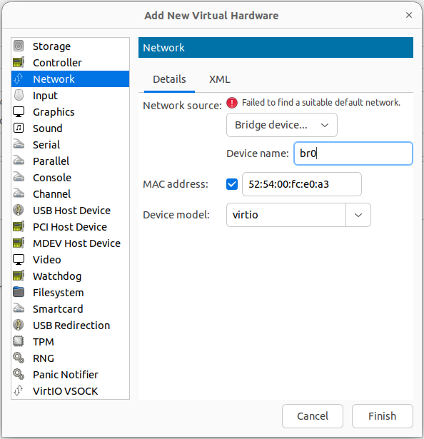

# 10. Extra Info

## **1. Related to the Server Preperation**

### 1.1. Check Virtual Functions Support

- Find the interface bus info:

```bash
$ lshw -c network -businfo
WARNING: you should run this program as super-user.
Bus info          Device        Class          Description
==========================================================
pci@0000:04:00.0  enp4s0f0      network        82599ES 10-Gigabit SFI/SFP+ Network Connection
pci@0000:04:00.1  enp4s0f1      network        82599ES 10-Gigabit SFI/SFP+ Network Connection
pci@0000:05:00.0  enp5s0        network        RTL8125 2.5GbE Controller
pci@0000:06:00.0  wlp6s0        network        Wi-Fi 6 AX210/AX211/AX411 160MHz
WARNING: output may be incomplete or inaccurate, you should run this program as super-user.
```

- To check `enp4s0f0` interface: (make sure SR-IOV is included in the capabilities)

```bash
$ sudo lspci -vs 0000:04:00.0
04:00.0 Ethernet controller: Intel Corporation 82599ES 10-Gigabit SFI/SFP+ Network Connection (rev 01)
	Subsystem: Intel Corporation Ethernet Server Adapter X520-2
	Flags: bus master, fast devsel, latency 0, IRQ 16
	Memory at 83800000 (64-bit, non-prefetchable) [size=512K]
	I/O ports at 4020 [size=32]
	Memory at 83a00000 (64-bit, non-prefetchable) [size=16K]
	Expansion ROM at 83880000 [disabled] [size=512K]
	Capabilities: [40] Power Management version 3
	Capabilities: [50] MSI: Enable- Count=1/1 Maskable+ 64bit+
	Capabilities: [70] MSI-X: Enable+ Count=64 Masked-
	Capabilities: [a0] Express Endpoint, MSI 00
	Capabilities: [e0] Vital Product Data
	Capabilities: [100] Advanced Error Reporting
	Capabilities: [140] Device Serial Number 64-9d-99-ff-ff-b1-bf-59
	Capabilities: [150] Alternative Routing-ID Interpretation (ARI)
	Capabilities: [160] Single Root I/O Virtualization (SR-IOV)
	Kernel driver in use: ixgbe
	Kernel modules: ixgbe
```


### 1.2. Using Bridge Interface

> In cases where SR-IOV is not supported.
- Bridge Interface would need to be created on the server and then add NIC interfaces on the CU and CORE VMs to use it.

```bash
sudo apt install bridge-utils
sudo brctl addbr br0
```
- Assuming the baremetal server interface is called enp2s0f1, Adapt the server netplan to use a bridge and apply
```bash
network:
  ethernets:
    enp2s0f1:
      dhcp4: false
      optional: true

  bridges:
    br0:
      addresses: 
      - 10.55.5.2/24
      - 10.55.5.5/24
      gateway4: <>
      nameservers: 
        addresses: [<>]
      interfaces:
        - enp2s0f1
```
- With virt-manager GUI edit the VM: `Add Hardware` -> `Network`.
<p align="center">
  
</p>


### 1.3. Unsupported SFP+ module type was detected
- Use information on this [link](https://www.serveradminz.com/blog/unsupported-sfp-linux/)


### 1.4. Check Performance VS Efficiency cores

- To plan the CPUs and decide on which to be isolated:

```bash
$ lscpu --all --extended
CPU NODE SOCKET CORE L1d:L1i:L2:L3 ONLINE    MAXMHZ   MINMHZ      MHZ
  0    0      0    0 0:0:0:0          yes 5500.0000 800.0000 3000.000
  1    0      0    0 0:0:0:0          yes 5500.0000 800.0000 3000.000
  2    0      0    1 4:4:1:0          yes 5500.0000 800.0000 3000.000
  3    0      0    1 4:4:1:0          yes 5500.0000 800.0000 5503.895
  4    0      0    2 8:8:2:0          yes 5500.0000 800.0000 3000.000
  5    0      0    2 8:8:2:0          yes 5500.0000 800.0000 3000.000
  6    0      0    3 12:12:3:0        yes 5500.0000 800.0000 3000.000
  7    0      0    3 12:12:3:0        yes 5500.0000 800.0000 3000.000
  8    0      0    4 16:16:4:0        yes 5800.0000 800.0000 3000.000
  9    0      0    4 16:16:4:0        yes 5800.0000 800.0000 3000.000
 10    0      0    5 20:20:5:0        yes 5800.0000 800.0000 3000.000
 11    0      0    5 20:20:5:0        yes 5800.0000 800.0000 3000.000
 12    0      0    6 24:24:6:0        yes 5500.0000 800.0000 3000.000
 13    0      0    6 24:24:6:0        yes 5500.0000 800.0000 3000.000
 14    0      0    7 28:28:7:0        yes 5500.0000 800.0000 3000.000
 15    0      0    7 28:28:7:0        yes 5500.0000 800.0000 3000.000
 16    0      0    8 32:32:8:0        yes 4300.0000 800.0000 3000.000
 17    0      0    9 33:33:8:0        yes 4300.0000 800.0000 3000.000
 18    0      0   10 34:34:8:0        yes 4300.0000 800.0000 3000.000
 19    0      0   11 35:35:8:0        yes 4300.0000 800.0000 3000.000
 20    0      0   12 36:36:9:0        yes 4300.0000 800.0000 3000.000
 21    0      0   13 37:37:9:0        yes 4300.0000 800.0000 3000.000
 22    0      0   14 38:38:9:0        yes 4300.0000 800.0000 3000.000
 23    0      0   15 39:39:9:0        yes 4300.0000 800.0000 3000.000
 24    0      0   16 40:40:10:0       yes 4300.0000 800.0000 3000.000
 25    0      0   17 41:41:10:0       yes 4300.0000 800.0000 3000.000
 26    0      0   18 42:42:10:0       yes 4300.0000 800.0000 3000.000
 27    0      0   19 43:43:10:0       yes 4300.0000 800.0000 3000.000
 28    0      0   20 44:44:11:0       yes 4300.0000 800.0000 3000.000
 29    0      0   21 45:45:11:0       yes 4300.0000 800.0000 3000.000
 30    0      0   22 46:46:11:0       yes 4300.0000 800.0000 3000.000
 31    0      0   23 47:47:11:0       yes 4300.0000 800.0000 3000.000
```

- From above output , cores 0-15 are Performance cores.


## **2. Related to Core**

### 2.1. TCP Algorithm Parameter Change

- Edit `/etc/sysctl.conf` to include below:

```bash
# allow testing with buffers up to 64MB
net.core.rmem_max = 67108864
net.core.wmem_max = 67108864
# increase Linux autotuning TCP buffer limit to 32MB
net.ipv4.tcp_rmem = 4096 87380 33554432
net.ipv4.tcp_wmem = 4096 65536 33554432
# change TCP congestion algorithm to BBR
net.ipv4.tcp_congestion_control = bbr
# recommended to use a 'fair queueing' qdisc
net.core.default_qdisc = fq
```

- Apply changes
```bash
sudo sysctl --system 
```


## **3. Related to Kubernetes**

### 3.1. Remove in full a Kubernetes installation

On occasion, it may be deemed necessary to fully remove Kubernetes, for instance if for any reason your server IP address will change, then the advertised Kubernetes IP address will have to follow. THe following command help making sure the previous installation is cleared up: 

``` bash 
sudo kubeadm reset
sudo apt-get purge kubeadm kubectl kubelet kubernetes-cni
sudo rm -rf ~/.kube
sudo rm -rf /etc/cni/net.d
sudo ip link delete cni0
sudo ip link delete flannel.1
```

## **4. Related to virt-manager**

### 4.1. Increase VM Disk Space
> In cases where the VM Disk space need to be increased after it was created

1. Stop VM
2. Increase the Allocated VM space (from the guest machine)
    - find the name of the virtual machine image

    ```bash
    $ sudo ls /var/lib/libvirt/images
    accelleran-ric-cu.qcow2
    ```

    - check current space allocated

    ```bash
    $ sudo qemu-img info /var/lib/libvirt/images/accelleran-ric-cu.qcow2
    ```

    - To add 20GB of space

    ```bash
    $ sudo qemu-img resize  /var/lib/libvirt/images/accelleran-ric-cu.qcow2 +20G
    ```

    - confirm current space allocated

    ```bash
    $ sudo qemu-img info /var/lib/libvirt/images/accelleran-ric-cu.qcow2
    ```

3. Start VM
4. Increase the partitions on the VM accordingly (from the VM)
    -  Check the partitions

    ```bash
    $ lsblk
    NAME                      MAJ:MIN RM  SIZE RO TYPE MOUNTPOINTS
    sr0                        11:0    1 1024M  0 rom  
    vda                       252:0    0  120G  0 disk 
    ├─vda1                    252:1    0    1M  0 part 
    ├─vda2                    252:2    0    2G  0 part /boot
    └─vda3                    252:3    0   98G  0 part 
      └─ubuntu--vg-ubuntu--lv 253:0    0   98G  0 lvm
    ```

    -  Increase the main partion vda3

    ```bash
    sudo parted /dev/vda
    ```

    -  Confirm there is unallocated space

    ```bash
    $ (parted) print free                                                       
    Model: Virtio Block Device (virtblk)
    Disk /dev/vda: 129GB
    Sector size (logical/physical): 512B/512B
    Partition Table: gpt
    Disk Flags: 

    Number  Start   End     Size    File system  Name  Flags
            17.4kB  1049kB  1031kB  Free Space
    1      1049kB  2097kB  1049kB                     bios_grub
    2      2097kB  2150MB  2147MB  ext4
    3      2150MB  107GB   105GB
            107GB   129GB   21.5GB  Free Space
    ```

    -  Increase partition 3 to end at 129GB instead of 107GB

    ```bash
    $ resizepart 3 129GB
    $ quit
    ```

5. Resize the filesystem to use the full space of the partition

```bash
sudo pvresize /dev/vda3
sudo lvextend -l +100%FREE /dev/ubuntu-vg/ubuntu-lv
sudo resize2fs /dev/mapper/ubuntu--vg-ubuntu--lv
```