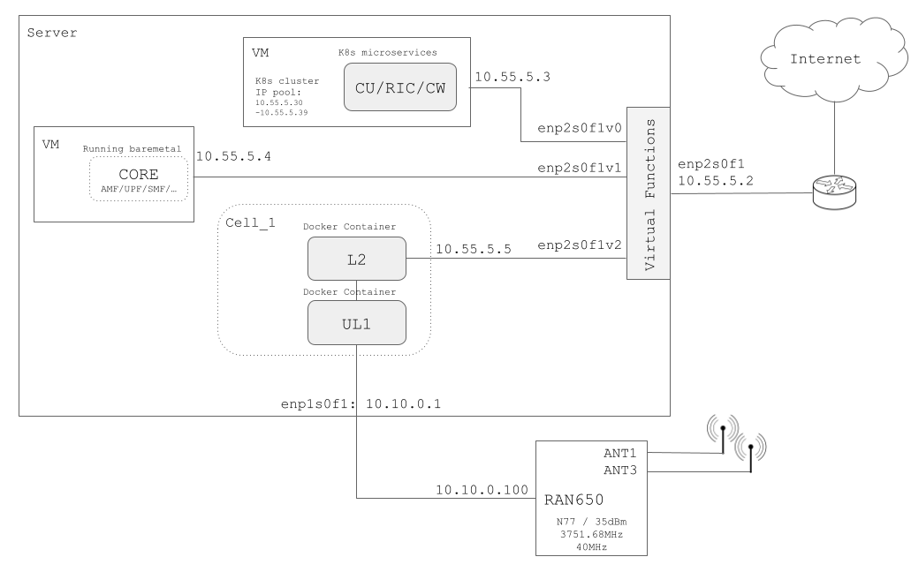

# **1. Introduction**

## 1. Releases

This document is released together with the system release 2023.3.0 which containes:

| Component    | Version                              |
|--------------|--------------------------------------|
| RIC          | 7.0.0                            |
| CU CHART     | 7.0.0                            |
| CU APP       | R4.3.12_leffe                         |
| DU           | 2024-01-31-q3-patch-release-01-8.7.4 |
| L1           | 8.7.4                                |
| BNTL650 (CATB)      | 0.7.0                                |
| BNTL550      | 0.7.1                                |
| cell wrapper config | 0.2.4                                |
| BNTL650 (CATA)| RAN650-1v1.0.4-dda1bf5                                |

## 2. Prerequisites / Preperations

This installation guide assumes that that the following are to be taken as prerequisites and made available before proceding further:

* **Hardware**:
    * Server with at least the following specifications:
        * ***Missing super micro server details***

* **Software**:
    * Ubuntu Server 22.04 OS installed on the server and VMs.
    * Access to the internet for the server and the VMs.

* **Licenses**:
    * A dRAX license file: license.crt
    * A Phluido license key
    * Effnet YubiKey USB Stick
    * Effnet yubikey license activation file
    * An active dockerhup account that has been allowed to access the necessary software images on accelleran dockerhub repositories

## 3. Example Network Components Overview

Here a simplified diagram of all network components and the related ip addresses, that would be used for the rest of this guide.

  

> Above example is using CAT_B RU. For CAT_A RU there would be a PTP enabled switch between the DU and RU.

### **Steps to take**

The installation process is divided in a number of steps.
Each of these steps is described in its own chapter.
It is recommended to execute these steps in the following order as there are dependencies from one chapter to another.

* [Server Preperation](/drax-docs/machine-prep/)
* [Prepare the Kubernetes Cluster](/drax-docs/kubernetes_ng-install/)
* [DRAX Deployment](/drax-docs/drax_ng-install/)
* [CU Deployment](/drax-docs/cu_ng-install/)
* [Cell Wrapper Deployment](/drax-docs/cw_ng-install/)
* [Core Installation](/drax-docs/core-install/)
