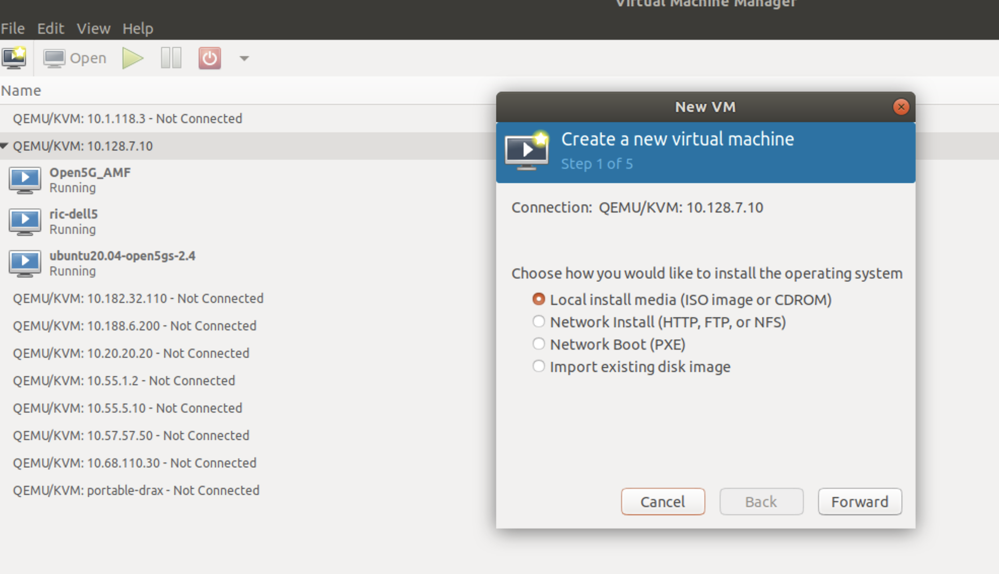
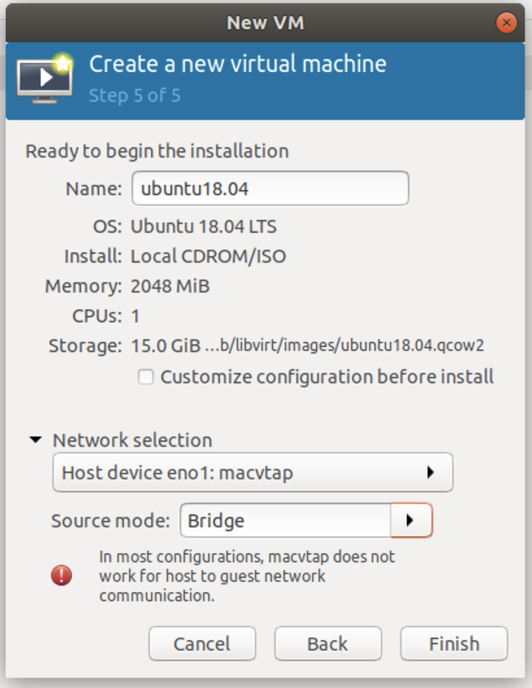

# VM installation


## Introduction

This chapter will guide you through following steps : 

* install VM ( with cpu pinning )
* install docker in the VM
* install kubernetes in the VM


### VM Minimum Requirements
1. 8 dedicated Cores    ( cpuset planned in the preperation chapter ) 
2. 32GB DDR4 RAM
3. 200GB Hard Disk      ( includes space for logging/monitor/debugging the system )

## Configure HOST server


### set a linux bridge
create a linux bridge using netplan

adapt your netplan file assuming that eno1 holds the physical interface name of your server
that connects to the network.


``` bash
network:
  ethernets:
    $SERVER_INT:
      dhcp4: false
  :
  :
  bridges:
    br0:
      interfaces: eno1
      addresses:
            - SERVER_IP/24
      gateway4: GATEWAY_IP
      nameservers:
        addresses: [8.8.8.8]

  version: 2

```
on the host uncomment the line in ```/etc/sysctl.conf``` so you get this.

``` bash
net.ipv4.ip_forward=1
```

reboot the host.

## Install VM

 Install the following linx packages

```bash
sudo apt install virtinst
```
``` bash
sudo apt install libvirt-clients
```
``` bash
sudo apt install qemu
```
``` bash
sudo apt install qemu-kvm
```
``` bash
sudo apt install libvirt_daemon_system
```
``` bash
sudo apt install bridge-utils
```
``` bash
sudo apt install virt-manager
```

Wait untill you can click reboot server

On your local machine make sure you can do an ssh without password to the server where you want to create your VM:

1) create your public/private pair of keys if you don't have them:
```bash
ssh-keygen -t rsa -b 4096
```
The private key (your identification) will be saved in the .ssh/id_rsa file under your home directory, the public key will be .ssh/id_rsa.pub file.

2) copy over to the server your identity:

```bash
ssh-copy-id remote-user@server-ip
```
3) try now again to ssh, an open up dialog will ask the password again, enter it and exit again. Now connect to the remote baremetal server using the ssh passwordless approach:

```bash
ssh remote-user@server-ip
```

if your Ubuntu desktop doesn’t open up a dialog to remember your key passphrase, then you can manually add the key passphrase with the following command

```bash
secret-tool store --label="Unlock password for: id_rsa" unique "ssh-store:/home/username/.ssh/id_rsa"
```
 Use now the Graphic Tool Virtual Machine Manager to connect to the remote baremetal server using the ssh passwordless approach as discussed above and create a new VM that meet the disk and memory requirements by using a stnadard Ubuntu 20.04 iso image (ubuntu-20.04.4-live-server-amd64.iso)


<p align="center">
  
</p>

The steps are very intuitive only on the last Step 5 make sure you create a bridge on one virtio virtual interface as shown below:


<p align="center">
  
</p>

copy the install directory from the HOST to this newly created VM

``` bash
cd ; scp -r install_$CU_VERSION  $USER@$NODE_IP:
```

``` bash
cd ; scp .profile  $USER@$NODE_IP:
```

ssh into the VM.

``` bash
ssh $USER@$NODE_IP
```

from inside this VM you should be able to ping the internet's ip address 8.8.8.8

``` bash
ping 8.8.8.8
```

make sure all available disk space is being used inside the VM.
```
lsblk
sudo lvextend -r -l +100%FREE /dev/mapper/ubuntu--vg-ubuntu--lv
lsblk
```

Every heading that follows has to be done inside this VM.

## Install Docker in the CU VM

Add the Docker APT repository:

``` bash
curl -fsSL https://download.docker.com/linux/ubuntu/gpg | sudo gpg --dearmor -o /usr/share/keyrings/docker-archive-keyring.gpg
```
```
echo "deb [arch=$(dpkg --print-architecture) signed-by=/usr/share/keyrings/docker-archive-keyring.gpg] https://download.docker.com/linux/ubuntu $(lsb_release -cs) stable" | sudo tee /etc/apt/sources.list.d/docker.list > /dev/null
```
```
sudo apt update
```

Install the required packages:

``` bash
sudo apt install docker-ce 
```
```
sudo apt install docker-ce-cli 
```
```
sudo apt install containerd.io 
```
```
sudo apt install docker-compose
```

Add your user to the docker group to be able to run docker commands without sudo access.

now all the variable values 

``` bash
sudo usermod -aG docker $USER
```

``` bash
sudo reboot
```

rerun the .profile to load install variables
``` bash
. $HOME/.profile
```

To check if your installation is working you can try to run a test image in a container:

``` bash
docker run hello-world
```

### Configure Docker Daemon

The recommended configuration of the Docker daemon is provided by the Kubernetes team - particularly to use systemd for the management of the container's cgroups:

``` bash
sudo mkdir /etc/docker
sudo tee /etc/docker/daemon.json <<EOF
{
  "exec-opts": ["native.cgroupdriver=systemd"],
  "log-driver": "json-file",
  "log-opts": {
    "max-size": "100m"
  },
  "storage-driver": "overlay2"
}
EOF
```

Restart Docker and enable on boot:

``` bash
sudo systemctl enable docker
sudo systemctl daemon-reload
sudo systemctl restart docker
```

### Disable Swap

Kubernetes refuses to run if swap is enabled on the node, so we disable swap immediately and then also disable it following a reboot:

``` bash
sudo swapoff -a
sudo sed -i '/\sswap\s/ s/^\(.*\)$/#\1/g' /etc/fstab
```

## Install Kubernetes inside the VM

Add the Kubernetes APT repository:

``` bash
sudo curl -fsSLo /usr/share/keyrings/kubernetes-archive-keyring.gpg https://packages.cloud.google.com/apt/doc/apt-key.gpg
echo "deb [signed-by=/usr/share/keyrings/kubernetes-archive-keyring.gpg] https://apt.kubernetes.io/ kubernetes-xenial main" | sudo tee /etc/apt/sources.list.d/kubernetes.list
sudo apt update
```

Accelleran dRAX currently supports Kubernetes up to version 1.20. The following command installs specifically this version:

``` bash
sudo apt install -y kubelet=1.20.0-00 
```
``` bash
sudo apt install -y kubeadm=1.20.0-00 
```
``` bash
sudo apt isntall -y kubectl=1.20.0-00
```
``` bash
sudo apt-mark hold kubelet kubeadm kubectl
```

### Configure Kubernetes

To initialize the Kubernetes cluster, the IP address of the node needs to be fixed, i.e. if this IP changes, a full re-installation of Kubernetes will be required.
This is generally the (primary) IP address of the network interface associated with the default gateway.
From here on, this IP is referred to as `$NODE_IP` - this shell variable has been stored in the first page:

> NOTE : in this part these variables will be used.
> 
>   export NODE_IP             # See Preperation paragraph for correct ip
>   export POD_NETWORK

This guide assumes we will use Flannel as the CNI-based Pod network for this Kubernetes instance, which uses the `10.244.0.0/16` subnet by default.
We store it again as an environment variable for later use, and of course if you wish to use a different subnet, change the command accordingly:


The following command initializes the cluster on this node:

``` bash
sudo kubeadm init --pod-network-cidr=$POD_NETWORK --apiserver-advertise-address=$NODE_IP
```

If this succeeds, we should see information for joining other worker nodes to this cluster.
We won't do that at this point, but it's a sign that the command completed successfully.

To make kubectl work for our non-root user, run the following commands:

``` bash
mkdir -p "$HOME/.kube"
sudo cp -i /etc/kubernetes/admin.conf $HOME/.kube/config
```
``` bash
sudo chown "$(id -u):$(id -g)" "$HOME/.kube/config"
```

### Install Flannel

Prepare the Manifest file:

``` bash
curl -sSOJ https://raw.githubusercontent.com/coreos/flannel/master/Documentation/kube-flannel.yml
sed -i '/net-conf.json/,/}/{ s#10.244.0.0/16#'"$POD_NETWORK"'#; }' kube-flannel.yml
```

Apply the Manifest file:

``` bash
kubectl apply -f kube-flannel.yml
```

### Enable Pod Scheduling

By default, Kubernetes will not schedule Pods on the control-plane node for security reasons.
As we're running with a single Node, we need to remove the node-role.kubernetes.io/master taint, meaning that the scheduler will then be able to schedule Pods on it.

``` bash
kubectl taint nodes --all node-role.kubernetes.io/master-
```

### A small busybox pod for testing

It is very convenient (however optional) to test the Kubernetes installation with a simple busybox pod for instance to test your DNS resolution inside a pod. To do so create the following yaml file (/tmp/busybox.yaml):

``` bash
cat << EOF > /tmp/busybox.yaml
apiVersion: v1
kind: Pod
metadata:
 name: busybox
 namespace: default
spec:
 containers:
 - name: busybox
   image: busybox:1.28
   command:
     - sleep
     - "3600"
   imagePullPolicy: IfNotPresent
 restartPolicy: Always
EOF
```

Then you can create the pod:
NOTE : --kubeconfig is optional here because ```$HOME/.kube/config``` is the default config file

``` bash
kubectl --kubeconfig $HOME/.kube/config create -f /tmp/busybox.yaml
```

If all went well a new POD was created, you can verify this with the following command

``` bash 
kubectl --kubeconfig $HOME/.kube/config get pods
#NAME      READY STATUS    RESTARTS AGE
#busybox   1/1 Running   21 21h
```

In order to verify if your Kubernetes is working correctly you could try some simple commands using the busybox POD. 
For instance to verify your name resolution works do:

``` bash 
kubectl exec -ti busybox -- nslookup mirrors.ubuntu.com 
#Server:    10.96.0.10
#Address 1: 10.96.0.10 kube-dns.kube-system.svc.cluster.local
 
#Name:      mirrors.ubuntu.com
#Address 1: 91.189.89.32 bilimbi.canonical.com
```
 
## APENDIX : Remove a full Kubernetes installation

On occasion, it may be deemed necessary to fully remove Kubernetes, for instance if for any reason your server IP address will change, then the advertised Kubernetes IP address will have to follow. THe following command help making sure the previous installation is cleared up: 


``` bash 
sudo kubeadm reset
```
``` bash
sudo apt-get purge kubeadm 
```
``` bash
sudo apt-get purge kubectl 
```
``` bash
sudo apt-get purge kubelet
```
``` bash
sudo apt-get purge kubernetes-cni
```
``` bash
sudo rm -rf ~/.kube
```
``` bash
sudo rm -rf /etc/cni/net.d
```
``` bash
sudo ip link delete cni0
```
``` bash
sudo ip link delete flannel.1
```
``` bash
sudo rm /etc/kubernetes/admin.conf
```


