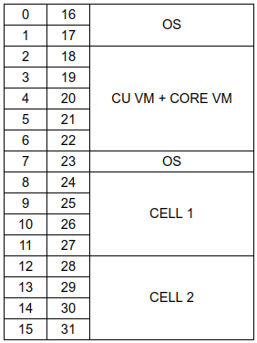
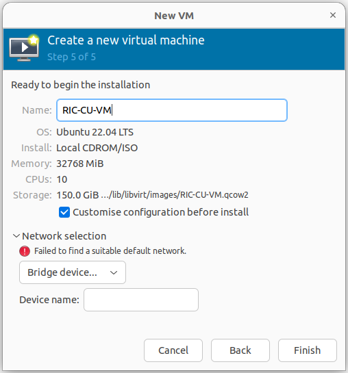
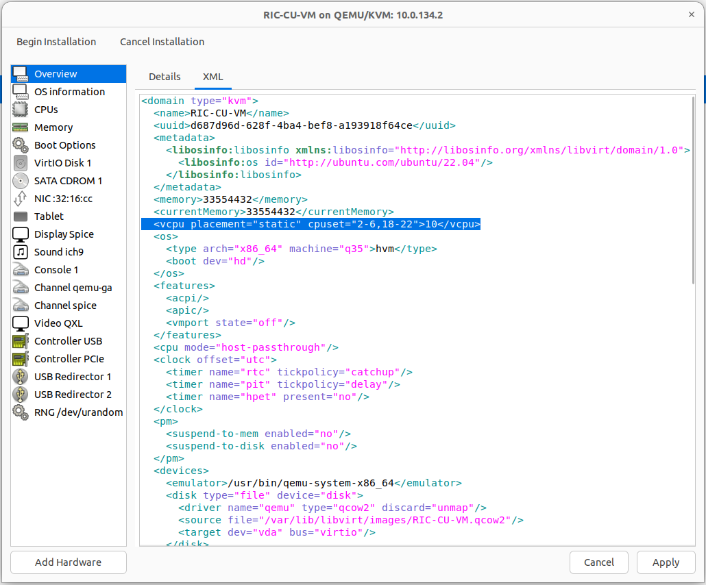

# **Server Preperation**

## **1. Mandatory Steps**

- This guide will follow the [Example Network Diagram](/drax-docs/)
- Also, below CPU allocation would be used:
<p align="center">
  
</p>

> PS:

> - This is based on the `AMD Ryzen 9 7950X 16-Core Processor` used with the lab super micro servers. But depending on the CPU this might be different.
> - This is intended to be used for single machine setups for testing purposes. (Customer setups would have a seperate machine to run the CU/RIC/CORE)

### 1.1. Prepare Virtual Functions

- Create Virtual Function Interfaces on your Server to be used later on by the CU and CORE VMs.
- Make sure the server interface can support Virtual Functions. This is by checking if the NIC can allow SR_IOV
```bash
sudo lspci -vvv | less 
cat /sys/class/net/enp2s0f1/device/sriov_numvfs
```
- Assuming the above is valid, virtual-functions can be created by editing the netplan to include below:
```bash
network:
  ethernets:
    enp2s0f1:
      virtual-function-count: 4
```
- After applying this, new interfaces would appear on the server. (enp2s0f1v0, enp2s0f1v1, enp2s0f1v2, enp2s0f1v3). Update the netplan again to include the IP to be used by the DU on one of these interfaces.
```bash
network:
  ethernets:
    enp2s0f1v2:
      addresses:
      - 10.55.5.5/24
```

### 1.2. Create Virtual Machines

Use below steps to create two VMs on the machine and connect it to the baremetal server.

- Install virt-manager on the baremetal server
```bash
sudo apt install virt-manager
```
- Download ubuntu22.04 server iso. (example below command)
```bash
curl -O https://releases.ubuntu.com/22.04.3/ubuntu-22.04.3-live-server-amd64.iso
```

#### Using virt-manager GUI

- ssh into the baremetal server using -X. and fire up virt-manager
```bash
ssh -X username@10.55.5.2
virt-manager
```
- Follow the steps and vreate the VM using ubuntu 22.04 server iso, Keep in mind:
    - The VM would be using cores other than those isolated for the DU in section 1.2 above.
        - To achieve this make sure to click on `Customise configuration before install`
        <p align="center">
        
        </p>
        - Edit the XML to change the cpu line to be as below:
        <p align="center">
        
        </p>

### 1.3. Prepare Fronthaul Interface

- Assuming the RU is connected to enp1s0f1 and the RU is using the default IP `10.10.0.100` as in [Example Network Diagram](/drax-docs/)
- Edit the DU server netplan to include below:
```bash
network:
  ethernets:
    enp1s0f1:
      addresses:
      - 10.10.0.1/24
      mtu: 9000
```
- Apply netplan and validate that the RU is reachable
```bash
sudo netplan apply 
ping 10.10.0.100
```

## **2. Automated Preperation Using Ansible**
- ***Missing to be added***


## **3. Manual Server Preperation**

### 3.1. Prepare the Machine for RealTime Performance

> These changes are needed to run any DU tested in our lab, Plus the VMs.

- On The BIOS Settings:
    - System Profile Settings:
        - System Profile -> Performance
    - Integrated Devices Settings:
        - SR-IOV Global Enable -> Enabled
        - USB 3.0 Settings -> Enabled

- Install lowlatency kernal
```bash
sudo apt update
sudo apt install linux-image-lowlatency
sudo apt remove linux-image-generic
sudo apt autoremove
```
- Configure the OS scheduler to be more responsive
```bash
sudo sh -c "echo -1 > /proc/sys/kernel/sched_rt_runtime_us"
sudo sh -c "echo 100000 > /sys/kernel/debug/sched/min_granularity_ns"
sudo sh -c "echo 20000 > /sys/kernel/debug/sched/wakeup_granularity_ns"
sudo sh -c "echo 500000 > /sys/kernel/debug/sched/latency_ns"
```
- configure sysctl for low latency
```bash
sudo tee /etc/sysctl.d/10-phluido.conf <<EOF
# Improves scheduling responsiveness for Phluido L1
kernel.sched_min_granularity_ns = 100000
kernel.sched_wakeup_granularity_ns = 20000
kernel.sched_latency_ns = 500000
kernel.sched_rt_runtime_us = -1
# Message queue
fs.mqueue.msg_max = 64
EOF
sudo sysctl --system 
```

- Disable CPU scaling
```bash
sudo apt install cpufrequtils
echo 'GOVERNOR="performance"' | sudo tee /etc/default/cpufrequtils
sudo systemctl disable ondemand
```

- To force the low latency kernal. Edit `/etc/default/grub` file to include below:
```bash
GRUB_FLAVOUR_ORDER=lowlatency
```

- To Apply run below:
```bash
sudo update-grub2 
```

### 3.2. Isolate CPU Cores for the DU/L1

- To isolate the needed DU/L1 cores, Edit `/etc/default/grub` file to include below:
```bash
GRUB_CMDLINE_LINUX="processor.max_cstate=1 intel_idle.max_cstate=0 intel_pstate=passive intel_iommu=on iommu=pt selinux=0 enforcing=0 nmi_watchdog=0 audit=0 mce=off kthread_cpus=0 irqaffinity=0 isolcpus=8-15,24-31 nosoftlockup nohz=on nohz_full=8-15,24-31 rcu_nocbs=8-15,24-31 skew_tick=1"
GRUB_FLAVOUR_ORDER=lowlatency
```
- To Apply run below:
```bash
sudo update-grub2 
```


### 3.3. Install Docker

From (https://docs.docker.com/engine/install/ubuntu/#install-using-the-repository)

```bash
sudo apt-get update
sudo apt-get install ca-certificates curl gnupg
sudo install -m 0755 -d /etc/apt/keyrings
curl -fsSL https://download.docker.com/linux/ubuntu/gpg | sudo gpg --dearmor -o /etc/apt/keyrings/docker.gpg
sudo chmod a+r /etc/apt/keyrings/docker.gpg
echo \
  "deb [arch="$(dpkg --print-architecture)" signed-by=/etc/apt/keyrings/docker.gpg] https://download.docker.com/linux/ubuntu \
  "$(. /etc/os-release && echo "$VERSION_CODENAME")" stable" | \
  sudo tee /etc/apt/sources.list.d/docker.list > /dev/null
sudo apt-get update
sudo apt-get install docker-ce docker-ce-cli containerd.io docker-buildx-plugin docker-compose-plugin docker-compose

sudo usermod -aG docker $USER
```

- logout and login for the last command to take effect

```bash
sudo mkdir /etc/docker
sudo tee /etc/docker/daemon.json <<EOF
{
  "exec-opts": ["native.cgroupdriver=systemd"],
  "log-driver": "json-file",
  "log-opts": {
    "max-size": "100m"
  },
  "storage-driver": "overlay2"
}
EOF
sudo systemctl enable docker
sudo systemctl daemon-reload
sudo systemctl restart docker
```

- Optionally, one can update docker-compose to the latest version. (It might be needed in cases when to operate the cell without the cell-wrapper). More information can be found in [link](https://docs.docker.com/compose/install/linux/#install-the-plugin-manually)

```bash
DOCKER_CONFIG=${DOCKER_CONFIG:-$HOME/.docker}
mkdir -p $DOCKER_CONFIG/cli-plugins
curl -SL https://github.com/docker/compose/releases/download/v2.24.5/docker-compose-linux-x86_64 -o $DOCKER_CONFIG/cli-plugins/docker-compose
sudo chmod +x $DOCKER_CONFIG/cli-plugins/docker-compose
sudo chmod +x /usr/local/lib/docker/cli-plugins/docker-compose
# to overwite the version installed in earlier
sudo cp $DOCKER_CONFIG/cli-plugins/docker-compose /usr/bin/.
```

### 3.4. Vendor Specific Steps
- [Effnet-Phluido-Benetel](/drax-docs/effnet-benetel-prep)


### 3.5. Extra Steps for the Virtual Machines

#### 3.5.1. In the CU Virtual Machine

- Needed change for ARP handling:
```bash
sudo tee /etc/rc.local <<EOF
#!/bin/sh -e
# Add a 10-second delay
sleep 10
# Apply ARP settings for all network interfaces
for iface in /proc/sys/net/ipv4/conf/*; do
    if [ -d "$iface" ]; then
        echo 1 | sudo tee "$iface/arp_announce" > /dev/null
        echo 1 | sudo tee "$iface/arp_ignore" > /dev/null
    fi
done

exit 0
EOF
sudo chmod +x /etc/rc.local
```

#### 3.5.2. In the CORE Virtual Machine

> Still under test

- Optimization changes for TCP throughput testing, edit `/etc/sysctl.conf` to add below lines:
```bash
# allow testing with buffers up to 64MB
net.core.rmem_max = 67108864
net.core.wmem_max = 67108864
# increase Linux autotuning TCP buffer limit to 32MB
net.ipv4.tcp_rmem = 4096 87380 33554432
net.ipv4.tcp_wmem = 4096 65536 33554432
# change TCP congestion algorithm to BBR
net.ipv4.tcp_congestion_control = bbr
# recommended to use a 'fair queueing' qdisc
net.core.default_qdisc = fq
```
- To apply:
```bash
sudo sysctl --system 
```