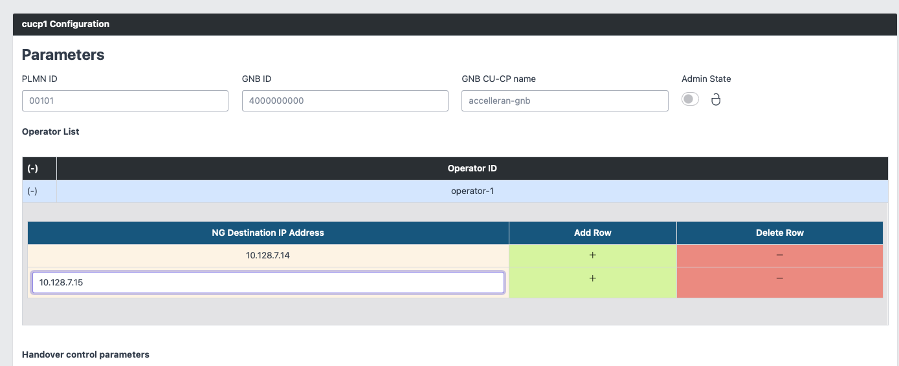
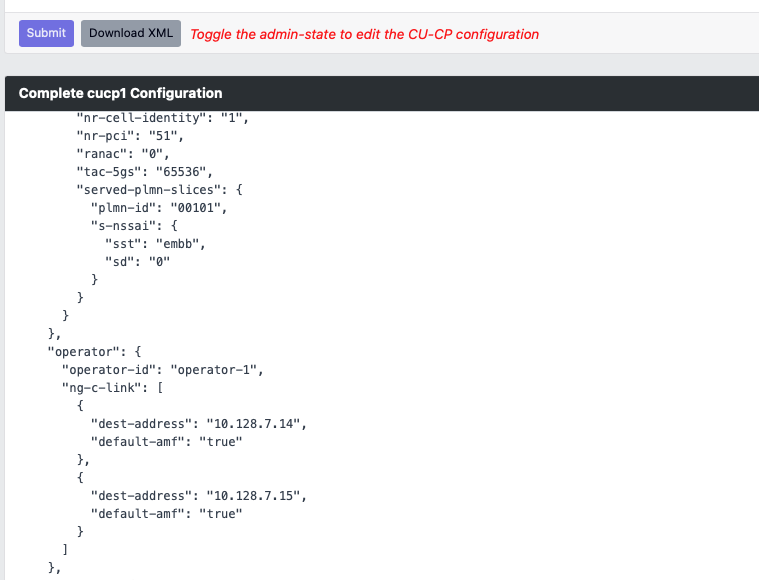

# MOCN Configuration for Effnet Phluido Benetel Solution

In order to obtain a working setup with MOCN, it is essential that three components are aligned and configured coherently to serve the same list of PLMNIDs, here below we give an example based on the Accelleran CU, the Effnet DU and the Open5Gs Core, this ofc course may need to be slightly modified case by case, but the principle remains: Currently there is no mechanism to determine if the DU, the CU and the Core have been configured consistently and the effect of a wrong configuration is simply that for instance the DU does not attempt to contact the CU, or the CU does not attempt to contact the Core, so it is essential to plan and ask in advance to your Accelleran Support Team in case of doubts.

In the rest of this section we will assume that the user is attempting to set two PLMN IDs 00101 and 00102 served by two different Cores located at two different IP addresses 10.128.7.14 and 10.128.7.15, both reachable by the CU. Each PLMNID has one sigle slice of type 1.

## CUCP MOCN Configuration 

Add simply in the Operator List the second IP address 10.128.7.15 to your list of NG IP addresses and verify they both are configured as "default" AMF in the relative XML configuration file see images below:

  

  

## CUUP MOCN Configuration 

Forsee the creation of one CU UP component for each PLMNID to be served and configure the slices consistently, in this example both slices of type one, one per CUUP as in the picture below (remove the slices that are not in use, by the default the tool will create two slices). Unfortunately not all the Core take the same input for the slices, some ignore the slice ID, some are very strict, so this will need to be adjusted in details as we go by

## CUCP MOCN Configuration 

# Slice Configuration for Effnet Phluido Benetel Solution
