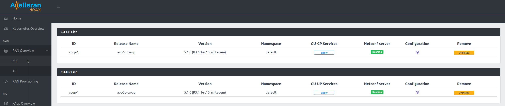
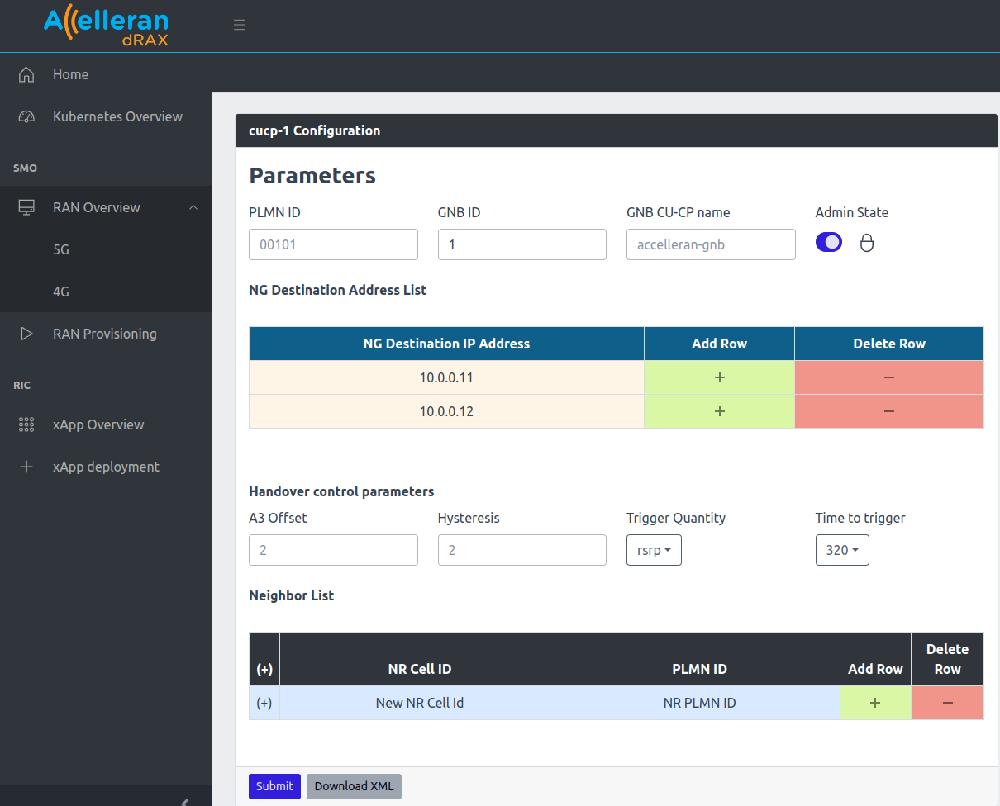
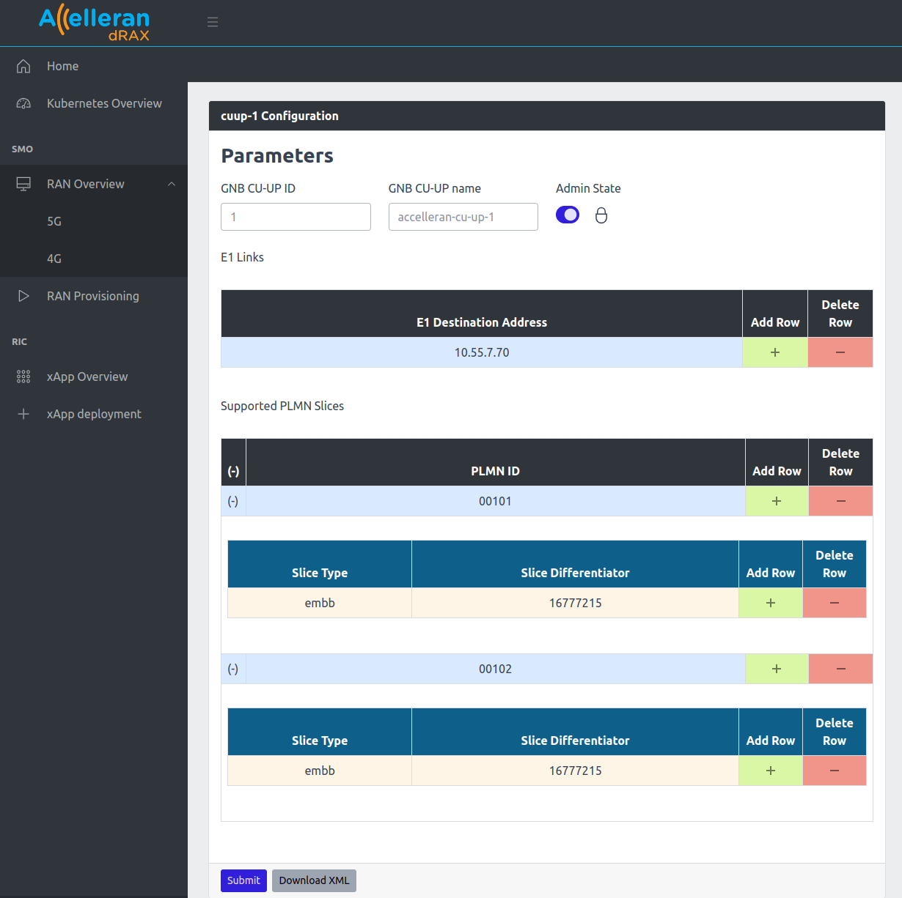

# CU Configuration

The CU components can be configured from the dRAX Dashboard by navigating to **RAN Overview** in the dRAX Dashboard sidebar and clicking the **5G**:

  

On this page there are two lists, one for CU-CPs and one for CU-UPs.
You can click the icon under the Edit column of each CU component to edit its configuration.

## 1. CU-CP configuration

The 5G CU-CP components have a number of parameters that you can set as can be seen below:

- **Admin State**: This will Lock and Unlock the CU-CP.
- **PLMN ID**: The PLMN ID to be used
- **GNB ID**: The GNB ID
- **GNB CU-CP name**: A friendly name of the 5G CU-CP component
- **NG Destination IP Address**: The AMF NG interface IP Address. You can click on the (+) sign in the table to connect the CU-CP with multiple cores. (This will be discussed further as Part of MOCN scenarios Configuration).
- **Handover Control Parameters**: A3 Offset, Hysteresis, Neighbor List, ..etc. (These will be discussed further as Part of Handover scenarios Configuration)

To edit the configuration, the **Admin State** must be set to Locked and then after modifying the fields Click the **Submit** button to send the configuration.

  

## 2. CU-UP configuration

The 5G CU-UP has a number of configuration parameters as seen below:

- **GNB CU-UP ID**: The ID of the CU-UP component.
- **GNB CU-UP name**: A friendly name of the CU-UP component,
- **E1 Destination IP Address**: This is the E1 IP address of the CU-CP component that this CU-UP component will connect to. You can Add Row or Delete Rows using the (+) sign to add more than one CU-CP.
- **Supported PLMN Slices**: Expand the table by clicking the (+) sign. This will include the PLMNIDs and the slices that can be handled by this CU-UP. Each slice is defined by the Slice Type and Slice Differentiator. (This will be discussed further as part of the MOCN and slicing scenarios configuration)

  

**IMPORTANT**  Do not attempt to modify slices and PLMNs unless you are aware of the target Scenario you want to achieve: slice configuration and multiple PLMN (MOCN) configurations are rather complex to handle and require that CU, DU and Core are configured coherently in order for such Scenarios to be functional. We recommend to consult the relative sections of this document and contact your Core Network Supplier and Accelleran to tailor a solution for your specific case. 
