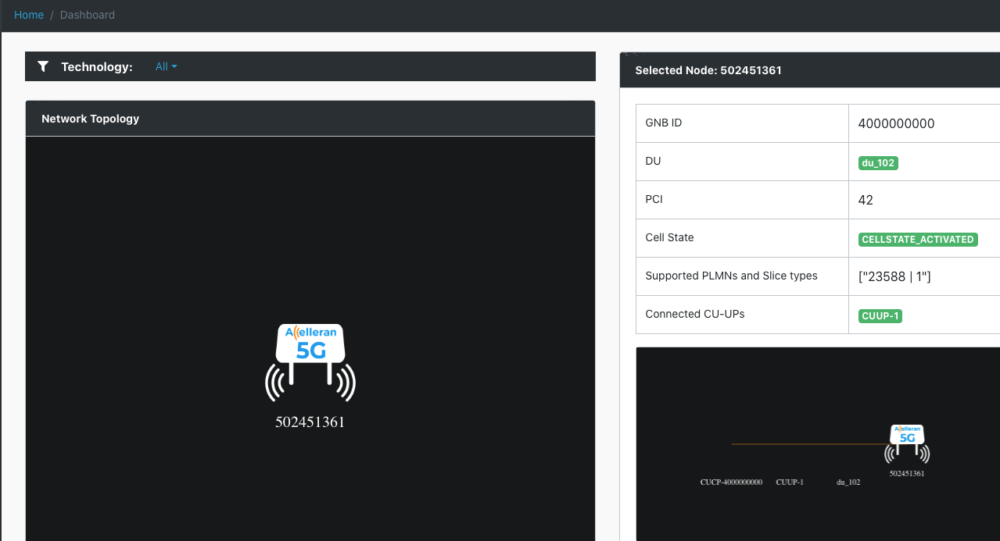

# DU/L1 Update

## EFFNET DU UPDATE

This section is dedicated to users who inted to update their licensed Effnet DU only. The DU will be installed in a Docker container that run on metal 
on the host machine. As mentioned in the introduction, a separate Virtual Machine will host the RIC and the CU and their relative pods will be handled
by Kubernetes inside that VM. Here we focus on the steps to update the DU and bring it back up and running.

We don't modify the parameters and the configuration in this section and we assume this is done previously

#### licenses and files needed
* accelleran-du-phluido-yyyy-mm-dd-release.zip
* effnet-license-activation-yyyy-mm-dd.zip 

For the license activation file we indicate the generic format yyyy_mm_dd as the file name may vary from case to case, at this point your Accelleran point of contact already made sure you received the correct license activation archive file which will have a certain timestamp on it, example effnet-license-activation-2021-12-16.zip

To check if the server can see the key do (in this example Device004 is your key): 
``` bash
lsusb
~$ lsusb
Bus 002 Device 002: ID 8087:8002 Intel Corp. 
Bus 002 Device 001: ID 1d6b:0002 Linux Foundation 2.0 root hub
Bus 001 Device 002: ID 8087:800a Intel Corp. 
Bus 001 Device 001: ID 1d6b:0002 Linux Foundation 2.0 root hub
Bus 004 Device 003: ID 2500:0020 Ettus Research LLC USRP B200
Bus 004 Device 001: ID 1d6b:0003 Linux Foundation 3.0 root hub
**Bus 003 Device 004: ID 1050:0407 Yubico.com Yubikey 4 OTP+U2F+CCID**
Bus 003 Device 029: ID 2a70:9024 OnePlus AC2003
Bus 003 Device 006: ID 413c:a001 Dell Computer Corp. Hub
Bus 003 Device 016: ID 20ce:0023 Minicircuits Mini-Circuits
Bus 003 Device 001: ID 1d6b:0002 Linux Foundation 2.0 root hub
```
Then you can find the serial number (yubikey-manager needed, install if it's not already):

``` bash
sudo apt install yubikey-manager
```
``` bash
ykman list --serials
#13134288
```
#### Effnet DU Update: Stop the running containers and the Cell Wrapper 

The first thing to do is to stop the running containers and prevent the Cell Wrapper from continuisly attempting to restart the components. For the Cell Wrapper simply login to your machine where the RIC is running and do:

``` bash
 helm uninstall cw
```
Regarding the rest, the DU software needs access to a YubiKey that contains its license.The license in the YubiKey is shared by the PCSCD daemon, which itself can run in a Docker container to satisfy OS dependencies. the first thing to do is to stop the daemon and verify there is no Docker Container running any DU instance (the cell wrapper has been previously disabed or uninstalled) 

Optional step: Remove the existing installation directory and its zip archive:

``` bash
rm accelleran-du-phluido-yyyy-mm-dd-version.zip 
rm -rf accelleran-du-phluido-yyyy-mm-dd-version
```
Check and kill the relevant running containers:

``` bash
 docker container ls --filter name=pcscd_yubikey_c
 CONTAINER ID   IMAGE           COMMAND                  CREATED        STATUS      PORTS     NAMES
8f6cd6af4333   pcscd_yubikey   "/usr/sbin/pcscd --f…"   4 months ago   Up 3 days             pcscd_yubikey_c

docker kill 8f6cd6af4333 (CONTAINER_ID)

docker ps | grep phluido
516a9be070d3   gnb_du_main_phluido:yyyy-mm-dd-version  "/bin/sh -c 'sleep 2…"   30 seconds ago   Up 30 seconds             gnb_du_main_phluido
bcaf36e5834b   phluido_l1:v8.7.1                               "/PhluidoUL1_NR /con…"   30 seconds ago   Up 30 seconds             phluido_l1
 
docker kill 516a9be070d3 bcaf36e5834b (you better kill L1 now as well)
 
```
Verify one last time that docker ps will return no running processes and remove the DU docker image:

``` bash
 
docker image ls | grep gnb_du
gnb_du_main_phluido           yyyy-mm-dd-version                          f7d7f75d7294   2 months ago   137MB

docker image rm f7d7f75d7294
Untagged: gnb_du_main_phluido:yyyy-mm-dd-version
Deleted: sha256:f65f9f66f7227b47b9205a30171822bc5e0affecce2ed90297efa74728cbceb7
Deleted: sha256:e561bbd172ba022fb1e2544f890b6db10ecb6817f3fb0c2f62f7db3e2edecc30
Deleted: sha256:b33bd2a555a1ad76656e47e3383026fda2029e2f93062f40cf5af2eff399f691
Deleted: sha256:b3cba33e6be01e7c59b44298fb6da156644cb9d5646a1158ce48cd6294af155f
Deleted: sha256:bf2537d1f5f6f7b597e313b86695f5d7cbeb11b2753dafbb879c596b35e993eb
Deleted: sha256:0770b7f116f8627ec336a62e65a1f79e344df7ae721eb3e06e11edca85d3d1e7
Deleted: sha256:476e931831a5b24b95ff7587cca09bde9d1d7c0329fbc44ac64793b28fb809d0
Deleted: sha256:9f32931c9d28f10104a8eb1330954ba90e76d92b02c5256521ba864feec14009

```
#### Effnet DU Update: Load the new image and restart PCSCD license daemon and the Cell Wrapper 

Now you can proceed on loading the new image. Unzip the effnet software bundle, and execute a docker load as follows:
``` bash
 unzip accelleran-du-phluido-yyyy-mm-dd-version.zip 
 bzcat accelleran-du-phluido-yyyy-mm-dd-version/gnb_du_main_phluido-yyyy-mm-dd-version.tar.bz2  | docker image load
```
Don't forget to start the license daemon again:
``` bash
docker build --rm -t pcscd_yubikey - <pcscd/Dockerfile.pcscd
docker run --restart always -id --privileged --name pcscd_yubikey_c -v /run/pcscd:/run/pcscd pcscd_yubikey
docker container ls --filter name=pcscd_yubikey_c
```
Verify that the docker image has been loaded and the license daemon is running again:
``` bash

docker image ls | grep gnb_du
gnb_du_main_phluido           yyyy-mm-dd-version                           b8c7c94d8215   1 minute ago   87MB

docker container ls --filter name=pcscd_yubikey_c
CONTAINER ID   IMAGE           COMMAND                  CREATED        STATUS      PORTS     NAMES
8f6cd6af4333   pcscd_yubikey   "/usr/sbin/pcscd --f…"   4 months ago   Up 1 minute             pcscd_yubikey_c
```
Now login to your RIC VM, locate the directory where your Cell Wrapper yaml configuration file is (typically named "cw.yml") and redeploy it:

``` bash
helm install cw acc-helm/cw-cell-wrapper --values cw.yaml
```

If you have done your job correctly, wait for a few minutes and observe your system go back to life and your Cell will go back on air, this can be seen of course in your Dashboard:

<p align="center">
  
</p>


``` bash

```

## PHLUIDO L1 UPDATE

This section is dedicated to users who inted to update their licensed Phluido L1 only. The L1 will be installed in a Docker container that run on metal 
on the host machine. As presented above in the DU Update session, most of the actions must be repeated to udpate the L1.

We don't modify the parameters and the configuration in this section and we assume this is done previously

#### licenses and files needed
* phluido_docker_xxxx.tar


For the 32 digit phluido license key, [ ex 2B2A-962F-783F-40B9-7064-2DE3-3906-9D2E ] at this point your Accelleran point of contact already made sure you received the correct and valid license key.

#### Phluido L1 Update: Stop the running containers and the Cell Wrapper 

The first thing to do is to stop the running containers and prevent the Cell Wrapper from continuisly attempting to restart the components. For the Cell Wrapper simply login to your machine where the RIC is running and do:

 ``` bash
 helm uninstall cw
```

Check and kill the relevant running container:

``` bash

docker ps | grep phluido
516a9be070d3   gnb_du_main_phluido:yyyy-mm-dd-version  "/bin/sh -c 'sleep 2…"   30 seconds ago   Up 30 seconds             gnb_du_main_phluido
bcaf36e5834b   phluido_l1:v8.7.1                               "/PhluidoUL1_NR /con…"   30 seconds ago   Up 30 seconds             phluido_l1
 
 docker kill 516a9be070d3 bcaf36e5834b (you better kill DU now as well)
 
```
Verify one last time that docker ps will return no running processes and remove the L1 docker image:

``` bash
docker image ls | grep l1
phluido_l1                    vx.y.z                                                   914588d807ee   7 weeks ago    70.4MB
docker image rm 914588d807ee
Untagged: phluido_l1:vx.y.z
Deleted: sha256:914588d807eec74cfb773720cd7ffb1107cb1793dc3b1e44e77d85bb83f88d4b
Deleted: sha256:3209e659de2ba51e007b1b58404f27640124bb4d756b9f820f5eace37c1b0c13
Deleted: sha256:2046d83cbb593a780ce8f987b5a8b96a307919316bbeb75568fdfcaab4e2ee10
Deleted: sha256:a4e25480be6bd70ea8f073f5af661a58e498b79f81d4d17a004bcbe54c7bd14d
 
```
#### Phluido L1 Update: Load the new image and restart the Cell Wrapper 

Now you can proceed on loading the new image. Execute a docker load as follows:
``` bash
 docker image load -i phluido_docker_v.x.y.z.tar
```
Verify that the docker image has been loaded:
``` bash
docker image ls | grep l1
phluido_l1            v.x.y.z                           b8c7c94d8215   1 minute ago   70MB

Now login to your RIC VM, locate the directory where your Cell Wrapper yaml configuration file is (typically named "cw.yaml") and redeploy it:

``` bash
helm install cw acc-helm/cw-cell-wrapper --values cw.yaml
```

If you have done your job correctly, wait for a few minutes and observe your system go back to life and your Cell will go back on air


