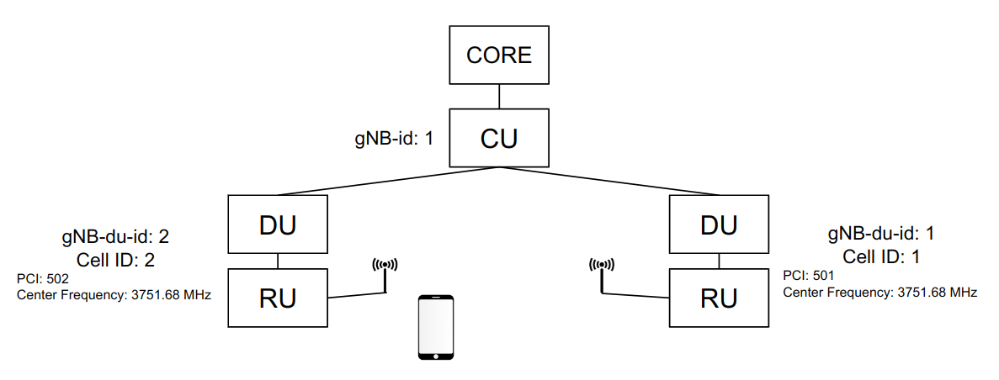
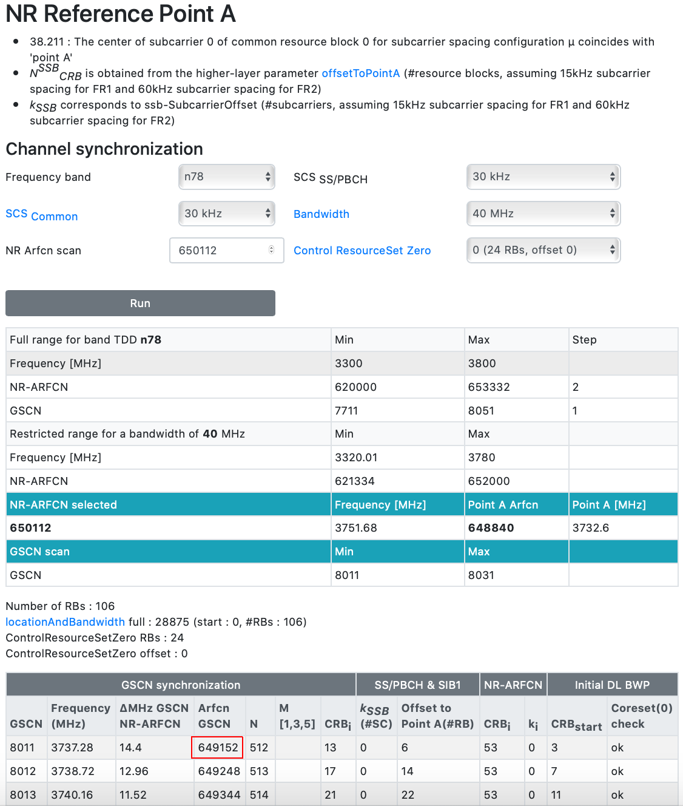
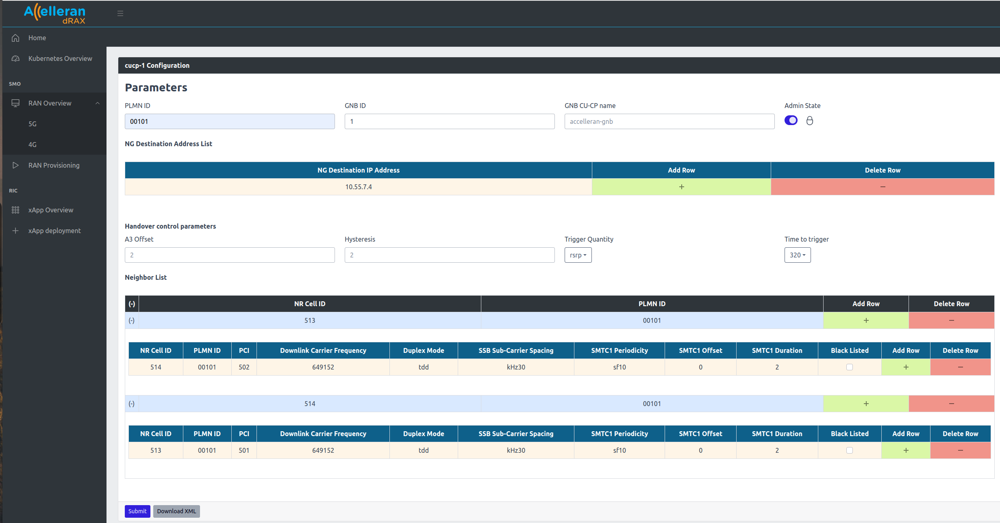

# Handover Configuration 

The handover supported with this release is Inter-DU, Intra Frequency handover is supported with this release. In the following sections the below example network would be configured to support handover between the cells.

As an example to configure the below setup for handover.

  

## 1. Prerequists

There are a couple of requirements:

1. The same CU-CP is used by the two cells using different DUs. (Inter-DU).
2. The two cells must operate in the same frequency (Intra Frequency).
3. The two DUs must have be configured with unique Cell ID, PCI, and gNB-DU-ID. (Extra care must be taken into selecting the PCI to prevent cases of PCI conflict or PCI confusion)
4. The UE must be using a slice that is available on both serving cell and target cell. Otherwise the UE won't find the slice it is currently using on the target cell and hence never trigger a handover.
>PS: In cases where the CU configuration was changed. Remember to click **submit** on the cell configuration as well. This will restart the cells to use the latest configuration of the CU.  

## 2. DU Handover Configuration

Using the cell wrapper, the configuration of the two cells can be modified/viewed.

- From the dashboard go to **RAN Overview** then **5G**
- From the **DU/RU List**, click on configuration.
- Note down the cell ID and PCI for each of the cells. (They would be later be used to populate the neighbor cell list in the CU)

## 3. CU Handover Configuration

Neighbor cell list must be configured in the CU-CP to let the UE know which cells to measure and when to trigger event A3 and handover to the neighbor cell.

- From the dashboard go to **RAN Overview** then **5G**
- From the **CU-CP List**, click on configuration.
- Add two neighbor relations. One from cell1 to cell2 and the other is from cell2 to cell1. Extra care must be taken into below settings:
    - "NR Cell ID": is the NR cell Identity which is 36 bit combination of the gNB-ID and the cell ID. 
    Assuming the gNB-ID was 1 and it is 27 bits. Then in our example: cell1 will have 513 and cell2 is 514.
    > "gNB-id" and "gnb-id-length" can be viewed from the **Complete cucp-1 Configuration** at the bottom of the Configuration Window. In our example: cell1 NR_CellID = 000000000000000000000000001000000001 = 513.
      
    - "Downlink Carrier Frequency": In this case this is the SSB ARFCN. Using tools like this (https://www.sqimway.com/nr_refA.php), knowing the center frequency ARFCN (650112), and the defaults values for the Kssb (0), PointA_Offset (6), Bandwidth (40MHz), SCS (30KHz). In our example the SSB ARFCN is 649152.

  

- The resulted CU configuration would be like this:

  

