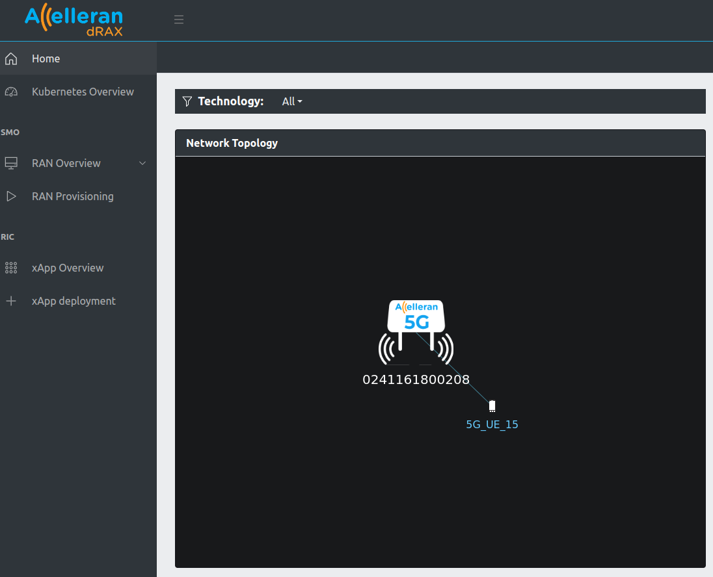
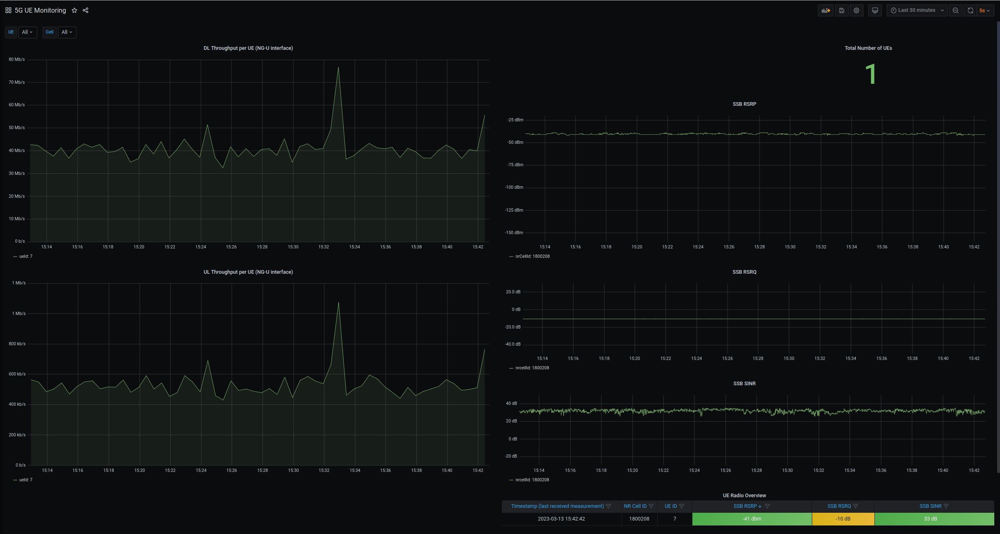
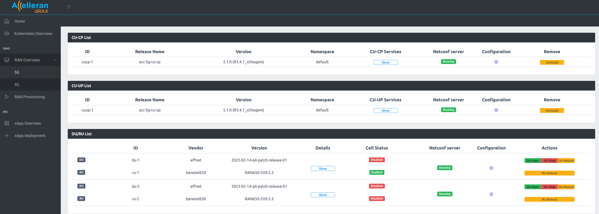

# Operational User Guide 

## 1. Introduction

This guide describes how to operate the Accelleran ORAN 5G  Platform and the different network components (RIC, CU, DU and L1). The scope of this document is therefore to cover only the operational aspects of the platform, including the basic configuration and examples of some test cases. 

This means that the installation and initial configuration of the System has been already made by Accelleran Customer Support and there is no need to worry about how to prepare the server, install and initialise the components.

2022.4.0 release include Accelleran Cell Wrapper, which works as a layer on top of the DU and RU. This provides a common interface for configuration and controls over a cell. 

It monitors a DU and RU through periodic health checks and uses the control interface internally to attempt an automatic repair from failures. These health checks include checks for reachability, traffic, container status and checks on a set of log messages. 


## 2. Releases
This document is released together with the system release 2022.4.0. 
This system release contains 

| component    | version                        |
|--------------|--------------------------------|
| RIC          | 6.2.0                          |
| CU CHART     | 5.2.0                          |
| CU APP       | R3.4.2_ichtegem                |
| DU           | 2023-02-14-q4-patch-release-01 |
| L1           | 8.7.4                          |
| BNTL650      | 0.5.3                          |
| BNTL550      | 0.5.2/0.6.0                    |
| cell wrapper | 2.0.0                          |
| DU/RU        | 5.1.0.30736                    |

## 3. Dashboard

The dashboard can be accessed via ```https://"RIC_CU_VM_IP":31315```

### 3.1. Cell Monitoring
From the **Home** tab the cell status can be monitored and the UEs attached to it.

<p align="center">
  
</p>

Furthermore, from the **Kubernetes Overview** tab, the status of the RIC/CU/CellWrapper pods and services can be monitored.

The DRAX dashboard also uses grafana to view measurements and Counters.

- This can be accessed via ```https://"RIC_CU_VM_IP":30300```
- A number of reports will be readily available on this release for example:
    - Radio Condition and Throughput can be viewed in the **5G UE Monitoring** dashboard. The dashboard includes:
        - UE Measured RSRP.
        - UE Measured RSRQ.
        - UE Measured SINR
        - DL Throughput on the NG-Interface per UE.
        - UL Throughput on the NG-Interface per UE.
    - Accessibility and Mobility Counters (e.g. Number of RRC Attempts or Number of Handover Execution Successes) can be viewed in the **5G PM Counters** dashboard. The dashboard includes:
        - RRC Connection Attempts and sub-counters for each of the connection attempt cause (MO Signalling, MO Data, ... etc)
        - RRC Connection Successes and sub-counters for each of the connection success causes (MO Signalling, MO Data, ... etc)
        - PDU Session Setup Requests.
        - PDU Session Setup Failures.
        - Intra-gNB Handover Execution Attempts.
        - Intra-gNB Handover Execution Successes.
        - Mean and Max Number of RRC Connections.
        > PS: The definition of these counters are included in 3GPP TS 28.552 .
    - A live view of the RIC/CU/CellWrapper Logs can be viewed using the **Loki Log Dashboard**.

Example **5G UE Monitoring** report:
<p align="center">
  
</p>

### 3.2. Basic Cell Operations

Basic cell operation like start, stop, restart. Or locking and unlocking the CU can all be done through the dashboard.

- From the dashbord go to **RAN Overview** then select **5G**.

Using the Configuration button, the cell and CU parameters can be easily modified. *(More on this will be explained in the other sections of this document)*

<p align="center">
  
</p>


## 4. Advanced Operations

Below sections will give more information on how to change some of the RAN parameters to enable features or modify RAN behavior.

* [CU Configuration](cu-configuration/index.md)
* [RU/DU Configuraiton](modifying-ran650-or-ran550/index.md)
* [Handover Configuration](handover-configuration/index.md)
* [MOCN and Slicing](mocn-and-slicing/index.md)
* [Split 2 RU/DU Configuration](nodeh-du-ru-operation/index.md)
* [Logs Collection](logs-collection/index.md)


## 5. Accelleran Customer Support Desk

In case of of bugs, request for support or feature requests. Please use the customer portal available at the below address.

[customer portal link](https://accelleran.atlassian.net/servicedesk/customer/portal/31)

Please contact Accelleran to get access to the customer portal. 
