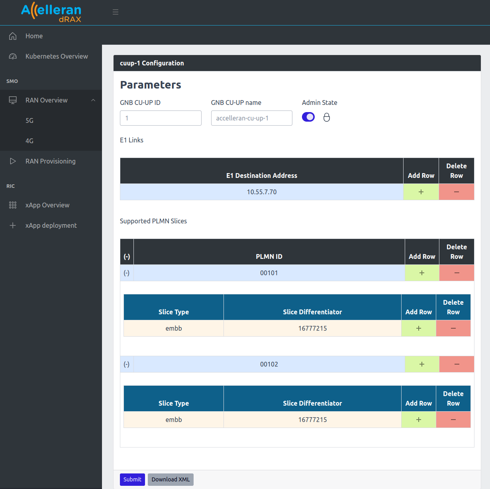

# Multi Slice and MOCN Configuration

## 1. Multi Slice Configuration

To enable multiple slices support for a cell, the different components of the network must be configured to support them.

As an example, Assuming we want to configure three slices: (SST:1), (SST:1,SD:1), (SST2)

### 1.1. CU-UP Multi Slice Configuration

Here, the CU UP must be configured with all the Slices that the Core and the Cell will be configured with to support.

- From the dashboard go to **RAN Overview** then **5G**
- From the **CU-UP List**, click on configuration.
- Set Admin State to Locked. (To allow changing the CU configuration)
- Add the different slices in the **Supported PLMN Slices** and then submit.

>*SD 16777215 (0xFFFFFF) = no SD, SST 1 = eMBB, SST 2 = URLLC*

  

### 1.2. DU Multi Slice Configuration

Similar to the CU UP, the DU must be configured with the slices that it needs to support.

- From the dashboard go to **RAN Overview** then **5G**
- From the **DU/RU List**, click on configuration.
- Add the different slices in the **Supported PLMN Slices** and then submit.

>*SD 16777215 (0xFFFFFF) = no SD, SST 1 = eMBB, SST 2 = URLLC*

  

### 1.3. Core MOCN Configuration 

The core connected should support the slices enabled on the cell. In our example the core should be configured with (SST:1), (SST:1,SD:1), (SST2).

As core configuration would be done differently based on which core vendor is used. It wouldn't be part of this document. Please contact Accelleran with the details of the core used to provide support if possible. 

## 2. MOCN Configuration

To configure the Cell to support MOCN (Multi-Operator Core Network) scenarios 

In order to obtain a working setup with MOCN, it is essential that all the network components are aligned and configured coherently to serve the same list of PLMNIDs.

As an example, this section will show how to configure the below scenario, where one cell will broadcast two PLMNIDs so that UE1 will connect to Core1 and UE2 will connect to Core2.

  

### 2.1. CU-CP MOCN Configuration

Simply the CU-CP must be configured with all the addresses to the cores that are needed.

- From the dashboard go to **RAN Overview** then **5G**
- From the **CU-CP List**, click on configuration.
- Set Admin State to Locked. (To allow changing the CU configuration)
- Add the first and second core IPs to the NG Address list and then submit.

  

### 2.2. CU-UP MOCN Configuration

Here, the CU UP must be configured with all the PLMNIDs and Slices that the Core and the Cell will be configured with to support.
(Assuming there is only one slice "SST1, SD:0" configured on each of the cores)

- From the dashboard go to **RAN Overview** then **5G**
- From the **CU-UP List**, click on configuration.
- Set Admin State to Locked. (To allow changing the CU configuration)
- Add the first and second PLMN IDs to the **Supported PLMN Slices** and then submit.

  

### 2.3. DU MOCN Configuration 

Similar to the CU UP, the DU must be configured with the PLMN IDs and slices that it needs to support.

- From the dashboard go to **RAN Overview** then **5G**
- From the **DU/RU List**, click on configuration.
- Add the first and second PLMN IDs to the **Supported PLMN Slices** and then submit.

  

### 2.4. Core MOCN Configuration 

The cores connected should support the PLMN IDs. In our example core1 should be configured with PLMNID 00101, and core2 with PLMNID 00102. 

As core configuration would be done differently based on which core vendor is used. It wouldn't be part of this document. Please contact Accelleran with the details of the core used to provide support if possible. 
