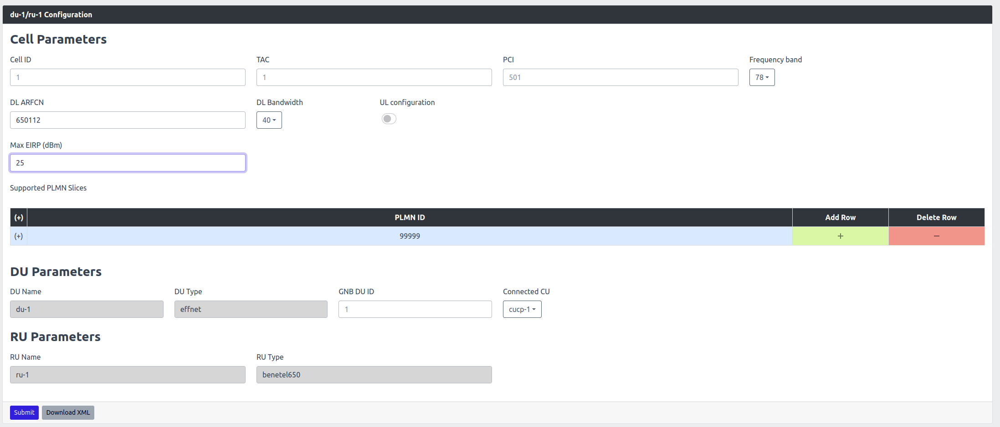

# DU/RU Configuration

This section is exclusively applicable to the user/customer that intends to use the Benetel RAN550 or RAN650 Radio End with our Accellleran 5G end to end solution, if you do not have such radio end the informations included in this section may be misleading and bring to undefined error scenarios. Please contact Accelleran if your Radio End is not included in any section of this user guide

## 1. Parameter Configuration

### 1.1. Configuring Center Frequency

Take into account that adjusting the center frequency will require applying the change on the RU and on the DU.

- The RU will take the Center Frequency in MHz, both on RX and TX to be witten in the EEPROM
- The DU will take the center Frequency in MHz, Which will be configured via the Cell Wrapper.

#### 1.1.1. Finding a Proper Frequency

There are several limitations on the Frequencies that can be selected:

- The selected frequency should be within the band supported by the hardware (RAN650/RAN550) used. 
- The selected frequency must be devisable by 3.84
- Subcarrier Spacing = 30KHz
- Bandwidth = 40MHz
- The K_ssb must be 0
- The offset to point A must be 6

Let's proceed with an example:

To set a center frequency of 3750 MHz, this is not devisable by 3.84, the nearest frequencies that meet this condition are 3747.84MHz (976*3.84) 3751.68MHz (977*3.84) so let's consider first 3747,84 MHz and verify the conditions on the K_ssb and Offset to Point A with this online tool (link at:  (https://www.sqimway.com/nr_refA.php) ) 

- On the tool set the Band to 78, SCS to 30KHz, the Bandwidth to 40MHz and the ARFCN of the center frequency 3747,84 which is 649856 and when we hit the **RUN** button we obtain:

<p align="center">
  
</p>

This Frequency, however does not meet the **GSCN Synchronisation requirements** as in fact the Offset to Point A of the first channel is 2 and the K_ssb is 16, this will cause the UE to listen on the wrong channel so the SIBs will never be seen and therefore the cell is "invisible"

- We then repeat the exercise with the higher center frequency 3751.68MHz, which yelds a center frequency ARFCN of 650112 and a point A ARFCN of 648840 and giving another run we will see that now the K_ssb and the Offset to Point A are correct.

<p align="center">
  
</p>

#### 1.1.2. Applying The Frequency Change

**Apply on the RU:**

- Create a file change_freq.sh with below content in the RU
```bash
#!/bin/bash

if [ -z "$1" ]; then
  echo "Please provide frequency in MHz in with the format XXXX.XXX as an argument"
  exit 1
fi

registercontrol -w 0xC036B -x 0x88000088
eeprog_cp60 -f -x -16 /dev/i2c-0 0x57 -w 0x174:0x01:0x3$(echo $1 | cut -c1)
eeprog_cp60 -f -x -16 /dev/i2c-0 0x57 -w 0x175:0x01:0x3$(echo $1 | cut -c2)
eeprog_cp60 -f -x -16 /dev/i2c-0 0x57 -w 0x176:0x01:0x3$(echo $1 | cut -c3)
eeprog_cp60 -f -x -16 /dev/i2c-0 0x57 -w 0x177:0x01:0x3$(echo $1 | cut -c4)
eeprog_cp60 -f -x -16 /dev/i2c-0 0x57 -w 0x178:0x01:0x2E
eeprog_cp60 -f -x -16 /dev/i2c-0 0x57 -w 0x179:0x01:0x3$(echo $1 | cut -c6)
eeprog_cp60 -f -x -16 /dev/i2c-0 0x57 -w 0x17A:0x01:0x3$(echo $1 | cut -c7)
eeprog_cp60 -f -x -16 /dev/i2c-0 0x57 -w 0x17B:0x01:0x3$(echo $1 | cut -c8)                    
eeprog_cp60 -f -x -16 /dev/i2c-0 0x57 -w 0x17C:0x01:0x3$(echo $1 | cut -c1)
eeprog_cp60 -f -x -16 /dev/i2c-0 0x57 -w 0x17D:0x01:0x3$(echo $1 | cut -c2)
eeprog_cp60 -f -x -16 /dev/i2c-0 0x57 -w 0x17E:0x01:0x3$(echo $1 | cut -c3)
eeprog_cp60 -f -x -16 /dev/i2c-0 0x57 -w 0x17F:0x01:0x3$(echo $1 | cut -c4)
eeprog_cp60 -f -x -16 /dev/i2c-0 0x57 -w 0x180:0x01:0x2E
eeprog_cp60 -f -x -16 /dev/i2c-0 0x57 -w 0x181:0x01:0x3$(echo $1 | cut -c6)
eeprog_cp60 -f -x -16 /dev/i2c-0 0x57 -w 0x182:0x01:0x3$(echo $1 | cut -c7)
eeprog_cp60 -f -x -16 /dev/i2c-0 0x57 -w 0x183:0x01:0x3$(echo $1 | cut -c8)
registercontrol -w 0xC036B -x 0x88000488
```
- For our example where the center frequency required is 3751.68MHz, run the script by:
```
./change_freq.sh 3751.680
```
- To validate the command is successful run below:
```bash
eeprog_cp60 -q -f -16 /dev/i2c-0 0x57 -r 372:8
```

**Apply on the DU:** (Through the cell wrapper)

- From the dashboard go to "RAN Overview" then "5G"
- From the DU/RU list, find the cell to be changed and Click on "configuration".
- For our example where the center frequency required is 3751.68MHz which is ARFCN 650112. Fill that in the "DL ARFCN" and click submit.
- This will reboot the RU and the DU and the change would take effect.

<p align="center">
  
</p>

### 1.2. Configuring Cell TX Power

Take into account for an optimum operation, changing the RU Transmission Power require applying a change on the RU and on the DU.

- The RU will take new attenuation values (this will be explained next), both for ANT1 and ANT3 which will be witten in the EEPROM
- The DU will take the new transmission power into account as well, Which will be configured via the Cell Wrapper.
By default RAN650 is configured with 35dBm and RAN550 is configured with 25dBm.

**Apply on the RU:**

- To adjust the power of the RU the attenuation settings on the RU would need to be changed: To increase the power the attenuation must be reduced and to decreasing the power, the attenuation must be increased.
- Important: The the current attenuation values on the RU must be saved as they are unit specific and used to make sure that the unit is transmitting on the needed power. (Please note these are in mdB)
For ANT1: ```eeprog_cp60 -q -f -16 /dev/i2c-0 0x57 -r 780:5```
For ANT3: ```eeprog_cp60 -q -f -16 /dev/i2c-0 0x57 -r 1060:5```
- Assuming as an example the RAN650 unit had for ANT1 16000 anf for ANT3 15730 and we want to reduce the output power by 10dB.
- Then the new attenuation values for ANT1 and ANT3 must be 26000 and 25730 respectivily.
- Modify the below script with the last digit of each value and run it on the RU.
```bash
registercontrol -w 0xC036B -x 0x88000088
#ANT1
eeprog_cp60 -f -x -16 /dev/i2c-0 0x57 -w 0x30C:0x01:0x32
eeprog_cp60 -f -x -16 /dev/i2c-0 0x57 -w 0x30D:0x01:0x36
eeprog_cp60 -f -x -16 /dev/i2c-0 0x57 -w 0x30E:0x01:0x30
eeprog_cp60 -f -x -16 /dev/i2c-0 0x57 -w 0x30F:0x01:0x30
eeprog_cp60 -f -x -16 /dev/i2c-0 0x57 -w 0x311:0x01:0x30
#ANT3
eeprog_cp60 -f -x -16 /dev/i2c-0 0x57 -w 0x424:0x01:0x32
eeprog_cp60 -f -x -16 /dev/i2c-0 0x57 -w 0x425:0x01:0x35
eeprog_cp60 -f -x -16 /dev/i2c-0 0x57 -w 0x426:0x01:0x37
eeprog_cp60 -f -x -16 /dev/i2c-0 0x57 -w 0x427:0x01:0x33
eeprog_cp60 -f -x -16 /dev/i2c-0 0x57 -w 0x428:0x01:0x30
registercontrol -w 0xC036B -x 0x88000488
```

**Apply on the DU:**

- From the dashboard go to "RAN Overview" then "5G"
- From the DU/RU list, find the cell to be changed and Click on "configuration".
- For our the new output power is 25dBm. Fill that in the "Max EIRP (dBm)" and click submit.
- This will reboot the RU and the DU and the change would take effect.

<p align="center">
  
</p>


## 2. Checking RU Status

After applying actions on the RU to change the frequency or the power. A reboot of the RU would be necessary and will be applied via the cell wrapper when clicking **submit** on when configuring the cell parameters. (Unless advanced settings was toggled and reboot RU was unchecked).

Below are some useful checks to confirm the status of the RU after the reboot.

- The RU Synchrnoization status can be checked by running below command on the RU.

```syncmon```

- The RAN650 or RAN550 units usually take from 4~6 mins to boot up after a power cycle. The status of the RU boot up will be printed in a file during boot up. It can be checked by: 

```tail -F /tmp/radio_status```